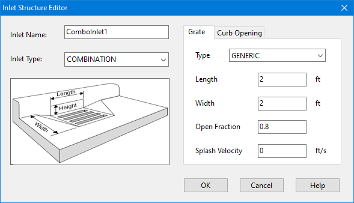
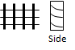
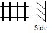
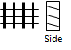
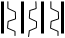
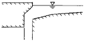
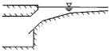
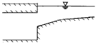
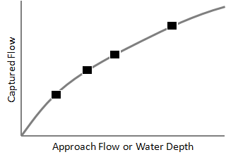

**C.11** **Inlet Structure Editor ** The Inlet Structure Editor is invoked when a new Inlet object is created or is selected for editing. As shown below it contains an Inlet Name field used to uniquely identify the inlet structure and an Inlet Type field to select the type of structure.

The design parameters shown in the data entry panel depend on the choice of inlet type. Grate Inlet The design parameters for a grated inlet include:

**Grate Type ** Select from the choices shown in Table C-1 below. **Length ** The grate's length parallel to the street curb (feet or meters). **Width ** The grate's width (feet or meters). **Open Fraction** (for GENERIC grates only) The fraction of the grate's area that is open. Values are predetermined for non-Generic grates. **Splash Velocity** (for GENERIC grates only)

The minimum velocity that causes some water to shoot over the inlet thus reducing its capture efficiency (ft/sec or m/sec). Values are predetermined for non-Generic grates.

**Table C-1 Types of grate inlets **

**Grate Type ** Sketch Description **P_BAR-50 **

Parallel bar grate with bar spacing 1⅞” on center

**P_BAR-50X100 **

Parallel bar grate with bar spacing 1⅞” on center and ⅜” diameter lateral rods spaced at 4” on center **P_BAR-30 **

Parallel bar grate with 1⅛” on center bar spacing

**CURVED_VANE **

Curved vane grate with 3¼” longitudinal bar and 4¼” transverse bar spacing on center

**TILT_BAR-45 **

45 degree tilt bar grate with 2¼” longitudinal bar and 4” transverse bar spacing on center

**TILT_BAR-30 **

30 degree tilt bar grate with 3¼” and 4” on center longitudinal and lateral bar spacing respectively

**RETICULINE **

"Honeycomb" pattern of lateral bars and longitudinal bearing bars

**GENERIC ** A generic grate design.

Curb Opening Inlet The design parameters for a curb opening inlet are:

**Length ** The length of the opening (feet or meters). **Height ** The height of the opening (feet or meters). **Throat Angle **

The orientation of the curb opening's throat relative to the street surface. Choices are:

Vertical

Inclined

Horizontal

Combination Inlet Combination inlets use the parameters for both a grate and curb opening inlet. For the curb opening, only the portion that extends beyond the length of the grate contributes to the overall capture efficiency. Slotted Drain Inlet The design parameters for a slotted drain inlet are:

**Length ** The drain's length parallel to the street curb (feet or meters). **Width ** The drain's width (feet or meters). Drop Grate Inlet Drop grate inlets use the same parameters as a grated inlet. Drop Curb Inlet Drop curb inlets use the same length and height parameters as a curb opening inlet. Custom Inlet The only design parameter for a custom inlet is the name of a user-defined flow capture curve. Two options for this curve are available:

1. Diversion Curve (normally used for Divider nodes) that has captured flow be a function of the inlet's approach flow 2. Rating Curve (normally used for Outlet links) that makes the captured flow be a function of water depth. Diversion curves are best suited for on-grade inlets and Rating curves for on-sag inlets.

Clicking the button next to the curve’s name field will open a Curve Editor dialog.