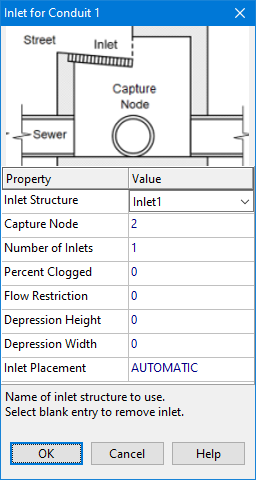

**C.12** **Inlet Usage Editor ** The Inlet Usage Editor is used to place an Inlet Structure into a Street or open channel conduit. It is accessed by selecting a conduit into the Property Editor and then clicking the ellipsis button in its Inlets property. The following information is requested by the editor:

**Inlet Structure ** Select the name of an inlet structure that was created with the Inlet Structure Editor (Section C.11) from the drop-down list. The list will contain only those inlets that are compatible with the conduit's cross-section (i.e., curb and gutter inlets for street sections or drop inlets for trapezoidal or rectangular channel sections). Selecting a blank value for the first item will remove the inlet from the conduit. **Capture Node ** Enter the name of the node that receives flow captured by the inlet. You can select the node by clicking it on the Study Area Map or by selecting it from the Project Browser. **Number of Inlets ** The number of identical inlets placed in the conduit. For two-sided street conduits this number refers to pairs of inlets placed on each side of the street

**Percent Clogged ** The degree to which each inlet is clogged. For example, if a value of 40% is entered then the normal flow capture computed for the inlet is reduced by 40%. **Flow Restriction ** The maximum flow (in the project's flow units) that can be captured by a single inlet. A value of 0 indicates that flow capture is unrestricted. **Depression Height ** The height of any local gutter depression that exists over the length of the inlet (in feet or meters). A value of 0 indicates no local depression. This parameter is ignored for drop inlets.

**Depression Width ** The width of any local gutter depression in feet or meters. It should be at least as large as the width that the inlet extends out into the gutter. This value is ignored if the depression height is 0 or if a drop inlet is used.

**Inlet Placement ** Specifies whether the inlet is placed in an on-grade or on-sag location. Selecting AUTOMATIC has the program determine the placement based on the topography of the street layout.

Grated, curb opening and slotted drain inlets can only be used by Street conduits. Drop grates and drop curb inlets can only be used by open rectangular or trapezoidal channels. Custom inlets can be used in any conduit.