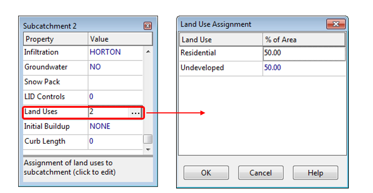

**C.13** **Land Use Assignment Editor ** The Land Use Assignment editor is invoked from the Property Editor when editing the Land Uses property of a subcatchment. Its purpose is to assign land uses to the subcatchment for water quality simulations. The percent of land area in the subcatchment covered by each land use is entered next to its respective land use category. If the land use is not present its field can be left blank. The percentages entered do not necessarily have to add up to 100.

