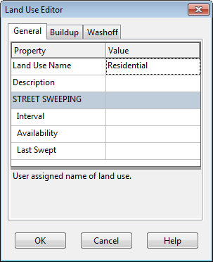
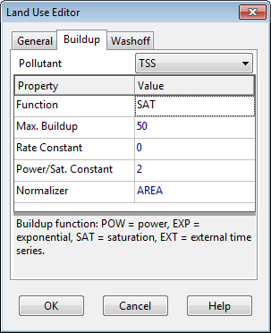
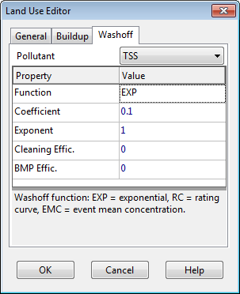

**C.14** **Land Use Editor ** The Land Use Editor dialog is used to define a category of land use for the study area and to define its pollutant buildup and washoff characteristics.

The dialog contains three tabbed pages of land use properties:

- General Page (provides land use name and street sweeping parameters)

- Buildup Page (defines rate at which pollutant buildup occurs)

- Washoff Page (defines rate at which pollutant washoff occurs) General Page The General page of the Land Use Editor dialog describes the following properties of a particular land use category: **Land Use Name ** The name assigned to the land use.

**Description ** An optional comment or description of the land use (click the ellipsis button or press Enter to edit). **Street Sweeping Interval ** Days between street sweeping within the land use (0 for no sweeping). **Street Sweeping Availability ** Fraction of the buildup of all pollutants that is available for removal by sweeping. **Last Swept ** Number of days since last swept at the start of the simulation. If street sweeping does not apply to the land use, then the last three properties can be left blank. Buildup Page

The Buildup page of the Land Use Editor dialog describes the properties associated with pollutant buildup over the land during dry weather periods. These consist of:

**Pollutant ** Select the pollutant whose buildup properties are being edited. **Function ** The type of buildup function to use for the pollutant. The choices are **NONE **for no buildup, **POW**

for power function buildup, **EXP** for exponential function buildup **SAT** for saturation function buildup, and **EXT** for buildup supplied by an external time series. See the discussion of Pollutant Buildup in Section 3.3.11 for explanations of these different functions. Select **NONE** if no buildup

occurs. **Max. Buildup ** The maximum buildup that can occur, expressed as lbs (or kg) of the pollutant per unit of the normalizer variable (see below). This is the same as the C1 coefficient used in the buildup formulas discussed in Section 3.3.11. The following two properties apply to the **POW**, **EXP**, and **SAT** buildup functions:

**Rate Constant ** The time constant that governs the rate of pollutant buildup. This is the C2 coefficient in the Power and Exponential buildup formulas discussed in Section 3.3.11. For Power buildup its units are mass/days raised to a power, while for Exponential buildup its units are 1/days.

**Power/Sat. Constant ** The exponent C3 used in the Power buildup formula, or the half-saturation constant C2 used in the Saturation buildup formula discussed in Section 3.3.11. For the latter case, its units are days. The following two properties apply to the **EXT** (External Time Series) option:

**Scaling Factor ** A multiplier used to adjust the buildup rates listed in the time series.

**Time Series ** The name of the Time Series that contains buildup rates (as mass per normalizer per day). **Normalizer ** The variable to which buildup is normalized on a per unit basis. The choices are either land area (in acres or hectares) or curb length. Any units of measure can be used for curb length, as long as they remain the same for all subcatchments in the project. When there are multiple pollutants, each pollutant must be selected separately from the Pollutant dropdown list and have its pertinent buildup properties specified.

Washoff Page

The Washoff page of the Land Use Editor dialog describes the properties associated with pollutant washoff over the land use during wet weather events. These consist of: **Pollutant ** The name of the pollutant whose washoff properties are being edited. **Function ** The choice of washoff function to use for the pollutant. The choices are:

- **NONE** no washoff

- **EXP** exponential washoff

- **RC** rating curve washoff

- **EMC** event-mean concentration washoff.

The formula for each of these functions is discussed in Section 3.3.11 (Land Uses) under the Pollutant Washoff topic. **Coefficient ** This is the value of C1 in the exponential and rating curve formulas, or the event-mean concentration.

**Exponent ** The exponent used in the exponential and rating curve washoff formulas. **Cleaning Efficiency ** The street cleaning removal efficiency (percent) for the pollutant. It represents the fraction of the amount that is available for removal on the land use as a whole (set on the General page of the editor) which is actually removed. **BMP Efficiency ** Removal efficiency (percent) associated with any Best Management Practice that might have been implemented (but is not explicitly represented in the model). The washoff load computed at each time step is simply reduced by this amount. As with the Buildup page, each pollutant must be selected in turn from the Pollutant dropdown list and have its pertinent washoff properties defined.