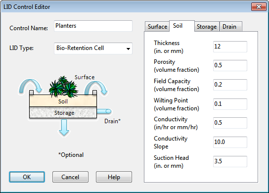

**C.15** **LID Control Editor ** The LID Control Editor is used to define a low impact development control that can be deployed throughout a study area to store, infiltrate, and evaporate subcatchment runoff. The design of the control is made on a per-unit-area basis so that it can be placed in any number of subcatchments at different sizes or number of replicates.

The editor contains the following data entry fields: **Control Name ** A name used to identify the particular LID control. **LID Type ** The generic type of LID being defined (bio-retention cell, rain garden, green roof, infiltration trench, permeable pavement, rain barrel, or vegetative swale). **Process Layers ** These are a tabbed set of pages containing data entry fields for the vertical layers and drain system that comprise an LID control. They include some combination of the following, depending on the type of LID selected: Surface Layer, Pavement Layer, Soil Layer, Storage Layer, and Drain System or Drainage Mat.

Surface Layer Properties The Surface Layer page of the LID Control Editor is used to describe the surface properties of all types of LID controls except rain barrels. Surface layer properties include: **Berm Height (or Storage Depth) ** When confining walls or berms are present this is the maximum depth to which water can pond above the surface of the unit before overflow occurs (in inches or mm). For Rooftop Disconnection it is the roof’s depression storage depth, and for Vegetative Swales it is the height of the trapezoidal cross-section. **Vegetative Volume Fraction ** The fraction of the volume within the storage depth filled with vegetation. This is the volume occupied by stems and leaves, not their surface area coverage. Normally this volume can be ignored, but may be as high as 0.1 to 0.2 for very dense vegetative growth. **Surface Roughness ** Manning's roughness coefficient (*n*) for overland flow over surface soil cover, pavement, roof surface or vegetative swale. Use 0 for other types of LIDs. **Surface Slope ** Slope of a roof surface, pavement surface or vegetative swale (percent). Use 0 for other types of LIDs. **Swale Side Slope ** Slope (run over rise) of the side walls of a vegetative swale's cross-section. This value is ignored for other types of LIDs.

If either Surface Roughness or Surface Slope values are 0 then any ponded water that exceeds the surface storage depth is assumed to completely overflow the LID control within a single time step. Pavement Layer Properties The Pavement Layer page of the LID Control Editor supplies values for the following properties of a permeable pavement LID:

**Thickness ** The thickness of the pavement layer (inches or mm). Typical values are 4 to 6 inches (100 to 150 mm). **Void Ratio ** The volume of void space relative to the volume of solids in the pavement for continuous systems or for the fill material used in modular systems. Typical values for pavements are 0.12 to 0.21. Note that porosity = void ratio / (1 + void ratio). **Impervious Surface Fraction ** Ratio of impervious paver material to total area for modular systems; 0 for continuous porous pavement systems. **Permeability ** Permeability of the concrete or asphalt used in continuous systems or hydraulic conductivity of the fill material (gravel or sand) used in modular systems (in/hr or mm/hr). In the latter case the fill's nominal conductivity should be multiplied by the fraction of the total area it covers. The permeability of new porous concrete or asphalt is very high (e.g., hundreds of in/hr) but can drop off over time due to clogging by fine particulates in the runoff (see below). **Clogging Factor ** Number of pavement layer void volumes of runoff treated it takes to completely clog the pavement. Use a value of 0 to ignore clogging. Clogging progressively reduces the pavement's permeability in direct proportion to the cumulative volume of runoff treated. If one has an estimate of the number of years it takes to fully clog the system (Yclog), the Clogging Factor can be computed as: Yclog  Pa  CR  (1 + VR)  (1 - ISF) / (T  VR) where Pa is the annual rainfall amount over the site, CR is the pavement's capture ratio (area that contributes runoff to the pavement divided by area of the pavement itself), VR is the system's Void Ratio, ISF is the Impervious Surface Fraction, and T is the pavement layer Thickness. As an example, suppose it takes 5 years to clog a continuous porous pavement system that serves an area where the annual rainfall is 36 inches/year. If the pavement is 6 inches thick, has a void ratio of 0.2 and captures runoff only from its own surface, then the Clogging Factor is 5 x 36 x (1 + 0.2) / 6 / 0.2 = 180. **Regeneration Interval ** The number of days that the pavement layer is allowed to clog before its permeability is restored, typically by vacuuming its surface. A value of 0 (the default) indicates that no permeability regeneration occurs.

**Regeneration Fraction ** The fractional degree to which the pavement's permeability is restored when a regeneration interval is reached. The default is 0 (no restoration) while a value of 1 indicates complete restoration to the original permeability value. Once a regeneration occurs the pavement begins to clog once again at a rate determined by the Clogging Factor. Soil Layer properties The Soil Layer page of the LID Control Editor describes the properties of the engineered soil mixture used in bio-retention types of LIDs and the optional sand layer beneath permeable pavement. These properties are: **Thickness ** The thickness of the soil layer (inches or mm). Typical values range from 18 to 36 inches (450 to 900 mm) for rain gardens, street planters and other types of land-based bio-retention units, but only 3 to 6 inches (75 to 150 mm) for green roofs. **Porosity ** The volume of pore space relative to total volume of soil (as a fraction). **Field Capacity ** Volume of pore water relative to total volume after the soil has been allowed to drain fully. Below this level, vertical drainage of water through the soil layer does not occur. **Wilting Point ** Volume of pore water relative to total volume for a well dried soil where only bound water remains. The moisture content of the soil cannot fall below this limit. **Conductivity ** Hydraulic conductivity for the fully saturated soil (in/hr or mm/hr). **Conductivity Slope ** Average slope of the curve of log(conductivity) versus soil moisture deficit (porosity minus moisture content) (unitless). Typical values range from 30 to 60. It can be estimated from a standard soil grain size analysis as 0.48(%Sand) + 0.85(%Clay). **Suction Head ** The average value of soil capillary suction along the wetting front (inches or mm). This is the same parameter as used in the Green-Ampt infiltration model.

Porosity, field capacity, conductivity and conductivity slope are the same soil properties used for Aquifer objects when modeling groundwater, while suction head is the same parameter used for Green-Ampt infiltration. Except here they apply to the special soil mixture used in a LID unit rather than the site's naturally occurring soil. See Appendix A.2 for typical values of these properties. Storage Layer Properties The Storage Layer page of the LID Control Editor describes the properties of the crushed stone or gravel layer used in bio-retention cells, permeable pavement systems, and infiltration trenches as a bottom storage/drainage layer. It is also used to specify the height of a rain barrel (or cistern). The following data fields are displayed: **Thickness (or Barrel Height) ** This is the thickness of a gravel layer or the height of a rain barrel (inches or mm). Crushed stone and gravel layers are typically 6 to 18 inches (150 to 450 mm) thick while single family home rain barrels range in height from 24 to 36 inches (600 to 900 mm). *The following data fields do not apply to Rain Barrels. * **Void Ratio ** The volume of void space relative to the volume of solids in the layer. Typical values range from 0.5 to 0.75 for gravel beds. Note that porosity = void ratio / (1 + void ratio). **Seepage Rate ** The rate at which water seeps into the native soil below the layer (in inches/hour or mm/hour). This would typically be the Saturated Hydraulic Conductivity of the surrounding subcatchment if Green-Ampt infiltration is used or the Minimum Infiltration Rate for Horton infiltration. If there is an impermeable floor or liner below the layer then use a value of 0. **Clogging Factor ** Total volume of treated runoff it takes to completely clog the bottom of the layer divided by the void volume of the layer. Use a value of 0 to ignore clogging. Clogging progressively reduces the Infiltration Rate in direct proportion to the cumulative volume of runoff treated and may only be of concern for infiltration trenches with permeable bottoms and no under drains. *The following data field applies only to Rain Barrels. *

**Covered ** Specifies if the rain barrel is covered or not.  A covered rain barrel receives no direct rainfall. Storage Drain Properties LID storage layers can contain an optional drainage system that collects water entering the layer and conveys it to a conventional storm drain or other location (which can be different than the outlet of the LID's subcatchment). Drain flow can also be returned to the pervious area of the LID's subcatchment. The drain can be offset some distance above the bottom of the storage layer, to allow some volume of runoff to be stored (and eventually infiltrated) before any excess is captured by the drain. For Rooftop Disconnection, the drain system consists of the roof’s gutters and downspouts that have some maximum conveyance capacity. The Drain page of the LID Control Editor describes the properties of this system. It contains the following data entry fields: **Drain Flow Coefficient and Drain Flow Exponent ** The drain coefficient C and exponent n determines the rate of flow through a drain as a function of the height of stored water above the drain’s offset. The following equation is used to compute this flow rate (per unit area of the LID unit):

𝑞𝑞= 𝐶𝐶ℎ𝑛𝑛

where q is outflow (in/hr or mm/hr) and h is the height of saturated media above the drain (inches or mm). A typical value for n would be 0.5 (making the drain act like an orifice). Note that the units of C depend on the unit system being used as well as the value assigned to n.  If the layer has no drain then set C  to 0. A typical value for *n* would be 0.5 (making the drain act like an orifice). Note that the units of *C* depend on the unit system being used as well as the value assigned to n. **Drain Offset Height ** This is the height of the drain line above the bottom of a storage layer or rain barrel (inches or mm). **Drain Delay (for Rain Barrels only) ** The number of dry weather hours that must elapse before the drain line in a rain barrel is opened (the line is assumed to be closed once rainfall begins). A value of 0 signifies that the barrel's drain line is always open and drains continuously. This parameter is ignored for other types of LIDs.

**Flow Capacity (for Rooftop Disconnection only) ** This is the maximum flow rate that the roof's gutters and downspouts can handle (in inches/hour or mm/hour) before overflowing. This is the only drain parameter used for Rooftop Disconnection. **Open Level ** The height (in inches or mm) in the drain's Storage Layer that causes the drain to automatically open when the water level rises above it. The default is 0 which means that this feature is disabled. **Closed Level ** The height (in inches or mm) in the drain's Storage Layer that causes the drain to automatically close when the water level falls below it. The default is 0. **Control Curve ** The name of an optional Control Curve that adjusts the computed drain flow as a function of the head of water above the drain. Leave blank if not applicable. There are several things to keep in mind when specifying the parameters of an LID's underdrain:

- If the storage layer that contains the drain has an impermeable bottom then it's best to place the drain at the bottom with a zero offset. Otherwise, to allow the full storage volume to fill before draining occurs, one would place the drain at the top of the storage layer.

- If the storage layer has no drain then set the drain coefficient to 0.

- If the drain can carry whatever flow enters the storage layer up to some specific limit then set the drain coefficient to the limit and the drain exponent to 0.

- If the underdrain consists of slotted pipes where the slots act as orifices, then the drain exponent would be 0.5 and the drain coefficient would be 60,000 times the ratio of total slot area to LID area. For example, drain pipe with five 1/4" diameter holes per foot spaced 50 feet apart would have an area ratio of 0.000035 and a drain coefficient of 2.

- If the goal is to drain a fully saturated unit in a specific amount of time then set the drain exponent to 0.5 (to represent orifice flow) and the drain coefficient to 2D1/2/T where D is the distance from the drain to the surface plus any berm height (in inches or mm) and T is the time in hours to drain. For example, to drain a depth of 36 inches in 12 hours requires a drain coefficient of 1. If this drain consisted of the slotted pipes described in the previous bullet, whose coefficient was 2, then a flow regulator, such as a cap orifice, would have to be placed on the drain outlet to achieve the reduced flow rate.

Drainage Mat Properties Green Roofs usually contain a drainage mat or plate that lies below the soil media and above the roof structure. Its purpose is to convey any water that drains through the soil layer off of the roof. The Drainage Mat page of the LID Control Editor for Green Roofs lists the properties of this layer which include: **Thickness ** The thickness of the mat or plate (inches or mm). It typically ranges between 1 to 2 inches. **Void Fraction ** The ratio of void volume to total volume in the mat. It typically ranges from 0.5 to 0.6. **Roughness ** This is the Manning's roughness coefficient (*n*) used to compute the horizontal flow rate of drained water through the mat. It is not a standard product specification provided by manufacturers and therefore must be estimated. Previous modeling studies have suggested using a relatively high value such as from 0.1 to 0.4. LID Pollutant Removal The Pollutant Removal page of the LID Control Editor allows one to specify the degree to which pollutants are removed by an LID control as seen by the flow leaving the unit through its underdrain system. Thus it only applies to LID practices that contain an underdrain (bio-retention cells,permeable pavement, infiltration trenches, and rain barrels). The page contains a data entry grid with the project's pollutant names listed in one column and the percent removal that each receives by the LID unit in the second editable column. If a percent removal value is left blank it is assumed to be 0. The removals specified on this page are applied to the unit's underdrain when it sends flow onto either a subcatchment or into a conveyance system node. They do not apply to any surface flow that leaves the LID unit. As an example, if the runoff treated by the LID unit had a TSS concentration of 100 mg/L and a removal percentage of 90, then if 5 cfs flowed from its drain into a conveyance system node the mass loading contribution to the node would be 100 x (1.0 – 0.9) x 5 x 28.3 L/ft3 = 1,415 mg/sec. If in addition the unit had a surface outflow of 1 cfs into the same node, the mass loading from this flow stream would be 100 x 1 x 28.3 = 2,830 mg/sec.