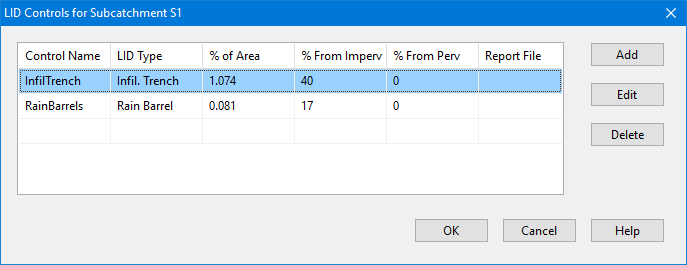

**C.16** **LID Group Editor ** The LID Group Editor is invoked when the LID Controls property of a Subcatchment is selected for editing. It is used to identify a group of previously defined LID controls that will be placed within the subcatchment, the sizing of each control, and what percent of runoff from the non-LID portion of the subcatchment each should treat.

The editor displays the current group of LIDs placed in the subcatchment along with buttons for adding an LID unit, editing a selected unit, and deleting a selected unit. These actions can also be chosen by hitting the **Insert** key, the **Enter** key, and the **Delete** key, respectively. Selecting **Add** or **Edit** will bring up an LID Usage Editor where one can enter values for the data fields shown in the Group Editor. Note that the total **% of Area** for all of the LID units within a subcatchment must not exceed 100%. The same applies to **% From Impervious** and **% From Pervious**. Refer to the LID Usage Editor for the meaning of these parameters.