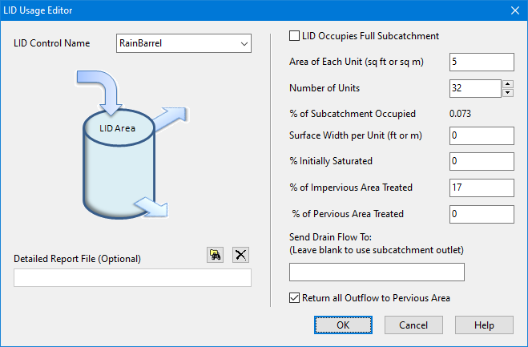

**C.17** **LID Usage Editor ** The LID Usage Editor is invoked from a subcatchment's LID Group Editor to specify how a particular LID control will be deployed within the subcatchment. It contains the following data entry fields:

**Control Name ** The name of a previously defined LID control to be used in the subcatchment. **LID Occupies Full Subcatchment ** Select this checkbox option if the LID control occupies the full subcatchment (i.e., the LID is placed in its own separate subcatchment and accepts runoff from upstream subcatchments). **Area of Each Unit ** The surface area devoted to each replicate LID unit (sq. ft or sq. m). If the **LID Occupies Full ** **Subcatchment** box is checked, then this field becomes disabled and will display the total subcatchment area divided by the number of replicate units.  (See Section 3.3.16 for options on placing LIDs within subcatchments.) The label below this field indicates how much of the total subcatchment area is devoted to the particular LID being deployed and gets updated as changes are made to the number of units and area of each unit.

**Number of Replicate Units ** The number of equal size units of the LID practice (e.g., the number of rain barrels) deployed within the subcatchment.

**Surface Width Per Unit ** The width of the outflow face of each identical LID unit (in ft or m). This parameter applies to roofs, pavement, trenches, and swales that use overland flow to convey surface runoff off of the unit. It can be set to 0 for other LID processes, such as bio-retention cells, rain gardens, and rain barrels that simply spill any excess captured runoff over their berms.

**% Initially Saturated ** For LID units with a soil layer this is the degree to which the layer is initially filled with water (0 % saturation corresponds to the wilting point moisture content, 100 % saturation has the moisture content equal to the porosity). For units with a storage layer it corresponds to the initial depth of water in the layer.

**% of Impervious Area Treated ** The percent of the impervious portion of the subcatchment's non-LID area whose runoff is treated by the LID practice. (E.g., if rain barrels are used to capture roof runoff and roofs represent 60% of the impervious area, then the impervious area treated is 60%). If the LID unit treats only direct rainfall, such as with a green roof or roof disconnection, then this value should be 0. If the LID unit takes up the entire subcatchment then this field is ignored.

**% of Pervious Area Treated ** The percent of the pervious portion of the subcatchment's non-LID area whose runoff is treated by the LID practice. If the LID unit treats only direct rainfall, such as with a green roof or roof disconnection, then this value should be 0. If the LID unit takes up the entire subcatchment then this field is ignored.

**Send Drain Flow To ** Provide the name of the Node or Subcatchment that receives any drain flow produced by the LID unit. This field can be left blank if this flow goes to the same outlet as the LID unit’s subcatchment.

**Return All Outflow to Pervious Area ** Select this option if outflow from the LID unit should be routed back onto the pervious area of the subcatchment that contains it. If drain outflow was selected to be routed to a different location than the subcatchment outlet then only surface outflow will be returned. Otherwise both surface and drain flow will be returned. Selecting this option would be a common choice to make for Rain Barrels, Rooftop Disconnection and possibly Green Roofs.

**Detailed Report File ** The name of an optional file where detailed time series results for the LID will be written. Click

the browse button to select a file using the standard Windows File Save dialog or click the

delete button to remove any detailed reporting. The detailed report file will be a tab delimited text file that can be easily opened and viewed with any text editor or spreadsheet program (such as Microsoft Excel) outside of SWMM.

If the subcatchment containing the LID internally routes some portion of the impervious area runoff onto the pervious area then the percent of impervious area treated by the LID unit refers to the remaining impervious area that is not internally routed. For example, if the subcatchment has 2 acres of impervious area with runoff from 50% of this area routed onto its pervious area then an LID unit which treats 20% of the impervious area would receive runoff from 0.2 acres of impervious area. This same convention applies to the percent of pervious area treated when there is internal routing from pervious to impervious areas.