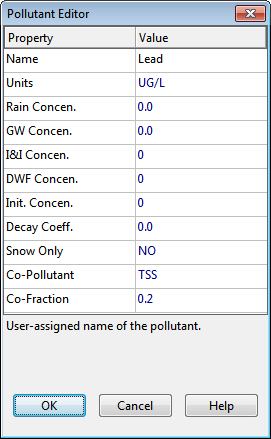

**C.18** **Pollutant Editor ** The Pollutant Editor is invoked when a new pollutant object is created or an existing pollutant is selected for editing. It contains the following fields:

**Name ** The name assigned to the pollutant. **Units ** The concentration units (mg/L, ug/L, or #/L (counts/L)) in which the pollutant concentration is expressed. **Rain Concentration ** Concentration of the pollutant in rain water (concentration units). **GW Concentration ** Concentration of the pollutant in ground water (concentration units).

**Initial Concentration ** Concentration of the pollutant throughout the conveyance system at the start of the simulation. **I&I Concentration ** Concentration of the pollutant in any rainfall-dependent infiltration and inflow (concentration units). **DWF Concentration ** Concentration of the pollutant in any dry weather sanitary flow (concentration units). This value can be overridden for any specific node of the conveyance system by editing the node's Inflows property. **Decay Coefficient ** First-order decay coefficient of the pollutant (1/days). **Snow Only ** **YES** if pollutant buildup occurs only when there is snow cover, **NO** otherwise (default is **NO**). **Co-Pollutant ** Name of another pollutant whose runoff concentration contributes to the runoff concentration of the current pollutant. **Co-Fraction ** Fraction of the co-pollutant's runoff concentration that contributes to the runoff concentration of the current pollutant. An example of a co-pollutant relationship would be where the runoff concentration of a particular heavy metal is some fixed fraction of the runoff concentration of suspended solids. In this case suspended solids would be declared as the co-pollutant for the heavy metal.