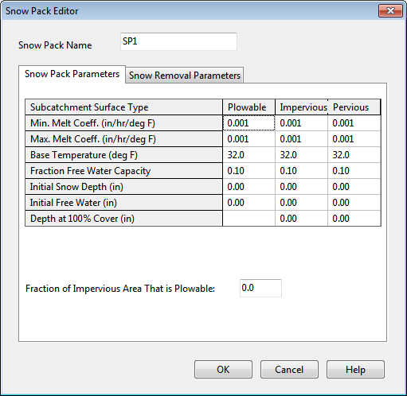
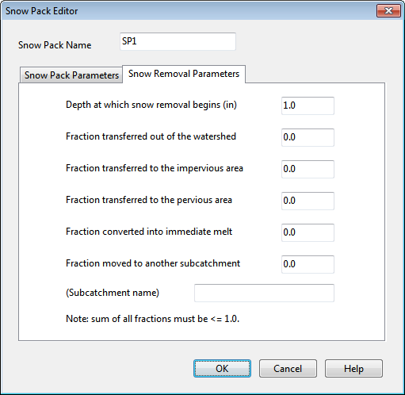

**C.19** **Snow Pack Editor ** The Snow Pack Editor is invoked when a new snow pack object is created or an existing snow pack is selected for editing. The editor contains a data entry field for the snow pack’s name and two tabbed pages, one for snow pack parameters and one for snow removal parameters.

Snow Pack Parameters Page The Parameters page of the Snow Pack Editor dialog provides snow melt parameters and initial conditions for snow that accumulates over three different types of areas: the impervious area that is plowable (i.e., subject to snow removal), the remaining impervious area, and the entire pervious area. The page contains a data entry grid which has a column for each type of area and a row for each of the following parameters:

**Minimum Melt Coefficient ** The degree-day snow melt coefficient that occurs on December 21. Units are either in/hr-deg F or mm/hr-deg C. **Maximum Melt Coefficient ** The degree-day snow melt coefficient that occurs on June 21. Units are either in/hr-deg F or mm/hr-deg C. For a short term simulation of less than a week or so it is acceptable to use a single value for both the minimum and maximum melt coefficients. The minimum and maximum snow melt coefficients are used to estimate a melt coefficient that varies by day of the year. The latter is used in the following degree-day equation to compute the melt rate for any particular day:

Melt Rate = (Melt Coefficient)  (Air Temperature – Base Temperature). **Base Temperature ** Temperature at which snow begins to melt (degrees F or C). **Fraction Free Water Capacity ** The volume of a snow pack's pore space which must fill with melted snow before liquid runoff from the pack begins, expressed as a fraction of snow pack depth. **Initial Snow Depth ** Depth of snow at the start of the simulation (water equivalent depth in inches or millimeters). **Initial Free Water ** Depth of melted water held within the pack at the start of the simulation (inches or mm). This number should be at or below the product of the initial snow depth and the fraction free water capacity. **Depth at 100% Cover ** The depth of snow beyond which the entire area remains completely covered and is not subject to any areal depletion effect (inches or mm). **Fraction of Impervious Area That is Plowable ** The fraction of impervious area that is plowable and therefore is not subject to areal depletion.

Snow Removal Parameters Page

The Snow Removal page of the Snow Pack Editor describes how snow removal occurs within the Plowable area of a snow pack. The following parameters govern this process: **Depth at which snow removal begins (in or mm) ** Depth which must be reached before any snow removal begins. **Fraction transferred out of the watershed ** The fraction of snow depth that is removed from the system (and does not become runoff). **Fraction transferred to the impervious area ** The fraction of snow depth that is added to snow accumulation on the pack's impervious area. **Fraction transferred to the pervious area ** The fraction of snow depth that is added to snow accumulation on the pack's pervious area.

**Fraction converted to immediate melt ** The fraction of snow depth that becomes liquid water which runs onto any subcatchment associated with the snow pack.

**Fraction moved to another subcatchment ** The fraction of snow depth which is added to the snow accumulation on some other subcatchment. The name of the subcatchment must also be provided.

The various removal fractions must add up to 1.0 or less. If less than 1.0, then some remaining fraction of snow depth will be left on the surface after all of the redistribution options are satisfied.