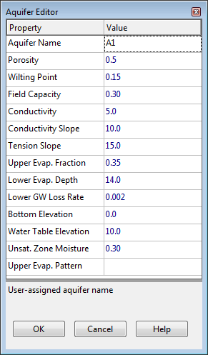

### Appendix C **SPECIALIZED PROPERTY EDITORS **

**C.1** **Aquifer Editor **

The Aquifer Editor is invoked whenever a new aquifer object is created or an existing aquifer object is selected for editing. It contains the following data fields:

**Aquifer Name ** User-assigned aquifer name.

**Porosity ** Volume of voids / total soil volume (volumetric fraction).

**Wilting Point ** Volume of pore water relative to total volume for a well dried soil where only bound water remains. The moisture content of the soil cannot fall below this limit.

**Field Capacity ** Volume of pore water relative to total volume after the soil has been allowed to drain fully. Below this level, vertical drainage of water through the soil layer does not occur.

**Conductivity ** Soil's saturated hydraulic conductivity (in/hr or mm/hr).

**Conductivity Slope ** Average slope of log(conductivity) versus soil moisture deficit (porosity minus moisture content) curve (unitless).

**Tension Slope ** Average slope of soil tension versus soil moisture content curve (inches or mm).

**Upper Evaporation Fraction ** Fraction of total evaporation available for evapotranspiration in the upper unsaturated zone.

**Lower Evaporation Depth ** Maximum depth below the surface at which evapotranspiration from the lower saturated zone can still occur  (ft or m).

**Lower Groundwater Loss Rate ** Rate of percolation to deep groundwater when the water table reaches the ground surface (in/hr or mm/hr).

**Bottom Elevation ** Elevation of the bottom of the aquifer (ft or m).

**Water Table Elevation ** Elevation of the water table in the aquifer at the start of the simulation (ft or m).

**Unsaturated Zone Moisture ** Moisture content of the unsaturated upper zone of the aquifer at the start of the simulation (volumetric fraction) (cannot exceed soil porosity).

**Upper Evaporation Pattern ** Name of the monthly time pattern of adjustments applied to the upper evaporation fraction (optional – leave blank if not applicable).