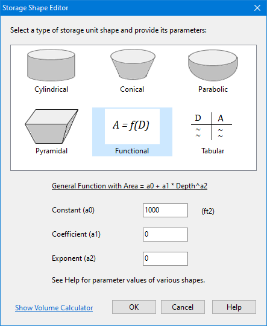

**C.20** **Storage Shape Editor ** The Storage Shape Editor is used to describe how a storage unit's surface area varies with depth above the bottom of the unit. It is invoked when the Storage Shape property of a storage node is selected for editing (see Section B.6).There are six types of shapes one can choose from:

Cylindrical The storage unit has vertical sides and an elliptical base. The equation for surface area A is:

𝐴𝐴= (𝜋𝜋4 ⁄ )𝐿𝐿𝐿𝐿

where L = base major axis length and W = base minor axis width. If only the surface area is known then one can use the Functional storage option instead.

Conical The storage unit is shaped as a truncated elliptical cone. The equation for surface area A as a function of water depth D is:

𝐴𝐴= 𝜋𝜋[𝐿𝐿(𝑊𝑊4 ⁄ ) + 𝑊𝑊𝑊𝑊𝑊𝑊+ (𝑊𝑊𝐿𝐿 ⁄ )(𝑍𝑍𝑍𝑍)2]

where L = base major axis length, W = base minor axis width and Z = side slope (run / rise) of a vertical slice through the major axis. Parabolic The storage unit has the shape of an elliptical paraboloid. The equation for surface area A as a function of water depth D is:

𝐴𝐴= (𝜋𝜋4 ⁄ )𝐿𝐿(𝑊𝑊𝐻𝐻 ⁄ )𝐷𝐷

where L = major axis length at height H and W = minor axis width at height H. This shape can also be described using the Functional storage option. Pyramidal This is for storage units shaped as a truncated rectangular pyramid or a rectangular box. The equation for surface area A as a function of water depth D is:

𝐴𝐴= 𝐿𝐿𝐿𝐿+ 2(𝐿𝐿+ 𝑊𝑊)𝑍𝑍𝑍𝑍+ (2𝑍𝑍𝑍𝑍)2

where L = base length, W = base width and Z = side slope (run / rise) (which would be 0 for a box). Functional The following general function is used to relate surface area A to water depth D:

𝐴𝐴= 𝑎𝑎0 + 𝑎𝑎1𝐷𝐷𝑎𝑎2

where a0, a1, and a2 are user supplied coefficients. The coefficient values for some particular types of shapes are as follows:

- Shapes with vertical sides (such as a cylinder or rectangular prism): *a0 *= area of the base *a1 = a2 = 0 *

- Open channel with a trapezoidal cross-section and vertical ends (i.e., a trapezoidal prism): 𝑎𝑎0 = 𝑊𝑊𝑊𝑊 𝑎𝑎1 = 2𝑍𝑍𝑍𝑍 𝑎𝑎2 = 1 where W = bottom width of cross-section, L = channel length, and Z = side slope.

- Open channel with a parabolic cross-section and vertical ends: *a0 = 0 * 𝑎𝑎1 = 𝑊𝑊𝑊𝑊𝐻𝐻0.5 *a2 = 1 * where *W* = top width, *L* = channel length and *H* = full height.

- Elliptical paraboloid: *a0 = 0 * 𝑎𝑎1 = 𝜋𝜋𝜋𝜋𝑊𝑊𝐻𝐻 ⁄ *a2 = 1 * where *L* is the length of the major axis and *W* the length of the minor axis at full height *H*.

- Circular non-truncated cone: *a0 = 0 * 𝑎𝑎1 = (𝜋𝜋4 ⁄ )(𝑊𝑊𝐻𝐻 ⁄ )2 *a2 = 2 * where *W* is the cone's diameter at height *H*. Tabular This option uses a tabular Storage Curve to relate surface area to depth. It can represent natural depressions with irregular shaped contour intervals, spheroid storage vessels or conventional shapes with different base sizes stacked on top of one another. The first point supplied to the curve should be the surface area of the unit's base at a depth of 0. Otherwise it will be assumed that the unit has zero surface area at its base. The curve will be extrapolated outwards to meet the unit's maximum depth if need be. For each of these options, depth is measured in feet and surface area in square feet for US units, while meters and square meters, respectively, are used for SI units. Clicking the Show Volume Calculator label will display a panel where one can see what the surface area and stored volume will be for a specified water depth for the currently selected storage shape.