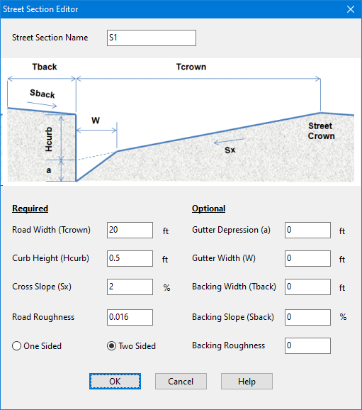

**C.21** **Street Section Editor ** The Street Section Editor is used to define the dimensions of a street or roadway cross-section. It is invoked when a new Street object is created or an existing one is selected for editing.

The editor asks that the following dimensions be provided for the portion of the street extending from the high point of the roadway to the curb and beyond to any backing that might exist: **Street Section Name ** The name assigned to the street cross-section. Conduits with a Street shape cross-section will refer to this name to identify its cross-section dimensions.

**Road Width (Tcrown) ** The distance from the curb to the high point of the street roadway (i.e., the street crown) (feet or meters). Traffic lanes are typically 10 to 12 feet (3.3 to 3.7 meters) wide with gutters being 1 to 3 feet (0.3 to 1 meter) wide.

**Curb Height (Hcurb) ** The height of the curb with respect to the street's cross slope (feet or meters). Typical heights are 0.33 to 0.67 feet (0.1 to 0.2 meters) with 0.5 feet (0.15 meters) being standard in the U.S.

**Cross Slope (Sx) ** The slope of the roadway portion of the cross-section (percent). Cross slopes range between 1 to 4 percent with 2 percent being a common value.

**Road Roughness ** Manning's roughness coefficient (*n*) for the road surface. Typical values range from 0.013 to 0.017.

**One or Two Sided ** Select One Sided if the street section extends only to the street crown or Two Sided if the same street section shape exists on the opposite side of the street crown.

**Gutter Depression (a) ** The distance that the gutter portion of the street is depressed below where the cross slope of the roadway would intersect the curb (feet or meters). Depressed gutter sections increase the conveyance capacity of a street. A typical value would be 0.17 feet (2 inches or 0.05 meters). Conventional gutters maintain the same slope as the roadway and would therefore have a 0 depression depth.

**Gutter Width (W) ** The width between the curb and the roadway for a depressed gutter (feet or meters). A typical value would be 2 feet (0.6 meters). For conventional gutters with no depression depth use a value of 0.

**Backing Width (Tback) ** The width of the area that the street backs up against (such as a sidewalk or lawn area) (feet or meters). Enter 0 if there is no backing.

**Backing Slope (Sback) ** The slope of the backing area (percent). If the backing width is non-zero then this must be a positive number. Otherwise it is ignored.

**Backing Roughness ** Manning's roughness coefficient (*n*) for the backing's surface. This parameter is ignored if the backing width is 0.