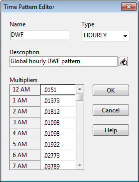

**C.22** **Time Pattern Editor ** The Time Pattern Editor is invoked when a new time pattern object is created or an existing time pattern is selected for editing.

The editor contains that following data entry fields: **Name ** The name assigned to the time pattern. **Type ** The type of time pattern being specified. The choices are Monthly, Daily, Hourly and Weekend Hourly. **Description ** Provide an optional comment or description for the time pattern. If more than one line is needed,

click the button to launch a multi-line comment editor. **Multipliers ** Enter a value for each multiplier. The number and meaning of the multipliers changes with the type of time pattern selected:

- MONTHLY One multiplier for each month of the year.  DAILY One multiplier for each day of the week.

- HOURLY One multiplier for each hour from 12 midnight to 11 PM.  WEEKEND Same as for HOURLY except applied to weekend days.

In order to maintain an average dry weather flow or pollutant concentration at its specified value (as entered on the Inflows Editor), the multipliers for a pattern should average to 1.0.