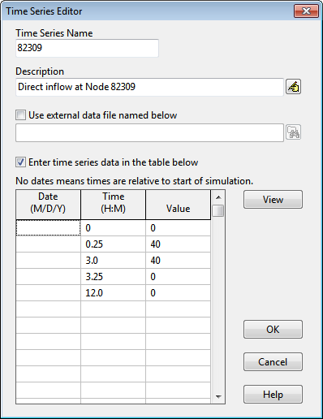

**C.23** **Time Series Editor ** The Time Series Editor is invoked whenever a new time series object is created or an existing time series is selected for editing.

To use the Time Series Editor:

**1.** Enter values for the following standard items:

*Name* Name of the time series.

*Description* Optional comment or description of what the time series represents.

Click the button to launch a multi-line comment editor if more than one line is needed.

**2.** Select whether to use an external file as the source of the data or to enter the data directly into the form's data entry grid.

**3.** If the external file option is selected, click the button to locate the file's name. The file's contents must be formatted in the same manner as the direct data entry option discussed below. See the description of Time Series Files in Section 11.6 for details.

**4.** For direct data entry, enter values in the data entry grid as follows:

*Date Column* Optional date (in month/day/year format) of the time series values (only needed at points in time where a new date occurs).

*Time Column* If dates are used, enter the military time of day for each time series value (as hours:minutes or decimal hours). If dates are not used, enter time as hours since the start of the simulation.

*Value Column* The time series’ numerical values.

A graphical plot of the data in the grid can be viewed in a separate window by clicking the **View** button. Right clicking over the grid will make a popup Edit menu appear. It contains commands to cut, copy, insert, and paste selected cells in the grid as well as options to insert or delete a row.

**5.** Press **OK** to accept the time series or **Cancel** to cancel the edits.

Note that there are two methods for describing the occurrence time of time series data:

- as calendar date/time of day (which requires that at least one date, at the start of the series,  be entered in the Date column)

- as elapsed hours since the start of the simulation (where the Date column remains empty).

For rainfall time series, it is only necessary to enter periods with non-zero rainfall amounts. SWMM interprets the rainfall value as a constant value lasting over the recording interval specified for the rain gage which utilizes the time series. For all other types of time series, SWMM uses interpolation to estimate values at times that fall in between the recorded values.