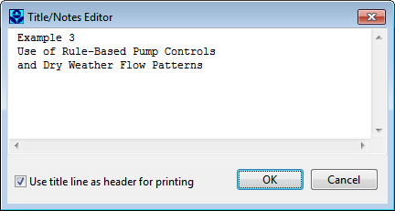

**C.24** **Title/Notes Editor ** The Title/Notes editor is invoked when a project’s Title/Notes data category is selected for editing. As shown below, the editor contains a multi-line edit field where a description of a project can be entered. It also contains a check box used to indicate whether or not the first line of notes should be used as a header for printing.

