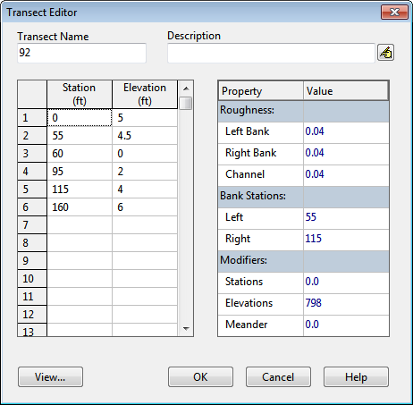

**C.25** **Transect Editor**

The Transect Editor is invoked when a new transect object is created or an existing transect is selected for editing. It contains the following data entry fields:

**Name ** The name assigned to the transect.

**Description ** An optional comment or description of the transect.

**Station/Elevation Data Grid ** Values of distance from the left side of the channel along with the corresponding elevation of the channel bottom as one moves across the channel from left to right, looking in the downstream direction. Up to 1500 data values can be entered.

**Roughness ** Values of Manning's roughness coefficient (*n*) for the left overbank, right overbank, and main channel portion of the transect. The overbank roughness values can be zero if no overbank exists. **Bank Stations ** The distance values appearing in the Station/Elevation grid that mark the end of the left overbank and the start of the right overbank. Use 0 to denote the absence of an overbank. **Modifiers **

- The Stations modifier is a factor by which the distance between each station will be multiplied when the transect data is processed by SWMM. Use a value of 0 if no such factor is needed.

- The Elevations modifier is a constant value that will be added to each elevation value.

- The Meander modifier is the ratio of the length of a meandering main channel to the length of the overbank area that surrounds it. This modifier is applied to all conduits that use this particular transect for their cross-section. It assumes that the length supplied for these conduits is that of the longer main channel. SWMM will use the shorter overbank length in its calculations while increasing the main channel roughness to account for its longer length. The modifier is ignored if it is left blank or set to 0. Right-clicking over the Data Grid will make a popup Edit menu appear. It contains commands to cut, copy, insert, and paste selected cells in the grid as well as options to insert or delete a row. Clicking the **View** button will bring up a window that illustrates the shape of the transect cross- section.