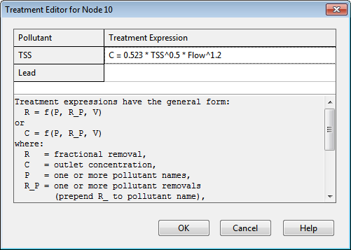

**C.26** **Treatment Editor**

The Treatment Editor is invoked whenever the Treatment property of a node is selected from the Property Editor. It displays a list of the project's pollutants with an edit box next to each as shown below. Enter a valid treatment expression in the box next to each pollutant which receives treatment.

A treatment function can be any well-formed mathematical expression involving:

- the pollutant concentration (use the pollutant name to represent its concentration) – for non-storage nodes this is the mixture concentration of all flow streams entering the node while for storage nodes it is the pollutant concentration within the node’s stored volume

- the removals of other pollutants (use** R_** prefixed to the pollutant name to represent removal)

- any of the following process variables:

-** FLOW** for flow rate into node (in user-defined flow units)

-** DEPTH** for water depth above node invert (ft or m)

-** AREA** for node surface area (ft2 or m2)

-** DT** for routing time step (sec)

-** HRT** for hydraulic residence time (hours)

Any of the following math functions (which are case insensitive) can be used in a treatment expression:

- abs(x) for absolute value of x

- sgn(x) which is +1 for x >= 0 or -1 otherwise

- step(x) which is 0 for x <= 0 and 1 otherwise

- sqrt(x) for the square root of x

- log(x) for logarithm base e of x

- log10(x) for logarithm base 10 of x

- exp(x) for e raised to the x power

- the standard trig functions (sin, cos, tan, and cot)

- the inverse trig functions (asin, acos, atan, and acot)

- the hyperbolic trig functions (sinh, cosh, tanh, and coth)

along with the standard operators +, -, , /, ^ (for exponentiation ) and any level of nested parentheses.

Care must be taken to avoid circular references when specifying treatment functions.  For example, the expression R = 0.75  R_TSS would not be computable if it were

used to compute fractional removal of TSS.