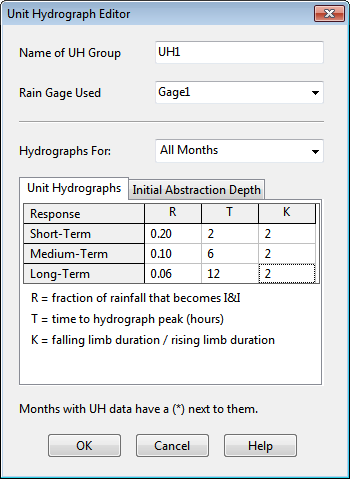

**C.27** **Unit Hydrograph Editor**

The Unit Hydrograph Editor is invoked whenever a new unit hydrograph object is created or an existing one is selected for editing. It is used to specify the shape parameters and rain gage for a group of triangular unit hydrographs. These hydrographs are used to compute rainfall-dependent infiltration and inflow (RDII) flow at selected nodes of the drainage system.

A UH group can contain up to 12 sets of unit hydrographs (one for each month of the year), and each set can consist of up to 3 individual hydrographs (for short-term, intermediate-term, and long-term responses, respectively) as well as parameters that describe any initial abstraction losses. The editor contains the following data entry fields:

**Name of UH Group ** Enter the name assigned to the UH Group.

**Rain Gage Used ** Type in (or select from the dropdown list) the name of the rain gage that supplies rainfall data to the unit hydrographs in the group.

**Hydrographs For: ** Select a month from the dropdown list box for which hydrograph parameters will be defined. Select All Months to specify a default set of hydrographs that apply to all months of the year. Then select specific months that need to have special hydrographs defined. Months listed with a () next to them have had hydrographs assigned to them.

**Unit Hydrographs ** Select this tab to provide the R-T-K shape parameters for each set of unit hydrographs in selected months of the year. The first row is used to specify parameters for a short-term response hydrograph (i.e., small value of T), the second for a medium-term response hydrograph, and the third for a long-term response hydrograph (largest value of T). It is not required that all three hydrographs be defined and the sum of the three R-values do not have to equal 1. The shape parameters for each UH consist of:

- *R*: the fraction of rainfall volume that enters the sewer system

- *T*: the time from the onset of rainfall to the peak of the UH in hours

- *K*: the ratio of time to recession of the UH to the time to peak

**Initial Abstraction Depth ** Select this tab to provide parameters that describe how rainfall will be reduced by any initial abstraction depth available (i.e., interception and depression storage) before it is processed through the unit hydrographs defined for a specific month of the year. Different initial abstraction parameters can be assigned to each of the three unit hydrograph responses. These parameters are:

- *Dmax*: the maximum depth of initial abstraction available (in rain depth units)

- *Drec*: the rate at which any utilized initial abstraction is made available again (in rain depth units per day)

- *Do*: the amount of initial abstraction that has already been utilized at the start of the simulation (in rain depth units).

If a grid cell is left empty its corresponding parameter value is assumed to be 0. Right-clicking over a data entry grid will make a popup Edit menu appear. It contains commands to cut, copy, and paste text to or from selected cells in the grid.