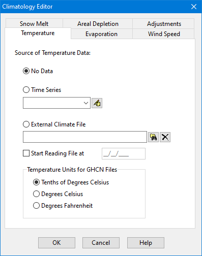
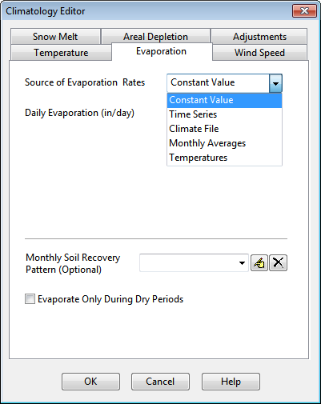
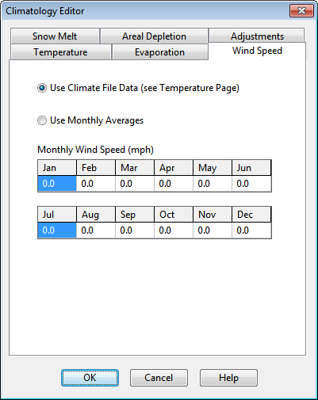
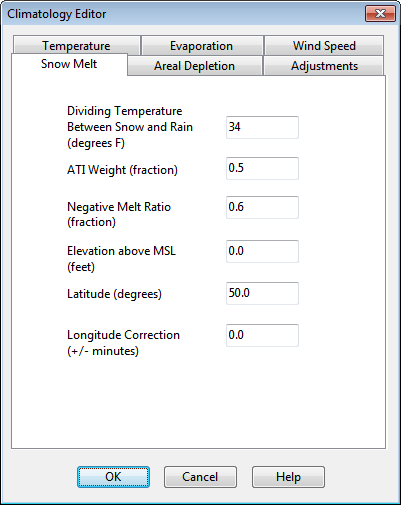
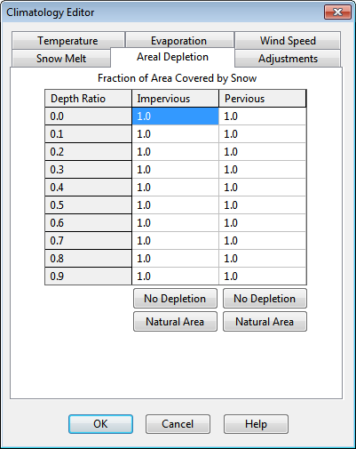
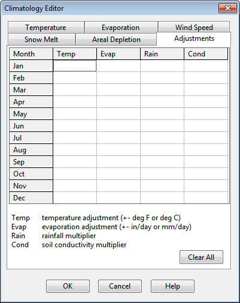

**C.2** **Climatology Editor ** The Climatology Editor is used to enter values for various climate-related variables required by certain SWMM simulations. The dialog is divided into six tabbed pages, where each page provides a separate editor for a specific category of climate data. Temperature Page

The Temperature page of the Climatology Editor dialog is used to specify the source of temperature data used for snowmelt computations. It is also used to select a climate file as a possible source for evaporation rates. There are three choices available:

- **No Data** Select this choice if snowmelt is not being simulated and evaporation rates are not based on data in a climate file.

- **Time Series ** Select this choice if the variation in temperature over the simulation period will be described by one of the project's time series. Also, enter (or select) the name of the time series. Click

the button to make the Time Series Editor appear for the selected time series.

- **External Climate File ** Select this choice if min/max daily temperatures will be read from an external climate file (see Section 11.4). Also choose this option if you want daily evaporation rates to be estimated from daily temperatures or be read directly from the file. Then do the following:

- Click the button to search for a climate file or click the button to clear the file name.

- To start reading the climate file at a particular date in time that is different than the start date of the simulation (as specified in the Simulation Options), check off the “Start Reading File at” box and enter a starting date (month/day/year) in the date entry field next to it.

- If using a NOAA-GHCN file, specify the temperature units used by the file.

Evaporation Page

The Evaporation page of the Climatology Editor dialog is used to supply evaporation rates, in inches/day (or mm/day), for a study area. There are five choices for specifying these rates that are selected from the **Source of Evaporation Rates** combo box:

- **Constant Value** Use this choice if evaporation remains constant over time. Enter the value in the edit box provided.

- **Time Series ** Select this choice if evaporation rates will be specified in a time series. Enter or select the

name of the time series in the dropdown combo box provided. Click the button to bring up the Time Series editor for the selected series. Note that for each date specified in the time series, the evaporation rate remains constant at the value supplied for that date until the next date in the series is reached (i.e., interpolation is not used on the series).

- **Climate File ** This choice indicates that daily evaporation rates will be read from the same climate file that was specified for temperature. Enter values for monthly pan coefficients in the data grid provided (these are used to convert pan evaporation to actual evaporation and are typically on the order of 0.7).

- **Monthly Averages ** Use this choice to supply an average rate for each month of the year. Enter the value for each month in the data grid provided. Note that rates remain constant within each month.

- **Temperatures ** The Hargreaves method will be used to compute daily evaporation rates from the daily air temperature record contained in the external climate file specified on the Temperature page of the dialog. This method also uses the site’s latitude, which can be entered on the Snowmelt page of the dialog even if snowmelt is not being simulated.

- **Evaporate Only During Dry Periods: ** Select this option if evaporation can only occur during periods with no precipitation. In addition this page allows one to specify an optional **Monthly Soil Recovery Pattern**. This is a time pattern whose factors adjust the rate at which infiltration capacity is recovered during periods with no precipitation. It applies to all subcatchments for any choice of infiltration method. For example, if the normal infiltration recovery rate was 1% during a specific time period and a pattern factor of 0.8 applied to this period, then the actual recovery rate would be 0.8%. The Soil Recovery Pattern allows one to account for seasonal soil drying rates. In principle, the variation in pattern factors should mirror the variation in evaporation rates but might be influenced by other

factors such as seasonal groundwater levels. The button is used to launch the Time Pattern Editor for the selected pattern.

Wind Speed Page

The Wind Speed page of the Climatology Editor dialog is used to provide average monthly wind speeds. These are used when computing snowmelt rates under rainfall conditions. Melt rates increase with increasing wind speed. Units of wind speed are miles/hour for US units and km/hour for metric units. There are two choices for specifying wind speeds:

- **Climate File Data** Wind speeds will be read from the same climate file that was specified for temperature.

- **Monthly Averages** Wind speed is specified as an average value that remains constant in each month of the year. Enter a value for each month in the data grid provided. The default values are all zero.

Snowmelt Page

The Snowmelt page of the Climatology Editor dialog is used to supply values for the following parameters related to snowmelt calculations: **Dividing Temperature Between Snow and Rain ** Enter the temperature below which precipitation falls as snow instead of rain. Use degrees F for US units or degrees C for metric units. **ATI (Antecedent Temperature Index) Weight ** This parameter reflects the degree to which heat transfer within a snow pack during non-melt periods is affected by prior air temperatures. Smaller values reflect a thicker surface layer of snow which results in reduced rates of heat transfer. Values must be between 0 and 1, and the default is 0.5.

**Negative Melt Ratio ** This is the ratio of the heat transfer coefficient of a snow pack during non-melt conditions to the coefficient during melt conditions. It must be a number between 0 and 1. The default value is 0.6. **Elevation Above MSL ** Enter the average elevation above mean sea level for the study area, in feet or meters. This value is used to provide a more accurate estimate of atmospheric pressure. The default is 0.0, which results in a pressure of 29.9 inches Hg. The effect of wind on snowmelt rates during rainfall periods is greater at higher pressures, which occur at lower elevations. **Latitude ** Enter the latitude of the study area in degrees North. This number is used when computing the hours of sunrise and sunset, which in turn are used to extend min/max daily temperatures into continuous values. It is also used to compute daily evaporation rates from daily temperatures. The default is 50 degrees North. **Longitude Correction ** This is a correction, in minutes of time, between true solar time and the standard clock time. It

depends on a location's longitude (θ) and the standard meridian of its time zone (SM) through the

expression 4(θ-SM). This correction is used to adjust the hours of sunrise and sunset when extending daily min/max temperatures into continuous values. The default value is 0.

Areal Depletion Page

The Areal Depletion page of the Climatology Editor Dialog is used to specify points on the Areal Depletion Curves for both impervious and pervious surfaces within a project's study area. These curves define the relation between the area that remains snow covered and snow pack depth. Each curve is defined by 10 equal increments of relative depth ratio between 0 and 0.9. (Relative depth ratio is the ratio of an area's current snow depth to the depth at which there is 100% areal coverage).  Enter values in the data grid provided for the fraction of each area that remains snow covered at each specified relative depth ratio. Valid numbers must be between 0 and 1, and be increasing with increasing depth ratio. Clicking the **Natural Area** button fills the grid with values that are typical of natural areas. Clicking the **No Depletion** button will fill the grid with all 1's, indicating that no areal depletion occurs. This is the default for new projects.

Adjustments Page

The Adjustments page of the Climatology Editor Dialog is used to supply a set of monthly adjustments applied to the temperature, evaporation rate, rainfall, and soil hydraulic conductivity that SWMM uses at each time step of a simulation:

- The monthly Temperature adjustment (plus or minus in either degrees F or C) is added to the temperature value that SWMM would otherwise use in a specific month of the year.

- The monthly Evaporation adjustment (plus or minus in either in/day or mm/day) is added to the evaporation rate value that SWMM would otherwise use in a specific month of the year.

- The monthly Rainfall adjustment is a multiplier applied to the precipitation value that SWMM would otherwise use in a specific month of the year.

- The monthly Conductivity adjustment is a multiplier applied to the soil hydraulic conductivity used compute rainfall infiltration, groundwater percolation, and exfiltration from channels and storage units.

The same adjustment is applied for each time period within a given month and is repeated for that month in each subsequent year being simulated. Leaving a monthly adjustment blank means that there is no adjustment made in that month.