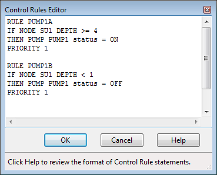
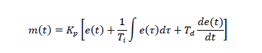

**C.3** **Control Rules Editor ** The Control Rules Editor is invoked whenever a new control rule is created or an existing rule is selected for editing. The editor contains a memo field where the entire collection of control rules is displayed and can be edited.

Control Rule Format Each control rule is a series of statements of the form: **RULE**  ruleID **IF**    condition_1 **AND**   condition_2 **OR**    condition_3 **AND**   condition_4 Etc. **THEN**  action_1 **AND**   action_2 Etc. **ELSE**  action_3 **AND**   action_4 Etc. **PRIORITY** value where keywords are shown in boldface and ruleID is an ID label assigned to the rule, condition_n is a Condition Clause, action_n is an Action Clause, and value is a priority

value (e.g., a number from 1 to 5). The formats used for Condition and Action clauses are discussed below. Only the RULE, IF and THEN portions of a rule are required; the ELSE and PRIORITY portions are optional. Blank lines between clauses are permitted and any text to the right of a semicolon is considered a comment. When mixing AND and OR clauses, the OR operator has higher precedence than AND, i.e.,

IF A or B and C is equivalent to

IF (A or B) and C. If the interpretation was meant to be

IF A or (B and C) then this can be expressed using two rules as in

IF A THEN ... IF B and C THEN ... The PRIORITY value is used to determine which rule applies when two or more rules require

that conflicting actions be taken on a link. A conflicting rule with a higher priority value has precedence over one with a lower value (e.g., PRIORITY 5 outranks PRIORITY 1). A rule without a priority value always has a lower priority than one with a value. For two rules with the same priority value, the rule that appears first is given the higher priority. Condition Clauses A Condition Clause of a control rule has the following formats:

object id attribute relation value object id attribute relation object id attribute

where:

object = a category of object

id = the object's ID name attribute = an attribute or property of the object relation = a relational operator (=, <>, <, <=, >, >=)

value = an attribute value

Some examples of condition clauses are:

GAGE  G1   6-HR_DEPTH > 0.5 NODE  N23  DEPTH  >  10 NODE  N23  DEPTH  >  NODE N25 DEPTH PUMP  P45  STATUS =  OFF SIMULATION CLOCKTIME = 22:45:00

The objects and attributes that can appear in a condition clause are as follows:

**Object ** **Attributes ** **Value **

**GAGE ** INTENSITY n-HR_DEPTH numerical value

DEPTH

**NODE **

MAXDEPTH HEAD numerical value

VOLUME INFLOW

FLOW FULLFLOW DEPTH MAXDEPTH numerical value

**LINK ****or** VELOCITY

**CONDUIT ** LENGTH SLOPE

STATUS OPEN or CLOSED

TIMEOPEN TIMECLOSED decimal hours or hr:min

STATUS ON or OFF

SETTING pump curve multiplier

**PUMP **

FLOW numerical value

**ORIFICE** SETTING fraction open

**WEIR ** SETTING fraction open

**OUTLET ** SETTING rating curve multiplier

in decimal hours or

TIME elapsed time hr:min:sec

DATE month/day/year

**SIMULATION **

MONTH month of year (January = 1)

DAY day of week (Sunday = 1)

CLOCKTIME time of day in hr:min:sec

Gage INTENSITY is the rainfall intensity for a specific rain gage in the current simulation time period. Gage n-HR_DEPTH is a gage's total rainfall depth over the past n hours where n is a number between 1 and 48.

TIMEOPEN is the duration a link has been in an OPEN or ON state or have its SETTING be greater than zero; TIMECLOSED is the duration it has remained in a CLOSED or OFF state or have its

SETTING be zero. Both TIMEOPEN and TIMECLOSED apply to all link objects, including pumps, orifices, weirs, and outlets.

Action Clauses

An Action Clause of a control rule can have one of the following formats:

**CONDUIT **id** STATUS = OPEN/CLOSED ** **PUMP** id **STATUS** = **ON/OFF** **PUMP/ORIFICE/WEIR/OUTLET** id **SETTING** = value

where the meaning of SETTING depends on the object being controlled:

- for Pumps it is a multiplier applied to the flow computed from the pump curve (for a Type5 pump curve it is a relative speed setting that shifts the curve up or down),

- for Orifices it is the fractional amount that the orifice is fully open,

- for Weirs it is the fractional amount of the original freeboard that exists (i.e., weir control is accomplished by moving the crest height up or down),

- for Outlets it is a multiplier applied to the flow computed from the outlet's rating curve.

Some examples of action clauses are:

PUMP P67 STATUS = OFF ORIFICE O212 SETTING = 0.5

Modulated Controls

Modulated controls are control rules that provide for a continuous degree of control applied to a pump or flow regulator as determined by the value of some controller variable, such as water depth at a node, or by time. The functional relation between the control setting and the controller variable can be specified by using a Control Curve, a Time Series, or a PID Controller. Some examples of modulated control rules are:

RULE MC1 IF NODE N2 DEPTH >= 0

THEN WEIR W25 SETTING = CURVE C25

RULE MC2 IF SIMULATION TIME > 0 THEN PUMP P12 SETTING = TIMESERIES TS101

RULE MC3 IF LINK L33 FLOW <> 1.6 THEN ORIFICE O12 SETTING = PID 0.1 0.0 0.0

Note how a modified form of the action clause is used to specify the name of the control curve, time series or PID parameter set that defines the degree of control. A PID parameter set contains three values -- a proportional gain coefficient, an integral time (in minutes), and a derivative time (in minutes). Also, by convention the controller variable used in a Control Curve or PID Controller will always be the object and attribute named in the last condition clause of the rule. As an example, in rule MC1 above Curve C25 would define how the fractional setting at Weir W25 varied with the water depth at Node N2. In rule MC3, the PID controller adjusts the opening of Orifice O12 to maintain a flow of 1.6 in Link L33.

PID Controllers

A PID (Proportional-Integral-Derivative) Controller is a generic closed-loop control scheme that tries to maintain a desired set-point on some process variable by computing and applying a corrective action that adjusts the process accordingly. In the context of a hydraulic conveyance system a PID controller might be used to adjust the opening on a gated orifice to maintain a target flow rate in a specific conduit or to adjust a variable speed pump to maintain a desired depth in a storage unit. The classical PID controller has the form:

where m(t) = controller output, Kp = proportional coefficient (gain), Ti = integral time, Td = derivative time, e(t) = error (difference between setpoint and observed variable value), and t = time. The performance of a PID controller is determined by the values assigned to the coefficients Kp*, *Ti, and Td.

The controller output m(t) has the same meaning as a link setting used in a rule's Action Clause while dt is the current flow routing time step in minutes. Because link settings are relative values (with respect to either a pump's standard operating curve or to the full opening height of an orifice or weir) the error e(t) used by the controller is also a relative value. It is defined as the difference

between the control variable setpoint x and its value at time t*,* x(t), normalized to the setpoint value: e(t) = (x - x(t)) / x.

Note that for direct action control, where an increase in the link setting causes an increase in the controlled variable, the sign of Kp must be positive. For reverse action control, where the controlled variable decreases as the link setting increases, the sign of Kp must be negative. The user must recognize whether the control is direct or reverse action and use the proper sign on Kp accordingly. For example, adjusting an orifice opening to maintain a desired downstream flow is direct action. Adjusting it to maintain an upstream water level is reverse action. Controlling a pump to maintain a fixed wet well water level would be reverse action while using it to maintain a fixed downstream flow is direct action.

Named Variables

Named Variables are aliases used to represent the triplet of <object type | object id | object attribute> (or a doublet for Simulation times) that appear in the condition clauses of control rules. They allow condition clauses to be written as:

variable relation value variable relation variable

where variable is defined on a separate line before its first use in a rule using the format:

**VARIABLE**  name = object id attribute

Here is an example of using this feature:

VARIABLE  N123_Depth = NODE N123 DEPTH VARIABLE  N456_Depth = NODE N456 DEPTH VARIABLE  P45 = PUMP 45 STATUS

RULE 1 IF    N123_Depth > N456_Depth AND   P45 = OFF THEN  PUMP 45 STATUS = ON

RULE 2 IF   N123_Depth < 1 THEN PUMP 45 STATUS = OFF

A variable is not allowed to have the same name as an object attribute.

Aside from saving some typing, named variables are required when using arithmetic expressions in rule condition clauses.

Arithmetic Expressions In addition to a simple condition placed on a single variable, a control condition clause can also contain an arithmetic expression formed from several variables whose value is compared against. Thus the format of a condition clause can be extended as follows:

expression  relation  value expression  relation  variable

where expression is defined on a separate line before its first use in a rule using the format:

**EXPRESSION**  name = f(variable1, variable2, ...) The function f(...) can be any well-formed mathematical expression containing one or more

named variables as well as any of the following math functions (which are case insensitive) and operators:

- abs(x) for absolute value of x

- sgn(x) which is +1 for x >= 0 or -1 otherwise

- step(x) which is 0 for x <= 0 and 1 otherwise

- sqrt(x) for the square root of x

- log(x) for logarithm base e of x

- log10(x) for logarithm base 10 of x

- exp(x) for e raised to the x power

- the standard trig functions (sin, cos, tan, and cot)

- the inverse trig functions (asin, acos, atan, and acot)

- the hyperbolic trig functions (sinh, cosh, tanh, and coth)

- the standard operators  +, -, , /, ^ (for exponentiation ) and any level of nested parentheses. Here is an example of using this feature:

VARIABLE  P1_flow = LINK 1 FLOW VARIABLE  P2_flow = LINK 2 FLOW VARIABLE  O3_flow = Link 3 FLOW EXPRESSION Net_Inflow = (P1_flow + P2_flow)/2 - O3_flow RULE 1 IF   Net_Inflow > 0.1 THEN ORIFICE 3 SETTING = 1 ELSE ORIFICE 3 SETTING = 0.5