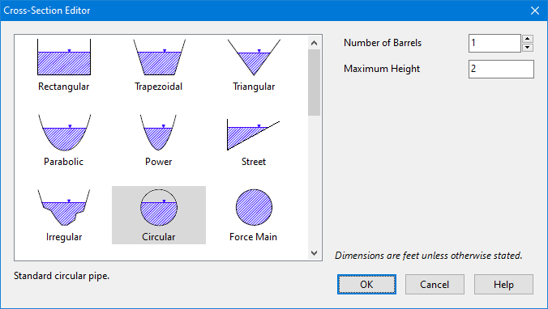
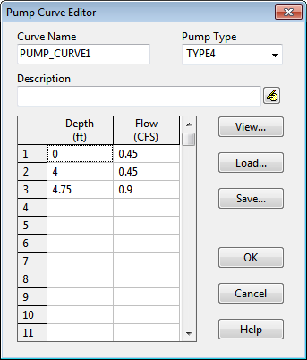

**C.4** **Cross-Section Editor ** The Cross-Section Editor dialog is used to specify the shape and dimensions of a conduit's cross- section.

When a shape is selected from the image list an appropriate set of edit fields appears for describing the dimensions of that shape. Length dimensions are in units of feet for US units and meters for SI units. Slope values represent ratios of horizontal to vertical distance. The Barrels field specifies how many identical parallel conduits exist between its end nodes. The **Force Main** shape option is a circular conduit that uses either the Hazen-Williams or Darcy- Weisbach formulas to compute friction losses for pressurized flow during Dynamic Wave flow routing. In this case the appropriate C-factor (for Hazen-Williams) or roughness height (for Darcy- Weisbach) is supplied as a cross-section property. The choice of friction loss equation is made on the Dynamic Wave Simulation Options dialog. Note that a conduit does not have to be assigned a Force Main shape for it to pressurize. Any of the other closed cross-section shapes can potentially pressurize and thus function as force mains using the Manning equation to compute friction losses. If a **Custom** shaped section is chosen, a drop-down edit box will appear where one can enter or select the name of a Shape Curve that will be used to define the geometry of the section. This curve specifies how the width of the cross-section varies with height, where both width and height are scaled relative to the section's maximum depth. This allows the same shape curve to be used

for conduits of differing sizes. Clicking the Edit button next to the shape curve box will bring up the Curve Editor where the shape curve's coordinates can be edited.

If a **Street** shaped section is chosen, a drop-down edit box will appear where one can enter or select the name of a Street object that describes the cross-section's geometry. Clicking the Edit

button next to the edit box will bring up the Street Section Editor where one can edit the street’s geometry.

If an **Irregular** shaped section is chosen, a drop-down edit box will appear where one can enter or select the name of a Transect object that describes the cross-section's geometry. Clicking the Edit

button next to the edit box will bring up the Transect Editor where one can edit the transect data.