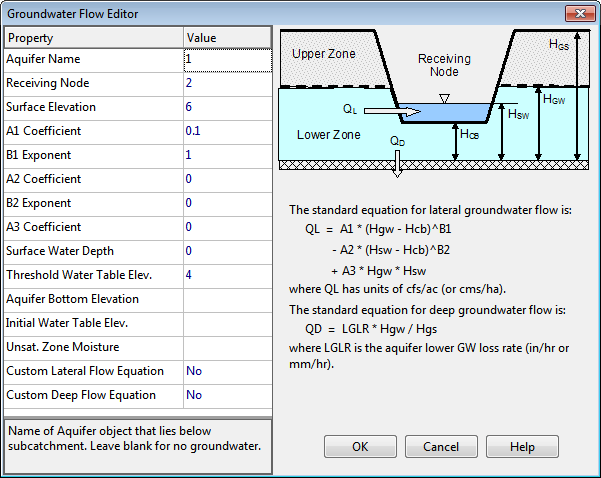
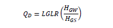

**C.6** **Groundwater Flow Editor ** The Groundwater Flow Editor dialog is invoked when the Groundwater property of a subcatchment is being edited. It is used to link a subcatchment to both an aquifer and to a node of the drainage system that exchanges groundwater with the aquifer.

The editor also specifies coefficients that determine the rate of lateral groundwater flow between the aquifer and the node. These coefficients (A1, A2, B1, B2, and A3) appear in the following equation that computes groundwater flow as a function of groundwater and surface water levels:

𝑄𝑄𝐿𝐿= 𝐴𝐴1(𝐻𝐻𝑔𝑔𝑔𝑔−𝐻𝐻𝑐𝑐𝑐𝑐)𝐵𝐵1 −𝐴𝐴2(𝐻𝐻𝑠𝑠𝑠𝑠−𝐻𝐻𝑐𝑐𝑐𝑐)𝐵𝐵2 + 𝐴𝐴3𝐻𝐻𝑔𝑔𝑔𝑔𝐻𝐻𝑠𝑠𝑠𝑠

where:

QL =   lateral groundwater flow (cfs per acre or cms per hectare) Hgw =   height of saturated zone above bottom of aquifer (ft or m) Hsw =   height of surface water at receiving node above aquifer bottom (ft or m) Hcb =   height of channel bottom above aquifer bottom (ft or m). Note that QL can also be expressed in inches/hr for US units.

The rate of percolation to deep groundwater, QD, in in/hr (or mm/hr) is given by the following equation:

where LGLR is the lower groundwater loss rate parameter assigned to the subcatchment's aquifer (in/hr or mm/hr) and HGS is the distance from the ground surface to the aquifer bottom (ft or m).

In addition to the standard lateral flow equation, the dialog allows one to define a custom equation whose results will be added onto those of the standard equation. One can also define a custom equation for deep groundwater flow that will replace the standard one. Finally, the dialog offers the option to override certain parameters that were specified for the aquifer to which the subcatchment belongs. The properties listed in the editor are as follows:

**Aquifer Name ** Name of the aquifer object that describes the subsurface soil properties, thickness, and initial conditions. Leave this field blank if you want the subcatchment not to generate any groundwater flow.

**Receiving Node ** Name of node that receives groundwater from the aquifer.

**Surface Elevation ** Elevation of ground surface for the subcatchment that lies above the aquifer in feet or meters.

**Groundwater Flow Coefficient ** Value of A1 in the groundwater flow formula.

**Groundwater Flow Exponent ** Value of B1 in the groundwater flow formula.

**Surface Water Flow Coefficient ** Value of A2 in the groundwater flow formula.

**Surface Water Flow Exponent ** Value of B2 in the groundwater flow formula.

**Surface-GW Interaction Coefficient ** Value of A3 in the groundwater flow formula.

**Surface Water Depth ** Fixed depth of surface water above receiving node’s invert (feet or meters). Set to zero if surface water depth will vary as computed by flow routing. **Threshold Water Table Elevation ** Minimum water table elevation that must be reached before any flow occurs (feet or meters). Leave blank to use the receiving node's invert elevation. **Aquifer Bottom Elevation ** Elevation of the bottom of the aquifer below this particular subcatchment (feet or meters). Leave blank to use the value from the parent aquifer. **Initial Water Table Elevation ** Initial water table elevation at the start of the simulation for this particular subcatchment (feet or meters). Leave blank to use the value from the parent aquifer. **Unsaturated Zone Moisture ** Moisture content of the unsaturated upper zone above the water table for this particular subcatchment at the start of the simulation (volumetric fraction). Leave blank to use the value from the parent aquifer. **Custom Lateral Flow Equation ** Click the ellipsis button (or press Enter) to launch the Custom Groundwater Flow Equation editor for lateral groundwater flow QL (see section C.7). The equation supplied by this editor will be used in addition to the standard equation to compute groundwater outflow from the subcatchment. **Custom Deep Flow Equation ** Click the ellipsis button (or press Enter) to launch the Custom Groundwater Flow Equation editor for deep groundwater flow QD. The equation supplied by this editor will be used to replace the standard equation for deep groundwater flow. The coefficients supplied to the groundwater flow equations must be in units that are consistent with the groundwater flow units, which can either be cfs/acre (equivalent to inches/hr) for US units or cms/ha for SI units.

Note that elevations are used to specify the ground surface, water table height, and aquifer bottom in the dialog’s data entry fields but that the groundwater flow equation uses depths above the aquifer bottom.

If groundwater flow is simply proportional to the difference in groundwater and surface water heads, then set the Groundwater and Surface Water Flow Exponents (B1 and B2) to 1.0, set the Groundwater Flow Coefficient (A1) to the proportionality factor, set the Surface Water Flow Coefficient (A2) to the same value as A1, and set the Interaction Coefficient (A3) to zero.

When conditions warrant, the groundwater flux can be negative, simulating flow into the

aquifer from the channel, in the manner of bank storage. An exception occurs when A3 ≠ 0, since the surface water - groundwater interaction term is usually derived from groundwater flow models that assume unidirectional flow. Otherwise, to ensure that negative fluxes will not occur, one can make A1 greater than or equal to A2, B1 greater than or equal to B2, and A3 equal to zero.

To completely replace the standard groundwater flow equation with the custom equation, set all of the standard equation coefficients to 0.