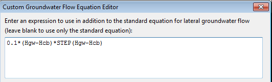

**C.7** **Groundwater Equation Editor ** The Groundwater Equation Editor is used to supply a custom equation for computing groundwater flow between the saturated sub-surface zone of a subcatchment and either a node in the conveyance network (lateral flow) or to a deeper groundwater aquifer (deep flow). It is invoked from the Groundwater Flow Editor form.

For lateral groundwater flow the result of evaluating the custom equation will be added onto the result of the standard equation. To replace the standard equation completely set all of its coefficients to 0. Remember that lateral groundwater flow units are cfs/acre (equivalent to inches/hr) for US units and cms/ha for metric units. The following symbols can be used in the equation: **Hgw** (for height of the groundwater table) **Hsw** (for height of the surface water) **Hcb** (for height of the channel bottom) **Hgs** (for height of the ground surface) **Phi** (for porosity of the subsurface soil) **Theta** (for moisture content of the upper unsaturated zone) **Ks** (for saturated hydraulic conductivity in inches/hr or mm/hr) **K** (for hydraulic conductivity at the current moisture content in inches/hr or mm/hr) **Fi** (for infiltration rate from the ground surface in inches/hr or mm/hr) **Fu** (for percolation rate from the upper unsaturated zone in inches/hr or mm/hr) **A** (for subcatchment area in acres or hectares) where all heights are relative to the aquifer's bottom elevation in feet (or meters).

The **STEP** function can be used to have flow only when the groundwater level is above a certain threshold. For example, the expression:

0.001  (Hgw - 5)  STEP(Hgw - 5)

would generate flow only when Hgw was above 5. See Section C.22 (Treatment Editor) for a list of additional math functions that can be used in a groundwater flow expression.