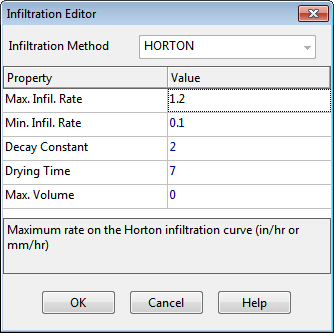

**C.8** **Infiltration Editor ** The Infiltration Editor dialog is used to specify the method and its parameters that model the rate at which rainfall infiltrates into the upper soil zone of a subcatchment's pervious area. It is invoked when editing the Infiltration property of a Subcatchment. The infiltration parameters depend on which infiltration method is selected for the subcatchment: Horton and Modified Horton, Green- Ampt and Modified Green-Ampt, or Curve Number. The infiltration method is normally the default one set by project's Simulation Options (see Section 8.1.1) or its Default Properties (see Section 5.4.2). The dialog allows one to override the default method for the subcatchment being edited.

Horton Infiltration Parameters The following data fields appear in the Infiltration Editor for Horton infiltration:

**Max. Infil. Rate ** Maximum infiltration rate on the Horton curve (in/hr or mm/hr). Representative values are as follows:

A. DRY soils (with little or no vegetation):

- Sandy soils: 5 in/hr

- Loam soils: 3 in/hr

- Clay soils: 1 in/hr

B. DRY soils (with dense vegetation):

- Multiply values in A. by 2

C. MOIST soils:

- Soils which have drained but not dried out (i.e., field capacity): Divide values from A and B by 3.

- Soils close to saturation: Choose value close to minimum infiltration rate.

- Soils which have partially dried out: Divide values from A and B by 1.5 - 2.5. **Min. Infil. Rate ** Minimum infiltration rate on the Horton curve (in/hr or mm/hr). Equivalent to the soil’s saturated hydraulic conductivity. See the Soil Characteristics Table in Section A.2 for typical values. **Decay Constant ** Infiltration rate decay constant for the Horton curve (1/hours). Typical values range between 2 and 7. **Drying Time ** Time in days for a fully saturated soil to dry completely. Typical values range from 2 to 14 days. **Max. Infil. Vol. ** Maximum infiltration volume possible (inches or mm, 0 if not applicable). It can be estimated as the difference between a soil's porosity and its wilting point times the depth of the infiltration zone. Green-Ampt Infiltration Parameters The following data fields appear in the Infiltration Editor for Green-Ampt infiltration:

**Suction Head ** Average value of soil capillary suction along the wetting front (inches or mm). **Conductivity ** Soil saturated hydraulic conductivity (in/hr or mm/hr). **Initial Deficit ** Fraction of soil volume that is initially dry (i.e., difference between soil porosity and initial moisture content). For a completely drained soil, it is the difference between the soil's porosity and its field capacity.

Typical values for all of these parameters can be found in the Soil Characteristics Table in Section A.2.

Curve Number Infiltration Parameters

The following data fields appear in the Infiltration Editor for Curve Number infiltration:

**Curve Number ** This is the SCS curve number which is tabulated in the publication SCS Urban Hydrology for Small Watersheds, 2nd Ed., (TR-55), June 1986. Consult the Curve Number Table (Section A.4) for a listing of values by soil group, and the accompanying Soil Group Table (Section A.3) for the definitions of the various groups.

**Conductivity ** This property has been deprecated and is no longer used.

**Drying Time ** The number of days it takes a fully saturated soil to dry. Typical values range between 2 and 14 days.