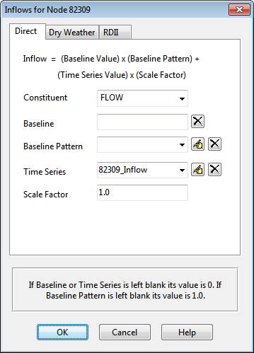
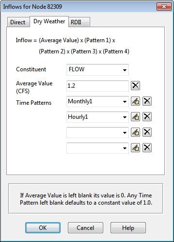
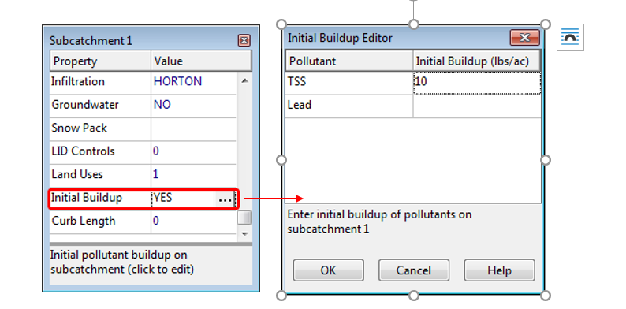

**C.9** **Inflows Editor **

The Inflows Editor dialog is used to assign Direct, Dry Weather, and RDII inflow into a node of the drainage system. It is invoked whenever the Inflows property of a Node object is selected in the Property Editor. The dialog consists of three tabbed pages that provide a special editor for each type of inflow.

Direct Inflows Page

The Direct page on the Inflows Editor dialog is used to specify the time history of direct external flow and water quality entering a node of the drainage system. These inflows are represented by both a constant and time varying component as follows:

*Inflow at time t = (baseline value)(baseline pattern factor) + *

*   (scale factor)(time series value at time t) *

The page contains the following input fields that define the properties of this relation:

**Constituent ** Selects the constituent (FLOW or one of the project's specified pollutants) whose direct inflow will be described.

**Baseline ** Specifies the value of the constant baseline component of the constituent's inflow. For FLOW, the units are the project's flow units. For pollutants, the units are the pollutant's concentration units if inflow is a concentration, or can be any mass flow units if the inflow is a mass flow (see Conversion Factor below). If left blank then no baseline inflow is assumed.

**Baseline Pattern ** An optional Time Pattern whose factors adjust the baseline inflow on either an hourly, daily, or

monthly basis (depending on the type of time pattern specified). Clicking the button will bring up the Time Pattern Editor dialog for the selected time pattern. If left blank, then no adjustment is made to the baseline inflow.

**Time Series ** Specifies the name of the time series that contains inflow data for the selected constituent. If left blank then no direct inflow will occur for the selected constituent at the node in question. You

can click the button to bring up the Time Series Editor dialog for the selected time series.

**Scale Factor ** A multiplier used to adjust the values of the constituent's inflow time series. The baseline value is not adjusted by this factor. The scale factor can have several uses, such as allowing one to easily change the magnitude of an inflow hydrograph while keeping its shape the same, without having to re-edit the entries in the hydrograph time series. Or it can allow a group of nodes sharing the same time series to have their inflows behave in a time-synchronized fashion while letting their individual magnitudes be different. If left blank the scale factor defaults to 1.0.

**Inflow Type ** For pollutants, selects the type of inflow data contained in the time series as being either a concentration (mass/volume) or mass flow rate (mass/time). This field does not appear for FLOW inflow.

**Units Factor ** A numerical factor used to convert the units of pollutant mass flow rate in the time series data into concentration mass units per second. For example, if the time series data were in pounds per

day and the pollutant concentration defined in the project was mg/L, then the conversion factor value would be (453,590 mg/lb) / (86400 sec/day) = 5.25 (mg/sec) per (lb/day). More than one constituent can be edited while the dialog is active by simply selecting another choice for the Constituent property. However, if the **Cancel** button is clicked then any changes made to all constituents will be ignored.

If a pollutant is assigned a direct inflow in terms of concentration, then one must also assign a direct inflow to flow, otherwise no pollutant inflow will occur. An exception is at submerged outfalls where pollutant intrusion can occur during periods of reverse flow. If pollutant inflow is defined in terms of mass, then a flow inflow time series is not required. Dry Weather Inflows Page

The Dry Weather page of the Inflows Editor dialog is used to specify a continuous source of dry weather flow entering a node of the drainage system. The page contains the following input fields:

**Constituent ** Selects the constituent (FLOW or one of the project's specified pollutants) whose dry weather inflow will be specified. **Average Value ** Specifies the average (or baseline) value of the dry weather inflow of the constituent in the relevant units (flow units for flow, concentration units for pollutants). Leave blank if there is no dry weather flow for the selected constituent. **Time Patterns ** Specifies the names of the time patterns to be used to allow the dry weather flow to vary in a periodic fashion by month of the year, by day of the week, and by time of day (for both weekdays and weekends). One can either type in a name or select a previously defined pattern from the dropdown list of each combo box. Up to four different types of patterns can be assigned. You can

click the button next to each Time Pattern field to edit the respective pattern. More than one constituent can be edited while the dialog is active by simply selecting another choice for the Constituent property. However, if the Cancel button is clicked then any changes made to all constituents will be ignored. RDII Inflow Page The RDII Inflow page of the Inflows Editor dialog form is used to specify RDII (Rainfall-Dependent Infiltration and Inflow) for the node in question. The page contains the following two input fields: **Unit Hydrograph Group ** Enter (or select from the dropdown list) the name of the Unit Hydrograph group that applies to the node in question. The unit hydrographs in the group are used in combination with the group's assigned rain gage to develop a time series of RDII inflows per unit area over the period of the

simulation. Leave this field blank to indicate that the node receives no RDII inflow. Clicking the button will launch the Unit Hydrograph Editor for the UH group specified. **Sewershed Area ** Enter the area (in acres or hectares) of the sewershed that contributes RDII to the node in question. Note this area will typically be only a small, localized portion of the subcatchment area that contributes surface runoff to the node.