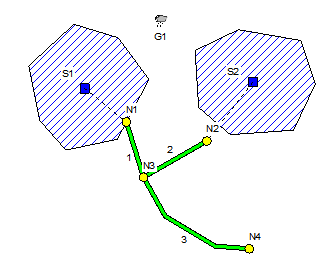

; Hourly adjustment factors H1 HOURLY  0.5 0.6 0.7 0.8 0.8 0.9 H1 1.1 1.2 1.3 1.5 1.1 1.0 H1 0.9 0.8 0.7 0.6 0.5 0.5 H1 0.5 0.5 0.5 0.5 0.5 0.5

**D.3** **Map Data Section**

SWMM’s graphical user interface (GUI) can display a schematic map of the drainage area being analyzed. This map displays subcatchments as polygons, nodes as circles, links as polylines, and rain gages as bitmap symbols. In addition it can display text labels and a backdrop image, such as a street map. The GUI has tools for drawing, editing, moving, and displaying these map elements.

The map’s coordinate data are stored in the format described below. Normally these data are simply appended to the SWMM input file by the GUI so users do not have to concern themselves with it. However it is sometimes more convenient to import map data from some other source, such as a CAD or GIS file, rather than drawing a map from scratch using the GUI. In this case the data can be added to the SWMM project file using any text editor or spreadsheet program. SWMM does not provide any automated facility for converting coordinate data from other file formats into the SWMM map data format.

SWMM's map data are organized into the following seven sections:

[MAP] X,Y coordinates of the map’s bounding rectangle

[POLYGONS] X,Y coordinates for each vertex of subcatchment polygons [COORDINATES] X,Y coordinates for nodes

[VERTICES] X,Y coordinates for each interior vertex of polyline links [LABELS] X,Y coordinates and text of labels [SYMBOLS] X,Y coordinates for rain gages

[BACKDROP] X,Y coordinates of the bounding rectangle and file name of the backdrop image.

Figure D-2 displays a sample map and Figure D-3 the data that describes it. Note that only one link, 3, has interior vertices which give it a curved shape. Also observe that this map’s coordinate system has no units, so that the positions of its objects may not necessarily coincide to their real- world locations.

**Figure D-2 Example study area map **

[MAP] DIMENSIONS      0.00 0.00 10000.00 10000.00 UNITS None

[COORDINATES] ;;Node X-Coord Y-Coord N1 4006.62 5463.58 N2 6953.64 4768.21 N3 4635.76 3443.71 N4 8509.93 827.81

[VERTICES] ;;Link X-Coord Y-Coord 3 5430.46 2019.87 3 7251.66 927.15

[SYMBOLS] ;;Gage X-Coord Y-Coord G1 5298.01 9139.07

[Polygons] ;;Subcatchment     X-Coord Y-Coord S1 3708.61 8543.05 S1 4834.44 7019.87 S1 3675.50 4834.44 < additional vertices not listed > S2 6523.18 8079.47 S2 8112.58 8841.06

**Figure D-3 Data for example study area map **

A detailed description of each map data section will now be given. Remember that map data are only used as a visualization aid for SWMM’s GUI and they play no role in any of the runoff or routing computations. Map data are not needed for running the command line version of SWMM.

**Section**: **[****MAP****]** **Purpose**: Provides dimensions and distance units for the map. **Formats**:

**DIMENSIONS*** X1 Y1 X2 Y2 * **UNITS** **FEET / METERS / DEGREES / NONE** **Parameters**:

*X1* lower-left X coordinate of full map extent *Y1* lower-left  Y coordinate of full map extent

*X2* upper-right X coordinate of full map extent *Y2* upper-right Y coordinate of full map extent

**Section**: [**COORDINATES**] **Purpose**: Assigns X,Y coordinates to drainage system nodes. **Format**: *Node  Xcoord  Ycoord* **Parameters**:

*Node* name of node. *Xcoord* horizontal coordinate relative to origin in lower left of map.

*Ycoord* vertical coordinate relative to origin in lower left of map.

**Section**: [**VERTICES**]

**Purpose**:

Assigns X,Y coordinates to interior vertex points of curved drainage system links.

**Format**:

*Link  Xcoord  Ycoord*

**Parameters**:

*Link* name of link. *Xcoord* horizontal coordinate of vertex relative to origin in lower left of map. *Ycoord* vertical coordinate of vertex relative to origin in lower left of map.

**Remarks: **

Include a separate line for each interior vertex of the link, ordered from the inlet node to the outlet node.

Straight-line links have no interior vertices and therefore are not listed in this section.

**Section**: [**POLYGONS**]

**Purpose**:

Assigns X,Y coordinates to  vertex points of polygons that define a subcatchment boundary.

**Format**:

*Subcat  Xcoord  Ycoord*

**Parameters**:

*Subcat* name of subcatchment. *Xcoord* horizontal coordinate of vertex relative to origin in lower left of map. *Ycoord* vertical coordinate of vertex relative to origin in lower left of map.

**Remarks: **

Include a separate line for each vertex of the subcatchment polygon, ordered in a consistent clockwise or counter-clockwise sequence.

**Section**: [**SYMBOLS**] **Purpose**: Assigns X,Y coordinates to rain gage symbols. **Format**: *Gage  Xcoord  Ycoord* **Remarks**:

*Gage* name of rain gage.

*Xcoord* horizontal coordinate relative to origin in lower left of map. *Ycoord* vertical coordinate relative to origin in lower left of map.

**Section**: [**LABELS**] **Purpose**: Assigns X,Y coordinates to user-defined map labels. **Format**: *Xcoord  Ycoord  Label (Anchor  Font  Size  Bold  Italic)* **Parameters**:

*Xcoord* horizontal coordinate relative to origin in lower left of map.

*Ycoord* vertical coordinate relative to origin in lower left of map. *Label* text of label surrounded by double quotes. *Anchor* name of node or subcatchment that anchors the label on zoom-ins (use an

empty pair of double quotes if there is no anchor). *Font* name of label’s font (surround by double quotes if the font name includes

spaces). *Size* font size in points.

*Bold* **YES** for bold font, **NO** otherwise. *Italic* **YES** for italic font, **NO** otherwise. **Remarks: **

Use of the anchor node feature will prevent the label from moving outside the viewing area when the map is zoomed in on. If no font information is provided then a default font is used to draw the label.

**Section**: [**BACKDROP**]

**Purpose**:

Specifies file name and coordinates of map’s backdrop image.

**Formats**:

**FILE** *Fname* **DIMENSIONS*** X1 Y1 X2 Y2*

**Parameters**:

*Fname* name of file containing backdrop image *X1* lower-left X coordinate of backdrop image *Y1* lower-left  Y coordinate of backdrop image

*X2* upper-right X coordinate of backdrop image *Y2* upper-right Y coordinate of backdrop image