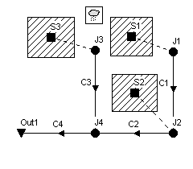

### Chapter 2 **QUICK START TUTORIAL **

*This chapter provides a tutorial on how to use EPA SWMM. If you are not familiar with the * *elements that comprise a drainage system, and how these are represented in a SWMM model, * *you might want to review the material in Chapter 3 first.*

2.1 **Example Study Area **

In this tutorial we will model the drainage system serving a 12-acre residential area. The system layout is shown in Figure 2-1 and consists of subcatchment areas1 *S1* through *S3*, storm sewer conduits *C1* through *C4*, and conduit junctions *J1* through* J4*. The system discharges to a creek at the point labeled *Out1*. We will first go through the steps of creating the objects shown in this diagram on SWMM's study area map and setting the various properties of these objects. Then we will simulate the water quantity and quality response to a 3-inch, 6-hour rainfall event, as well as a continuous, multi-year rainfall record.

**Figure 2-1  Example Study Area **

1 A subcatchment is an area of land containing a mix of pervious and impervious surfaces whose runoff drains to a common outlet point, which could be either a node of the drainage network or another subcatchment.