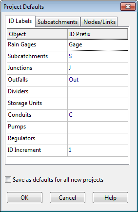
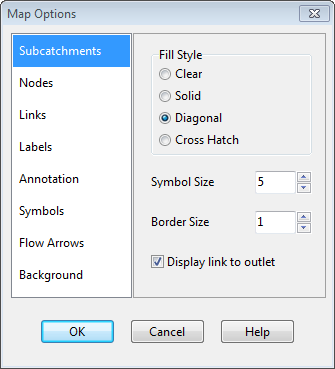

2.2 **Project Setup **

Our first task is to create a new SWMM project and make sure that certain default options are selected. Using these defaults will simplify the data entry tasks later on.

**1.** Launch EPA SWMM if it is not already running and select **File** >> **New** from the Main Menu bar to create a new project.

**2.** Select **Project** >> **Defaults** to open the Project Defaults dialog.

**3.** On the ID Labels page of the dialog, set the ID Prefixes as shown below. This will make SWMM automatically label new objects with consecutive numbers following the designated prefix.

**4.** On the Subcatchments page of the dialog set the following default values:

Area 4 Width 400 % Slope 0.5 % Imperv. 50 N-Imperv. 0.01 N-Perv. 0.10 Dstore-Imperv. 0.05 Dstore-Perv 0.05 %Zero-Imperv. 25 Infil. Model <click to edit> - Method Modified Green-Ampt - Suction Head 3.5 - Conductivity 0.5 - Initial Deficit 0.26

**5.** On the Nodes/Links page set the following default values:

Node Invert 0 Node Max. Depth 4 Node Ponded Area 0 Conduit Length 400 Conduit Geometry <click to edit> - Barrels 1 - Shape Circular - Max. Depth 1.0 Conduit Roughness 0.01 Flow Units CFS Link Offsets DEPTH Routing Model Kinematic Wave

**6.** Click **OK** to accept these choices and close the dialog. If you wanted to save these choices for all future new projects, you could check the Save box at the bottom of the form before accepting it.

Next, we will set some map display options so that ID labels and symbols will be displayed as we add objects to the study area map, and links will have direction arrows.

**1.** Select **Tools** >> **Map Display Options** to bring up the Map Options dialog.

**2.** Select the Subcatchments page, set the Fill Style to Diagonal and the Symbol Size to 5.

**3.** Then select the Nodes page and set the Node Size to 5.

**4.** Select the Annotation page and check off the boxes that will display ID labels for Subcatchments, Nodes, and Links. Leave the others un-checked.

**5.** Finally, select the Flow Arrows page, select the Filled arrow style, and set the arrow size to 7.

**6.** Click the **OK** button to accept these choices and close the dialog.

Before placing objects on the map we should set its dimensions.

1. Select **View** >> **Dimensions** to bring up the Map Dimensions dialog. 2. You can leave the dimensions at their default values for this example.

Finally, look in the status bar at the bottom of the main window and check that the **Auto-Length** feature is off. If it is on, then click the down arrow button and select "*Auto-Length: Off*" from the popup menu that appears. Also make sure that the **Offsets** option is set to **Depth**. If set to **Elevation** then click the down arrow button and select "*Depth Offsets*" from the popup menu that appears.