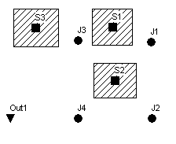

2.3 **Drawing Objects **

We are now ready to begin adding components to the Study Area Map2. We will start with the subcatchments.

**1.** Begin by selecting the **Subcatchments** category (under Hydrology) in the Project Browser panel (on the left side of the main window).

**2.** Then click the button on the toolbar underneath the object category listing in the Project panel (or select **Project | Add a New Subcatchment** from the main menu). Notice how the mouse cursor changes shape to a pencil when you move it over the map.

**3.** Move the mouse to the map location where one of the corners of subcatchment *S1* lies and left-click the mouse.

**4.** Do the same for the next three corners and then right-click the mouse (or hit the **Enter** key) to close up the rectangle that represents subcatchment *S1*. You can press the **Esc** key if instead you wanted to cancel your partially drawn subcatchment and start over again. Don't worry if the shape or position of the object isn't quite right. We will go back later and show how to fix this.

**5.** Repeat this process for subcatchments *S2* and *S3*3.

Observe how sequential ID labels are generated automatically as we add objects to the map .

Next we will add in the junction nodes and the outfall node that comprise part of the drainage network.

**1.** To begin adding junctions, select the **Junctions** category from the Project Browser (under

Hydraulics -> Nodes) and click the button or select **Project | Add a New Junction** from the main menu.

**2.** Move the mouse to the position of junction *J1* and left-click it. Do the same for junctions *J2* through *J4*.

2 Drawing objects on the map is just one way of creating a project. For large projects it might be more convenient to first construct a SWMM project file external to the program. The project file is a text file that describes each object in a specified format as described in Appendix D of this manual. Data extracted from various sources, such as CAD drawings or GIS files, can be used to create the project file.

3 If you right-click (or press **Enter**) after adding the first point of a subcatchment's outline, the subcatchment will be shown as just a single point.

**3.** To add the outfall node, select **Outfalls** from the Project Browser, click the button or select **Project | Add a New Outfall** from the main menu, move the mouse to the outfall's location on the map, and left-click. Note how the outfall was automatically given the name *Out1*.

At this point your map should look something like that shown in Figure 2-2.

**Figure 2-2  Subcatchments and nodes for example study area **

Now we will add the storm sewer conduits that connect our drainage system nodes to one another. (You must have created a link's end nodes as described previously before you can create the link.) We will begin with conduit *C1*, which connects junction *J1* to *J2*.

**1.** Select the **Conduits** category from the Project Browser (under Hydraulics -> Links) and press the   button or select **Project | Add a New Conduit** from the main menu. The mouse cursor will change shape to a cross hair when moved onto the map .

**2.** Left-click the mouse on junction *J1*. Note how the mouse cursor changes shape to a pencil.

**3.** Move the mouse over to junction *J2* (note how an outline of the conduit is drawn as you move the mouse) and left-click to create the conduit. You could have cancelled the operation by either right clicking or by hitting the <**Esc**> key.

**4.** Repeat this procedure for conduits *C2* through *C4*.

Although all of our conduits were drawn as straight lines, it is possible to draw a curved link by left-clicking at intermediate points where the direction of the link changes before clicking on the end node.