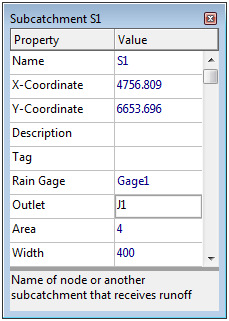
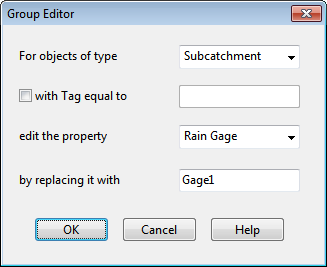
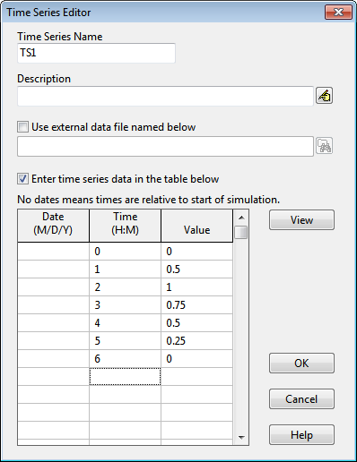

To complete the construction of our study area schematic we need to add a rain gage.

1. Select the Rain Gages category from the Project Browser panel (under Hydrology) and

either click the button or select Project | Add a New Rain Gage from the main menu.

2. Move the mouse over the Study Area Map to where the gage should be located and left- click the mouse.

At this point we have completed drawing the example study area. Your system should look like the one in Figure 2-1. If a rain gage, subcatchment or node is out of position you can move it by doing the following:

1. If the     button on the Map Toolbar is not already depressed, click it to place the map in Object Selection mode .

2. Click on the object to be moved.

3. Drag the object with the left mouse button held down to its new position.

To re-shape a subcatchment's outline :

1. With the map in Object Selection mode, click on the subcatchment's centroid (indicated by a solid square within the subcatchment) to select it.

2. Then click the button on the Map Toolbar to put the map into Vertex Selection mode.

3. Select a vertex point on the subcatchment outline by clicking on it (note how the selected vertex is indicated by a filled solid square).

4. Drag the vertex to its new position with the left mouse button held down.

5. If need be, vertices can be added or deleted from the outline by right-clicking the mouse and selecting the appropriate option from the popup menu that appears.

6. When finished, click the        button to return to Object Selection mode .

This same procedure can also be used to re-shape a link.

2.4 **Setting Object Properties**

As visual objects are added to our project, SWMM assigns them a default set of properties. To change the value of a specific property for an object we must select the object into the Property Editor. There are several different ways to do this. If the Editor is already visible, then you can simply click on the object or select it from the Project Browser. If the Editor is not visible then you can make it appear by one of the following actions:

- double-click the object on the map,

- or right-click on the object and select **Properties** from the pop-up menu that appears,

- or select the object from the Project Browser and then click the Browser’s button,

- or after selecting the object choose **Edit >> Edit Object** from the Main Menu.

Whenever the Property Editor has the focus you can press the **F1** key to obtain a more detailed description of the properties listed.

Two key properties of our subcatchments that need to be set are the rain gage that supplies rainfall  data to the subcatchment and the node of the drainage system that receives runoff from the subcatchment. Since all of our subcatchments utilize the same rain gage, *Gage1*, we can use a shortcut method to set this property for all subcatchments at once:

**1.** From the Main Menu select **Edit** >>**Select All**.

**2.** Then select **Edit** >> **Group Edit** to make a Group Editor dialog appear.

**3.** Select *Subcatchment* as the type of object to edit, *Rain Gage* as the property to edit, and type in *Gage1* as the new value.

**4.** Click **OK** to change the rain gage of all subcatchments to *Gage1*. A confirmation dialog will appear noting that 3 subcatchments have changed. Select “**No**” when asked to continue editing.

To set the outlet node of our subcatchments we have to proceed one by one, since these vary by subcatchment:

1. Double click on subcatchment *S1* or select it from the Project Browser and click the Browser's button to bring up the Property Editor.

2. Type *J*1 in the Outlet field and press Enter. Note how a dotted line is drawn between the subcatchment and the node.

3. Click on subcatchment *S2* and enter *J2* as its Outlet.

4. Click on subcatchment *S3* and enter *J3* as its Outlet.

We also wish to represent area *S3* as being less developed than the others. Select *S3* into the Property  Editor and set its % Imperviousness to 25.

The junctions and outfall of our drainage system need to have invert elevations assigned to them. As we did with the subcatchments, select each junction individually into the Property Editor and set its Invert Elevation to the value shown below4.

**Node ** **  Invert ** *J1 * *96 * *J2 * *90 * *J3 * *93 * *J4 * *88 * *Out1 * *85 *

4 An alternative way to move from one object of a given type to the next in order (or to the previous one) in the Property Editor is to hit the Page Down (or Page Up) key.

Only one of the conduits in our example system has a non-default property value. This is conduit *C4*, the outlet pipe, whose diameter should be 1.5 instead of 1 ft. To change its diameter, select conduit C4 into the Property Editor and set the Max. Depth value to 1.5.

In order to provide a source of rainfall input to our project we need to set the rain gage’s properties. Select *Gage1* into the Property Editor and set the following properties:

*Rain Format * *INTENSITY * *Rain Interval * *1:00 * *Data Source * *TIMESERIES * *Series Name * *TS1 *

As mentioned earlier, we want to simulate the response of our study area to a 3-inch, 6-hour design storm. A time series named *TS1* will contain the hourly rainfall intensities that make up this storm. Thus we need to create a time series object and populate it with data. To do this:

**1.** From the Project Browser select the *Time Series* category of objects.

**2.** Click the button on the Browser to bring up the Time Series Editor dialog5.

**3.** Enter *TS1* in the Time Series Name field.

**4.** Enter the values shown in the dialog on the next page into the *Time* and *Value* columns of the data entry grid (leave the *Date* column blank6).

**5.** You can click the **View** button on the dialog to see a graph of the time series values. Click the **OK** button to accept the new time series.

5 The Time Series Editor can also be launched directly from the Rain Gage Property Editor by selecting the editor's Series Name field and double clicking on it.

6 Leaving off the dates for a time series means that SWMM will interpret the time values as hours from the start of the simulation. Otherwise, the time series follows the date/time values specified by the user.

Having completed the initial design of our example project it is a good idea to give it a title and save our work to a file at this point. To do this:

**1.** Select the *Title/Notes* category from the Project Browser and click the button.

**2.** In the Project Title/Notes dialog that appears, enter “Tutorial Example” as the title of our project  and click the **OK **button to close the dialog.

**3.** From the **File** menu select the **Save As** option.

**4.** In the Save As dialog that appears, select a folder and file name under which to save this project. We suggest naming the file **tutorial.inp**. (An extension of .inp will be added to the file name if one is not supplied.)

**5.** Click **Save** to save the project to file.