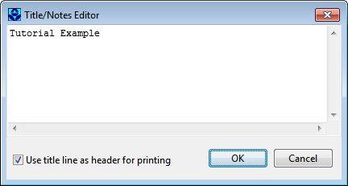

The project data are saved to the file in a readable text format. You can view what the file looks like by selecting **Project** >> **Details** from the main menu. To open our project at some later time, you would select the **Open** command from the **File** menu.

2.5 **Running a Simulation**

Setting Simulation Options

Before analyzing the performance of our example drainage system we need to set some options that determine how the analysis will be carried out. To do this:

**1.** From the Project Browser, select the **Options** category and click the button.

**2.** On the **General** page of the Simulation Options dialog that appears (see next page), select **Kinematic Wave** as the flow routing method. The infiltration method should already be set to **Modified** **Green-Ampt**. The **Allow Ponding** option should be unchecked.

**3.** On the **Dates** page of the dialog, set the **End Analysis** time to 12:00:00.

**4.** On the **Time Steps** page, set the **Routing Time Step** to 60 seconds.

**5.** Click **OK** to close the Simulation Options dialog.

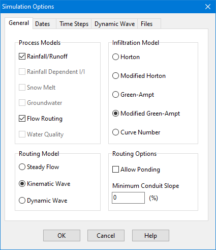

Starting a Simulation

We are now ready to run the simulation. To do so, select **Project >> Run Simulation **(or click the

button). If there was a problem with the simulation, a Status Report will appear describing what errors occurred. Upon successfully completing a run, there are numerous ways in which to view the results of the simulation. We will illustrate just a few here.

Viewing the Status Report

The Status Report contains useful information about the quality of a simulation run, including a mass  balance on rainfall, infiltration, evaporation, runoff, and inflow/outflow for the conveyance system. To view the report select **Report >> Status** (or click the button on the Standard Toolbar and then select **Status Report** from the drop down menu). A portion of the report for the system just analyzed is shown below:

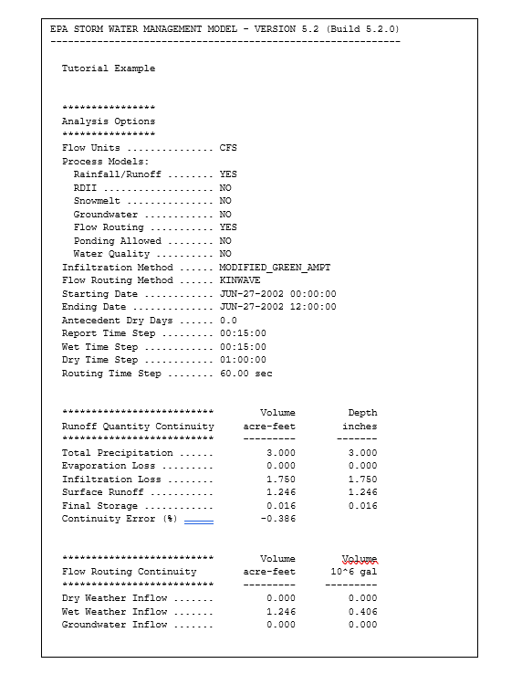

For the system we just analyzed the report indicates the quality of the simulation is quite good, with negligible mass balance continuity errors for both runoff and routing (-0.39% and 0.03%, respectively, if all data were entered correctly). Also, of the 3 inches of rain that fell on the study area, 1.75 infiltrated into the ground and essentially the remainder became runoff.

Viewing the Summary Report

The Summary Report contains tables listing summary results for each subcatchment, node and link in the drainage system. Total rainfall, total runoff, and peak runoff for each subcatchment, peak depth and hours flooded for each node, and peak flow, velocity, and depth for each conduit are just some of the outcomes included in the summary report.

To view the Summary Report select **Report | Summary** from the main menu (or click the button on the Standard Toolbar and then select **Summary Report** from the drop down menu). The report's window has a drop down list from which you select a particular report to view. For our example, the Node Flooding Summary table indicates there was internal flooding in the system at node J2. Note. The Conduit Surcharge Summary table shows that Conduit C2, just downstream of node J2, was at full capacity and therefore appears to be slightly undersized.

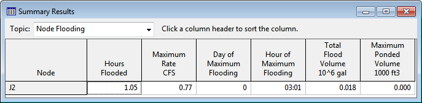

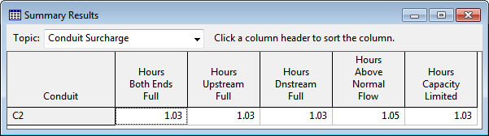

In SWMM flooding will occur whenever the water surface at a node exceeds the maximum  assigned depth. Normally such water will be lost from the system. The option also exists to have this water pond atop the node and be re-introduced into the drainage system when capacity exists to do so.

Viewing Results on the Map

Simulation results (as well as some design parameters, such as subcatchment area, node invert elevation, and link maximum depth) can be viewed in color-coded fashion on the study area map.

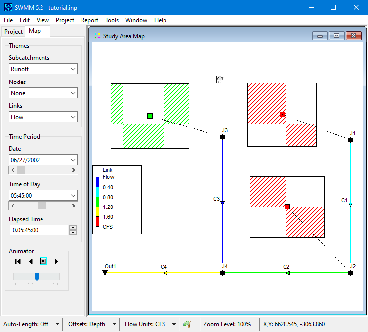

To view a particular variable in this fashion:

1. Select the **Map** page of the Browser panel.

2. Select the variables to view for Subcatchments, Nodes, and Links from the dropdown combo  boxes appearing in the Themes panel. As shown above, subcatchment runoff and link flow have been selected for viewing

3. The color-coding used for a particular variable is displayed with a legend on the study area map. To toggle the display of a legend, select **View** >> **Legends**.

4. To move a legend to another location, drag it with the left mouse button held down.

**5.** To change the color-coding and the breakpoint values for different colors, select **View** >> **Legends** >> **Modify** and then the pertinent class of object (or if the legend is already visible, simply right-click on it). To view numerical values for the variables being displayed on the map, select **Tools** >> **Map Display Options** and then select the Annotation page of the Map Options dialog. Use the check boxes for Subcatchment Values, Node Values, and Link Values to specify what kind of annotation to add.

**6.** The Date / Time of Day / Elapsed Time controls on the Map Browser can be used to move through the simulation results in time. The map view shown above depicts results at 5 hours and 45 minutes into the simulation.

**7.** You can use the controls in the Animator panel of the Map Browser to animate the map

display through time. For example, pressing the button will run the animation forward in time.

Viewing a Time Series Plot

To generate a time series plot of a simulation result:

1. Select **Report** >> **Graph** >> **Time Series** or simply click on the Standard Toolbar.

2.   A Time Series Plot Selection dialog will appear. It is used to select the objects and variables

to be plotted.

For our example, the Time Series Plot Selection dialog can be used to graph the flow in conduits *C1* and *C2* as follows (refer to the dialog forms shown below):

1. Click the **Add** button on the dialog to view the Data Series Selection dialog .

2. Select conduit *C1* (either on the map or in the Project Browser) and select **Flow** as the variable to be plotted. Click the **Accept** button to return to the Time Series Plot Selection dialog.

3. Repeat steps 1 and 2 for conduit *C2.*

4. Press OK to create the plot which should look like the graph shown below.

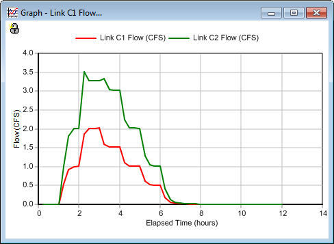

After a plot is created you can:

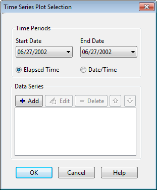

- customize its appearance by selecting **Report **>> **Customize** or by clicking the button on the Standard Toolbar or by simply right clicking on the plot,

- copy it to the clipboard and paste it into another application by selecting **Edit** >> **Copy** **To**

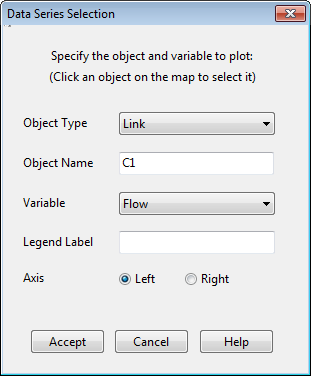

or clicking on the Standard Toolbar

- print it by selecting **File** >> **Print** or **File** >> **Print Preview** (use **File** >> **Page Setup** first to set margins, orientation, etc.).

Viewing a Profile Plot

SWMM can generate profile plots showing how water surface depth varies across a path of connected nodes and links. Let's create such a plot for the conduits connecting junction *J1* to the outfall *Out1* of our example drainage system. To do this:

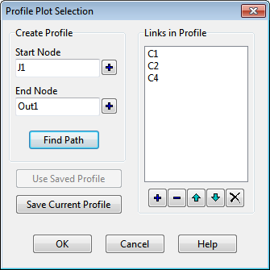

**1.** Select **Report** >> **Graph** >> **Profile** on the main menu or click on the main Toolbar.

**2.** Either enter *J1* in the **Start Node** field of the Profile Plot Selection dialog or select it on the

map or from the Project Browser and click the button next to the field.

**3.** Do the same for node *Out1* in the **End Node **field of the dialog.

**4.** Click the **Find Path** button. An ordered list of the links forming a connected path between the specified Start and End nodes will be displayed in the **Links in Profile** box. You can edit the entries in this box if need be.

**5.** Click the **OK** button to create the plot, showing the water surface profile as it exists at the simulation time currently selected in the Map Browser (hour 02:45 for the plot shown below).

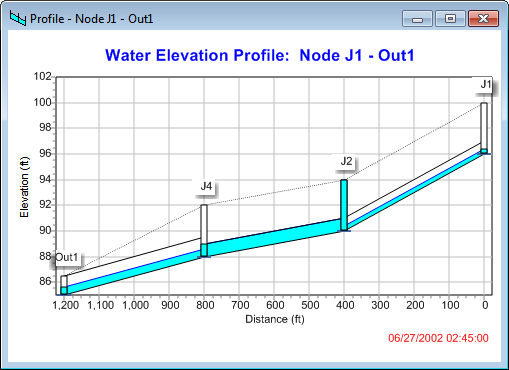

As you move through time using the Map Browser or with the Animator control, the water depth profile on the plot will be updated. Observe how node *J2* becomes flooded between hours 2 and 3 of the storm event. A Profile Plot’s appearance can be customized and it can be copied or printed using the same procedures as for a Time Series Plot.

Running a Full Dynamic Wave Analysis

In the analysis just run we chose to use the Kinematic Wave method of routing flows through our drainage system. This is an efficient but simplified approach that cannot deal with such phenomena as backwater effects, pressurized flow, flow reversal, and non-dendritic layouts. SWMM also includes a Dynamic Wave routing procedure that can represent these conditions. This procedure, however, requires more computation time, due to the need for smaller time steps to maintain numerical stability.

Most of the effects mentioned above would not apply to our example. However we had one conduit, *C2*, which flowed full and caused its upstream junction to flood. It could be that this pipe is actually being pressurized and could therefore convey more flow than was computed using Kinematic Wave routing. We would now like to see what would happen if we apply Dynamic Wave routing instead.

To run the analysis with Dynamic Wave routing:

**1.** From the Project Browser, select the **Options** category and click the button.

**2.** On the **General** page of the Simulation Options dialog that appears, select **Dynamic** **Wave** as the flow routing method.

**3.** On the **Dynamic Wave** page of the dialog, use the settings shown below7.

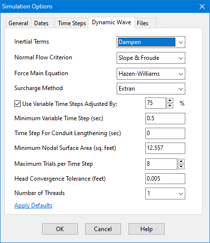

**4.** Click **OK** to close the form and select **Project** >> **Run Simulation **(or click the button) to re-run the analysis. If you look at the Summary Report for this run, you will see that there is no longer any junction flooding and that the peak flow carried by conduit *C2* has been increased from 3.52 cfs to 4.04 cfs.

7 Normally when running a Dynamic Wave analysis, one would also want to reduce the routing time step (on the Time Steps page of the dialog). We will keep it at 60 seconds.