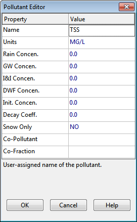
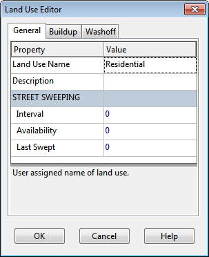
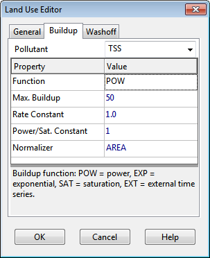
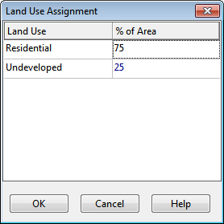

2.6 **Simulating Water Quality **

In the next phase of this tutorial we will add water quality analysis to our example project. SWMM has the ability to analyze the buildup, washoff, transport and treatment of any number of water quality constituents. The steps needed to accomplish this are:

**1.** Identify the pollutants to be analyzed.

**2.** Define the categories of land uses that generate these pollutants.

**3.** Set the parameters of buildup and washoff functions that determine the quality of runoff from each land use.

**4.** Assign a mixture of land uses to each subcatchment area

**5.** Define pollutant removal functions for nodes within the drainage system that contain treatment facilities.

We will now apply each of these steps, with the exception of number 5, to our example project8.

We will define two runoff pollutants; total suspended solids (TSS), measured as mg/L, and total Lead, measured in ug/L. In addition, we will specify that the concentration of Lead in runoff is a fixed fraction (0.25) of the TSS concentration. To add these pollutants to our project:

**1.** Under the **Quality** category in the project Browser, select the **Pollutants** sub-category beneath it.

**2.** Click the button to add a new pollutant to the project.

**3.** In the Pollutant Editor dialog that appears, enter **TSS** for the pollutant name and leave the other data fields at their default settings.

**4.** Click the **OK** button to close the Editor.

**5.** Click the button on the Project Browser again to add our next pollutant.

**6.** In the Pollutant Editor, enter **Lead **for the pollutant name, select **UG/L** for the concentration  units, enter **TSS** as the name of the Co-Pollutant, and enter **0.25** as the Co- Fraction value.

**7.** Click the **OK** button to close the Editor.

8 Aside from surface runoff, SWMM also allows pollutants to be introduced into the nodes of a drainage system through user-defined time series of direct inflows, dry weather inflows, groundwater interflow, and rainfall-dependent infiltration and inflow.

In SWMM, pollutants associated with runoff are generated by specific land uses assigned to subcatchments. In our example, we will define two categories of land uses: Residential and Undeveloped. To add these land uses to the project:

1. Under the **Quality** category in the Project Browser, select the **Land Uses** sub-category

and click the button.

2. In the Land Use Editor dialog that appears (see Figure 2-20), enter **Residential** in the Name field  and then click the **OK** button.

3. Repeat steps 1 and 2 to create the **Undeveloped** land use category.

Next we need to define buildup and washoff functions for TSS in each of our land use categories. Functions for Lead are not needed since its runoff concentration was defined to be a fixed fraction of the TSS concentration. Normally, defining these functions requires site-specific calibration.

In this example we will assume that suspended solids in Residential areas builds up at a constant rate of 1 pound per acre per day until a limit of 50 lbs per acre is reached. For the Undeveloped area we will assume that buildup is only half as much. For the washoff function, we will assume a constant event mean concentration of 100 mg/L for Residential land and 50 mg/L for Undeveloped land. When runoff occurs, these concentrations will be maintained until the available buildup is exhausted. To define these functions for the Residential land use:

1. Select the **Residential** land use category from the Project Browser and click .

2. In the Land Use Editor dialog, move to the **Buildup** page.

3. Select **TSS** as the pollutant and **POW** (for Power function) as the function type.

4. Assign the function a maximum buildup of **50**, a rate constant of **1.0**, a power of **1** and select **AREA** as the normalizer.

**5.** Move to the **Washoff** page of the dialog and select **TSS** as the pollutant, **EMC** as the function type, and enter **100** for the coefficient. Fill the other fields with 0.

**6.** Click the **OK** button to accept your entries.

Now do the same for the Undeveloped land use category, except use a maximum buildup of **25**, a  buildup rate constant of **0.5**, a buildup power of **1**, and a washoff EMC of **50**.

The final step in our water quality example is to assign a mixture of land uses to each subcatchment area:

**1.** Select subcatchment *S1* into the Property Editor.

**2.** Select the **Land Uses** property and click the ellipsis button (or press **Enter**).

**3.** In the Land Use Assignment dialog that appears, enter **75** for the % Residential and **25** for the % Undeveloped. Then click the **OK** button to close the dialog.

**4.** Repeat the same three steps for subcatchment *S2*.

**5.** Repeat the same for subcatchment *S3*, except assign the land uses as **25%** Residential and **75%** Undeveloped.

Before we simulate the runoff quantities of TSS and Lead from our study area, an initial buildup of  TSS should be defined so it can be washed off during our single rainfall event. We can either specify the number of antecedent dry days prior to the simulation or directly specify the initial buildup mass on each subcatchment. We will use the former method:

**1.** From the **Options** category of the Project Browser, select the **Dates** sub-category and click

the button.

**2.** In the Simulation Options dialog that appears, enter 5 into the **Antecedent Dry Days** field.

**3.** Leave the other simulation options the same as they were for the dynamic wave flow routing we just completed.

**4.** Click the **OK** button to close the dialog.

Now run the simulation by selecting **Project >> Run Simulation** or by clicking       on the Standard Toolbar .

When the run is completed, view its Status Report. Note that two new sections have been added for **Runoff Quality Continuity** and **Quality Routing Continuity**. From the Runoff Quality Continuity table we see that there was an initial buildup of 47.5 lbs of TSS on the study area and an additional 2.2 lbs of buildup added during the dry periods of the simulation. About 47.9 lbs were washed off during the rainfall event. The quantity of Lead washed off is a fixed percentage (25% times 0.001 to convert from mg to ug) of the TSS as was specified.