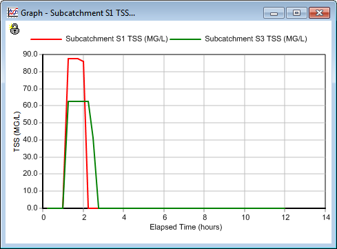
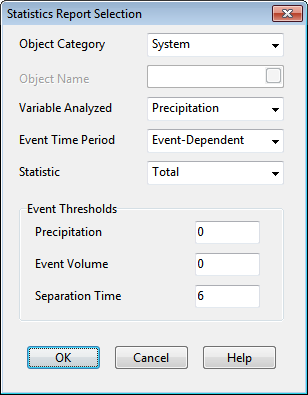
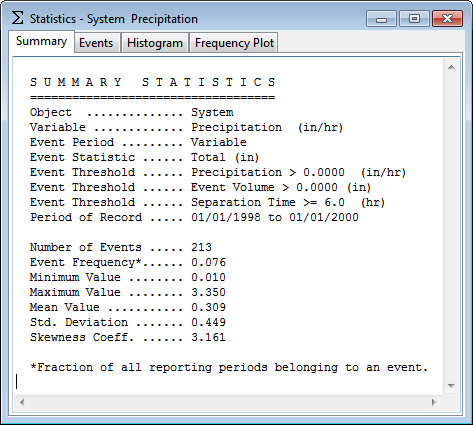

If you plot the runoff concentration of TSS for subcatchment *S1* and *S3* together on the same time series graph as shown below, you will see the difference in concentrations resulting from the different mix of land uses in these two areas. You can also see that the duration over which pollutants are washed off is much shorter than the duration of the entire runoff hydrograph (i.e., 1 hour versus about 6 hours). This results from having exhausted the available buildup of TSS over this period of time.

2.7 **Running a Continuous Simulation **

As a final exercise in this tutorial we will demonstrate how to run a long-term continuous simulation  using a historical rainfall record and how to perform a statistical frequency analysis on the results. The rainfall record will come from a file named **sta310301.dat** that was included with the example data sets provided with EPA SWMM. It contains several years of hourly rainfall beginning in January 1998. The data are stored in the National Climatic Data Center's DSI 3240 format, which SWMM can automatically recognize.

To run a continuous simulation with this rainfall record:

**1.** Select the rain gage *Gage1* into the Property Editor.

**2.** Change the selection of Data Source to FILE.

**3.** Select the File Name data field and click the ellipsis button (or press the **Enter** key) to bring up a standard Windows File Selection dialog.

**4.** Navigate to the folder where the SWMM example files were stored, select the file named sta310301.dat, and click **Open** to select the file and close the dialog.

**5.** In the Station No. field of the Property Editor enter **310301**.

**6.** Select the **Options** category in the Project Browser and click the button to bring up the Simulation Options form.

**7.** On the **General** page of the form, select Kinematic Wave as the Routing Method (this will help speed up the computations).

**8.** On the **Dates** page of the form, set both the Start Analysis and Start Reporting dates to **01/01/1998**, and set the End Analysis date to **01/01/2000**.

**9.** On the **Time Steps** page of the form, set the Routing Time Step to **300** seconds.

**10.** Close the Simulation Options form by clicking the OK button and start the simulation by selecting   **Project >> Run Simulation** (or by clicking     on the Standard Toolbar).

After our continuous simulation is completed we can perform a statistical frequency analysis on any of the variables produced as output. For example, to determine the distribution of rainfall volumes within each storm event over the two-year period simulated:

**1.** Select **Report** >> **Statistics** or click the button on the Standard Toolbar.

**2.** In the Statistics Report Selection dialog that appears, enter the values shown below.

**3.** Click the **OK** button to close the form.

The results of this request will be a Statistics Report form containing four tabbed pages: a Summary page, an Events page containing a rank-ordered listing of each event, a Histogram page containing a plot of the occurrence frequency versus event magnitude, and a Frequency Plot page that plots event magnitude versus cumulative frequency.

The summary page shows that there were a total of 213 rainfall events. The Events page shows that the largest rainfall event had a volume of 3.35 inches and occurred over a 24- hour period. There were no events that matched the 3-inch, 6-hour design storm event used in our previous single-event analysis that had produced some internal flooding. In fact, the Summary Report for this continuous simulation indicates that there were no flooding or surcharge occurrences over the simulation period.

We have only touched the surface of SWMM's capabilities. Some additional features of the program  that you will find useful include:

- adding low impact development (LID) controls (i.e., green infrastructure) to reduce or delay runoff from subcatchments

- utilizing additional types of drainage elements, such as storage units, flow dividers, pumps, and regulators, to model more complex types of systems

- using control rules to simulate real-time operation of pumps and regulators

- employing different types of externally-imposed inflows at drainage system nodes, such as direct time series inflows, dry weather inflows, and rainfall-dependent infiltration and inflow

- modeling groundwater interflow between aquifers beneath subcatchment areas and drainage system nodes

- modeling snow fall accumulation and melting within subcatchments

- adding calibration data to a project so that simulated results can be compared with measured values

- utilizing a background street, site plan, or topo map to assist in laying out a system's drainage elements and to help relate simulated results to real-world locations.

You can find more information on these and other features in the remaining chapters of this manual.