3.2 **Visual Objects **

Figure 3-1 depicts how a collection of SWMM’s visual objects might be arranged together to represent a stormwater drainage system. These objects can be displayed on a map in the SWMM workspace. The following sections describe each of these objects.

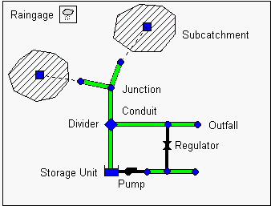

**Figure 3-1  Physical objects used to model a drainage system **

3.2.1 *Rain Gages *

Rain Gages supply precipitation data for one or more subcatchment areas in a study region. The rainfall data can be either a user-defined time series or come from an external file. Several different popular rainfall file formats currently in use are supported, as well as a standard user- defined format. More details on these formats are presented in Section 11.3.

The principal input properties of rain gages include:

- rainfall data type (e.g., intensity, volume, or cumulative volume)

- recording time interval (e.g., hourly, 15-minute, etc.)

- source of rainfall data (input time series or external file)

- name of rainfall data source

3.2.2 *Subcatchments *

Subcatchments are hydrologic units of land whose topography and drainage system elements direct surface runoff to a single discharge point. The user is responsible for dividing a study area

into an appropriate number of subcatchments, and for identifying the outlet point of each subcatchment. Discharge outlet points can be either nodes of the drainage system or other subcatchments.

Subcatchments are divided into pervious and impervious subareas. Surface runoff can infiltrate into the upper soil zone of the pervious subarea, but not through the impervious subarea. Impervious areas are themselves divided into two subareas - one that contains depression storage and another that does not. Runoff flow from one subarea in a subcatchment can be routed to the other subarea, or both subareas can drain to the subcatchment outlet.

Infiltration of rainfall from the pervious area of a subcatchment into the unsaturated upper soil zone can be described using five different models:

- Classic Horton infiltration

- Modified Horton infiltration

- Green-Ampt infiltration

- Modified Green-Ampt infiltration

- SCS Curve Number infiltration

To model the accumulation, re-distribution, and melting of precipitation that falls as snow on a subcatchment, it must be assigned a Snow Pack object. To model groundwater flow between an aquifer underneath the subcatchment and a node of the drainage system, the subcatchment must be assigned a set of Groundwater parameters. Pollutant buildup and washoff from subcatchments are associated with the Land Uses assigned to the subcatchment. Capture and retention of rainfall/runoff using different types of low impact development practices (such as bio-retention cells, infiltration trenches, porous pavement, vegetative swales, and rain barrels) can be modeled by assigning a set of pre-designed LID controls to the subcatchment.

The other principal input parameters for subcatchments include:

- assigned rain gage

- outlet node or subcatchment

- total area

- percent imperviousness area

- average slope

- characteristic width of overland flow

- Manning's roughness (*n*) for overland flow on both pervious and impervious areas

- depression storage in both pervious and impervious areas

- percent of impervious area with no depression storage.

3.2.3 *Junction Nodes *

Junctions are drainage system nodes where links join together. Physically they can represent the confluence of natural surface channels, manholes in a sewer system, or pipe connection fittings. External inflows can enter the system at junctions. Excess water at a junction can become partially pressurized while connecting conduits are surcharged and can either be lost from the system or be allowed to pond atop the junction and subsequently drain back into the junction.

The principal input parameters for a junction are:

- invert (channel or manhole bottom) elevation

- height to ground surface

- ponded surface area when flooded (optional)

- external inflow data (optional).

3.2.4 *Outfall Nodes *

Outfalls are terminal nodes of the drainage system used to define final downstream boundaries under Dynamic Wave flow routing. For other types of flow routing they behave as a junction. Only a single link can be connected to an outfall node, and the option exists to have the outfall discharge onto a subcatchment's surface.

The boundary conditions at an outfall can be described by any one of the following stage relationships:

- the critical or normal flow depth in the connecting conduit

- a fixed stage elevation

- a tidal stage described in a table of tide height versus hour of the day

- a user-defined time series of stage versus time.

The principal input parameters for outfalls include:

- invert elevation

- boundary condition type and stage description

- presence of a flap gate to prevent backflow through the outfall.

3.2.5 *Flow Divider Nodes *

Flow Dividers are drainage system nodes that divert inflows to a specific conduit in a prescribed manner. A flow divider can have no more than two conduit links on its discharge side. Flow dividers are only active under Steady Flow and Kinematic Wave routing and are treated as simple junctions under Dynamic Wave routing.

There are four types of flow dividers, defined by the manner in which inflows are diverted:

*Cutoff Divider*: diverts all inflow above a defined cutoff value. *Overflow Divider*: diverts all inflow above the flow capacity of the non-diverted conduit. *Tabular Divider: * uses a table that expresses diverted flow as a function of total inflow. *Weir Divider*: uses a weir equation to compute diverted flow.

The flow diverted through a weir divider is computed by the following equation

𝑄𝑄𝑑𝑑𝑑𝑑𝑑𝑑= 𝐶𝐶𝑊𝑊(𝑓𝑓𝐻𝐻𝑊𝑊)1.5

where Qdiv = diverted flow, Cw = weir coefficient, Hw = weir height and f is computed as

𝑓𝑓= 𝑄𝑄𝑖𝑖𝑖𝑖−𝑄𝑄𝑚𝑚𝑚𝑚𝑚𝑚

𝑄𝑄𝑚𝑚𝑚𝑚𝑚𝑚−𝑄𝑄𝑚𝑚𝑚𝑚𝑚𝑚

where Qin is the inflow to the divider, Qmin is the flow at which diversion begins, and 𝑄𝑄𝑚𝑚𝑚𝑚𝑚𝑚=

𝐶𝐶𝑊𝑊𝐻𝐻𝑊𝑊 1.5. The user-specified parameters for the weir divider are Qmin, Hw, and Cw.

The principal input parameters for a flow divider are:

- junction parameters (see above)

- name of the link receiving the diverted flow

- method used for computing the amount of diverted flow.

3.2.6 *Storage Units *

Storage Units are drainage system nodes that provide storage volume. Physically they could represent storage facilities as small as a catch basin or as large as a lake. The volumetric properties

of a storage unit are described by a function or table of surface area versus height. In addition to receiving inflows and discharging outflows to other nodes in the drainage network, storage nodes can also lose water from surface evaporation and from seepage into native soil.

The principal input parameters for storage units include:

- invert (bottom) elevation

- maximum depth

- depth-surface area data

- evaporation potential

- seepage parameters (optional)

- external inflow data (optional).

3.2.7 *Conduits *

Conduits are pipes or channels that move water from one node to another in the conveyance system. Their cross-sectional shapes can be selected from a variety of standard open and closed geometries as listed in Table 3-1.

Most open channels can be represented with a rectangular, trapezoidal, or user-defined irregular cross-section shape. For irregular sections a Transect object is used to define how depth varies with distance across the cross-section (see Section 3.3.5 below). Most new drainage and sewer pipes are circular while culverts typically have elliptical, rectangular, or arch shapes. Elliptical and Arch pipes come in standard sizes that are listed in Appendix A.12 and A.13. The Filled Circular shape allows the bottom of a circular pipe to be filled with sediment and thus limit its flow capacity. The Custom Closed Shape allows any closed geometrical shape that is symmetrical about the center line to be defined by supplying a Shape Curve for the cross section (see Section 3.3.13 below).

SWMM uses the Manning equation to express the relationship between flow rate (*Q*), cross- sectional area (*A*), hydraulic radius (*R*), and slope (*S*) in all conduits. For standard U.S. units,

𝑄𝑄= 1.49 𝑛𝑛 𝐴𝐴𝑅𝑅2/3𝑆𝑆1/2

where n is the Manning roughness coefficient. The slope S is interpreted as either the conduit slope or the friction slope (i.e., head loss per unit length), depending on the flow routing method used.

**Table 3-1 Available cross section shapes for conduits **

**Name ** **Parameters ** **Shape ** **Name ** **Parameters ** **Shape **

Circular Full Height

Circular Main

Force Full Height, Roughness

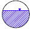

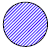

Rectangular - Closed

Full Height, Width

Filled Circular Full Height, Filled Depth

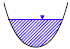

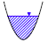

Trapezoidal

Rectangular Open

– Full Height, Width

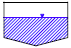

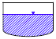

Full Height, Base Width, Side Slopes

Triangular Full Height, Top Width

Horizontal Ellipse

Full Height, Max. Width

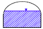

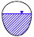

Vertical Ellipse

Full Height, Max. Width

Arch Full Height, Max. Width

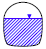

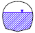

Power

Parabolic Full Height, Top Width

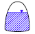

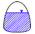

Full Height, Top Width, Exponent

Rectangular- Triangular

Rectangular- Round

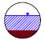

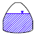

Full Height, Top Width, Triangle Height

Full Height, Top Width, Bottom Radius

Egg Full Height

Modified Baskethandle

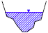

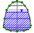

Full Height, Bottom Width, Top Radius

Horseshoe Full Height

Gothic Full Height

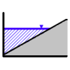

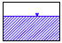

Catenary Full Height

Semi-Elliptical Full Height

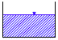

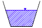

Baskethandle Full Height

Semi-Circular Full Height

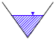

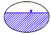

Irregular Channel

Transect Coordinates

Custom Closed Shape

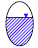

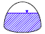

Full Height, Shape Curve Coordinates

Section

Street or Roadway

See 3.3.6

For pipes with Circular Force Main cross-sections either the Hazen-Williams or Darcy-Weisbach formula is used in place of the Manning equation for fully pressurized flow. For U.S. units the Hazen-Williams formula is:

𝑄𝑄= 1.318𝐶𝐶𝐶𝐶𝑅𝑅0.63𝑆𝑆0.54

where C is the Hazen-Williams C-factor which varies inversely with surface roughness and is supplied as one of the cross-section’s parameters. The Darcy-Weisbach formula is:

where g is the acceleration of gravity and f is the Darcy-Weisbach friction factor. For turbulent flow, the latter is determined from the height of the roughness elements on the walls of the pipe (supplied as an input parameter) and the flow’s Reynolds Number using the Colebrook-White equation. The choice of which equation to use is a user-supplied option.

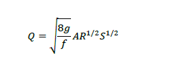

A conduit does not have to be assigned a Force Main shape for it to pressurize. Any of the closed cross-section shapes can potentially pressurize and thus function as force mains that use the Manning equation to compute friction losses.

A constant rate of exfiltration of water along the length of the conduit can be modeled by supplying a Seepage Rate value (in/hr or mm/hr). This only accounts for seepage losses, not infiltration of rainfall dependent groundwater. The latter can be modeled using SWMM’s RDII feature (see Section 3.3.8).

A conduit can also be designated to act as a culvert (see Figure 3-2) if a Culvert Inlet Geometry code number is assigned to it. These code numbers are listed in Appendix A.10. Culvert conduits are checked continuously during dynamic wave flow routing to see if they operate under Inlet Control as defined in the Federal Highway Administration’s publication *Hydraulic Design of * *Highway Culverts Third Edition* (Publication No. FHWA-HIF-12-026, April 2012). Under inlet control a culvert obeys a particular flow versus inlet depth rating curve whose shape depends on the culvert’s shape, size, slope, and inlet geometry.

Street and channel conduits with storm drain inlet structures (see Figure 3-3) use the methods described in the Federal Highway Administration's publication *Urban Drainage Design Manual - * *HEC-22* (Publication No. FHWA-NHI-10-009, August 2013) to determine the amount of flow they capture.

**Figure 3-2  Concrete box culvert **

**Figure 3-3  Storm drain inlet **

The principal input parameters for conduits are:

- names of the inlet and outlet nodes

- offset height or elevation above the inlet and outlet node inverts

- length

- Manning's roughness coefficient (*n*)

- cross-sectional geometry

- entrance/exit losses (optional)

- seepage rate (optional)

- presence of a flap gate to prevent reverse flow (optional)

- culvert type code number if the conduit acts as a culvert (optional)

- name of any inlet structure placed in a street or channel conduit (optional).

3.2.8 *Pumps * Pumps are links used to lift water to higher elevations. A pump curve describes the relation between a pump's flow rate and conditions at its inlet and outlet nodes. Five different types of pump curves are supported: Type1 (Fixed/Volume) Consists of a series of constant flow rates that apply over a series of volume intervals at the pump’s inlet node.

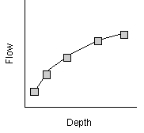

Type2 (Fixed/Depth) Similar to a Type1 pump except that the fixed flow rate levels vary over a set of depth intervals at the pump’s inlet node.

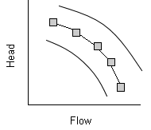

Type3 (Variable/Head) Uses a pump characteristic curve at some nominal impeller speed to relate flow rate and delivered head.

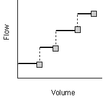

Type4 (Variable/Depth) A variable speed pump where flow varies continuously with inlet node water depth.

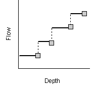

Type5 (Variable/Affinity) A variable speed version of the Type3 pump where the pump curve shifts position when control rules change the pump’s relative speed setting (see Section 3.3.9).

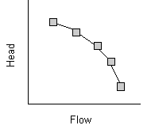

SWMM also supports an "Ideal" transfer pump that does not require a pump curve and is used mainly for preliminary analysis. Its flow rate equals the inflow rate to its inlet node no matter what the head difference is between its inlet and outlet nodes.

The on/off status of pumps can be controlled dynamically by specifying startup and shutoff water depths at the inlet node or through user-defined Control Rules. Rules can also be used to simulate variable speed drives that modulate pump flow. For a Type 5 pump, its operating curve shifts position such that flow changes in direct proportion to the controlled speed setting while head changes in proportion to the setting squared.

The principal input parameters for a pump include:

- names of its inlet and outlet nodes  name of its pump curve (or  for an Ideal pump)  initial on/off status  startup and shutoff depths (optional).

3.2.9 *Flow Regulators *

Flow Regulators are structures or devices used to control and divert flows within a conveyance system. They are typically used to:

- control releases from storage facilities

- prevent unacceptable surcharging

- divert flow to treatment facilities and interceptors

SWMM can model the following types of flow regulators: Orifices, Weirs, and Outlets.

Orifices

Orifices are used to model outlet and diversion structures in drainage systems, which are typically openings in the wall of a manhole, storage facility, or control gate. They are internally represented in SWMM as a link connecting two nodes. An orifice can have either a circular or rectangular shape, be located either at the bottom or along the side of the upstream node, and have a flap gate to prevent backflow.

Orifices can be used as storage unit outlets under all types of flow routing. If not attached to a storage unit node, they can only be used in drainage networks that are analyzed with Dynamic Wave flow routing.

The flow through a fully submerged orifice is computed as

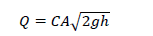

where Q = flow rate, C = discharge coefficient, A = area of orifice opening, g = acceleration of gravity, and h = head difference across the orifice. The height of an orifice's opening can be controlled dynamically through user-defined Control Rules. This feature can be used to model gate openings and closings. Flow through a partially full orifice is computed using an equivalent weir equation.

The principal input parameters for an orifice include:

- names of its inlet and outlet nodes

- configuration (bottom or side)

- shape (circular or rectangular)

- height or elevation above the inlet node invert

- discharge coefficient

- time to open or close (optional).

Weirs

Weirs, like orifices, are used to model outlet and diversion structures in a drainage system. Weirs are typically located across a channel, along its side, or at the top of a storage unit. They are internally represented in SWMM as a link connecting two nodes, where the weir itself is placed at the upstream node. A flap gate can be included to prevent backflow.

Five varieties of weirs are available, each incorporating a different formula for computing flow across the weir as listed in Table 3-2.

**Table 3-2 Available types of weirs **

**Weir Type ** **Cross Section Shape ** **Flow Formula **

Transverse Rectangular 𝐶𝐶𝑊𝑊𝐿𝐿ℎ3/2

Side flow Rectangular 𝐶𝐶𝑊𝑊𝐿𝐿ℎ5/3

V-notch Triangular 𝐶𝐶𝑊𝑊𝑆𝑆ℎ5/2

Trapezoidal Trapezoidal 𝐶𝐶𝑊𝑊𝐿𝐿ℎ3/2 + 𝐶𝐶𝑊𝑊𝑊𝑊𝑆𝑆ℎ5/2

Roadway Rectangular 𝐶𝐶𝑊𝑊𝐿𝐿ℎ3/2

Cw = weir discharge coefficient, L = weir length, S = side slope of V-notch or trapezoidal weir, h = head difference across the weir, Cws = discharge coefficient through sides of trapezoidal weir.

The Roadway weir is a broad crested rectangular weir used model roadway crossings usually in conjunction with culvert-type conduits (see Figure 3-2). It uses curves from the Federal Highway Administration publication *Hydraulic Design of Highway Culverts Third Edition* (Publication No. FHWA-HIF-12-026, April 2012) to determine CW as a function of h and roadway width.

Weirs can be used as storage unit outlets under all types of flow routing. If not attached to a storage unit, they can only be used in drainage networks that are analyzed with Dynamic Wave flow routing.

The height of the weir crest above the inlet node invert can be controlled dynamically through user-defined Control Rules. This feature can be used to model inflatable dams.

Weirs can either be allowed to surcharge or not. A surcharged weir will use an equivalent orifice equation to compute the flow through it. Weirs placed in open channels would normally not be allowed to surcharge while those placed in closed diversion structures or those used to represent storm drain inlet openings would be allowed to.

The principal input parameters for a weir include:

- names of its inlet and outlet nodes

- shape and geometry

- crest height or elevation above the inlet node invert

- discharge coefficient.