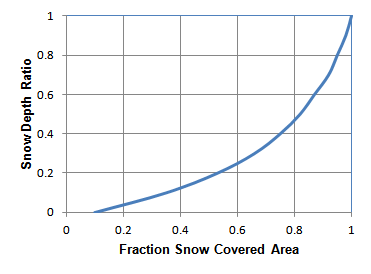
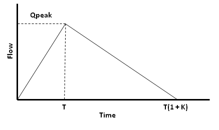
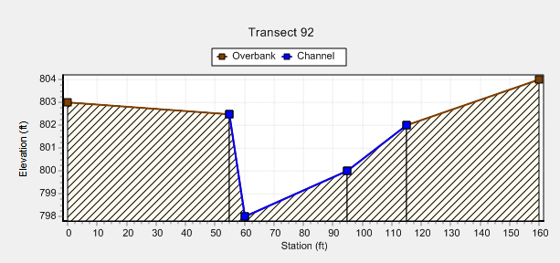
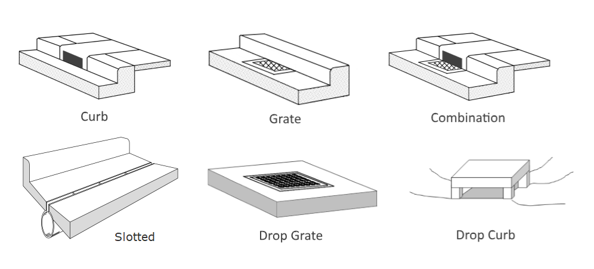
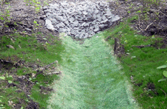
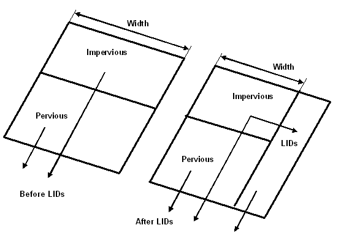

Outlets Outlets are flow control devices that are typically used to control outflows from storage units. They are used to model special head-discharge relationships that cannot be characterized by pumps, orifices, or weirs. Outlets are internally represented in SWMM as a link connecting two nodes. An outlet can also have a flap gate that restricts flow to only one direction. Outlets attached to storage units are active under all types of flow routing. If not attached to a storage unit, they can only be used in drainage networks analyzed with Dynamic Wave flow routing. A user-defined rating curve determines an outlet's discharge flow as a function of either the freeboard depth above the outlet's opening or the head difference across it. Control Rules can be used to dynamically adjust this flow when certain conditions exist. The principal input parameters for an outlet include:

- names of its inlet and outlet nodes

- height or elevation above the inlet node invert

- function or table containing its head (or depth) - discharge relationship.

3.2.10 *Map Labels * Map Labels are optional text labels added to SWMM's Study Area Map to help identify particular objects or regions of the map. The labels can be drawn in any Windows font, freely edited and be dragged to any position on the map.

3.3 **Non-Visual Objects ** In addition to physical objects that can be displayed visually on a map, SWMM utilizes several classes of non-visual data objects to describe additional characteristics and processes within a study area.

3.3.1 *Climatology * Temperature Air temperature data are used when simulating snowfall and snowmelt processes during runoff calculations. They can also be used to compute daily evaporation rates. If these processes are not

being simulated then temperature data are not required. Air temperature data can be supplied to SWMM from one of the following sources:

- a user-defined time series of point values (values at intermediate times are interpolated)

- an external climate file containing daily minimum and maximum values (SWMM fits a sinusoidal curve through these values depending on the day of the year).

For user-defined time series, temperatures are in degrees F for US units and degrees C for metric units. The external climate file can also be used to directly supply evaporation and wind speed as well.

Evaporation

Evaporation can occur for standing water on subcatchment surfaces, for subsurface water in groundwater aquifers, for water traveling through open channels, and for water held in storage units. Evaporation rates can be stated as:

- a single constant value

- a set of monthly average values

- a user-defined time series of values

- values computed from the daily temperatures contained in an external climate file

- daily values read directly from an external climate file.

These values represent potential rates. The actual amount of water evaporated will depend on the amount available.

If rates are read directly from a climate file, then a set of monthly pan coefficients should also be supplied to convert the pan evaporation data to free water-surface values. An option is also available to allow evaporation only during periods with no precipitation.

Wind Speed

Wind speed is an optional climatic variable that is used only for snowmelt calculations.  SWMM can use either a set of monthly average speeds or wind speed data contained in the same climate file used for daily minimum/maximum temperatures.

Snowmelt

Snowmelt parameters are climatic variables that apply across the entire study area when simulating snowfall and snowmelt. They include:

- the air temperature at which precipitation falls as snow

- heat exchange properties of the snow surface

- study area elevation, latitude, and longitude correction Areal Depletion Areal depletion refers to the tendency of accumulated snow to melt non-uniformly over the surface of a subcatchment. As the melting process proceeds, the area covered by snow gets reduced. This behavior is described by an Areal Depletion Curve that plots the fraction of total area that remains snow covered against the ratio of the actual snow depth to the depth at which there is 100% snow cover. A typical ADC for a natural area is shown in Figure 3-4. Two such curves can be supplied to SWMM, one for impervious areas and another for pervious areas.

**Figure 3-4  Areal depletion curve for a natural area **

Climate Adjustments Climate Adjustments are optional modifications applied to the temperature, evaporation rate, and rainfall intensity that SWMM would otherwise use at each time step of a simulation. Separate sets of adjustments that vary periodically by month of the year can be assigned to these variables. They provide a simple way to examine the effects of future climate change without having to modify the original climatic time series. A set of monthly adjustments can also be applied to the hydraulic conductivity used in computing rainfall infiltration on all pervious land surfaces, including those in all LID units, and for exfiltration

from all storage nodes and conduits. These can reflect the increase of hydraulic conductivity with increasing temperature or the effect that seasonal changes in land surface conditions, such as frozen ground, can have on infiltration capacity. They can be overridden for individual subcatchments (and their LID units) by assigning a monthly infiltration adjustment Time Pattern to a subcatchment.  Monthly adjustment time patterns for depression storage and pervious surface roughness coefficient (Mannings n) can also be specified for individual subcatchments

3.3.2 *Snow Packs * Snow Pack objects contain parameters that characterize the buildup, removal, and melting of snow over three types of subareas within a subcatchment:

- The Plowable snow pack area consists of a user-defined fraction of the total impervious area. It is meant to represent such areas as streets and parking lots where plowing and snow removal can be done.

- The Impervious snow pack area covers the remaining impervious area of a subcatchment.

- The Pervious snow pack area encompasses the entire pervious area of a subcatchment. Each of these three areas is characterized by the following parameters:

- minimum and maximum snow melt coefficients

- minimum air temperature for snow melt to occur

- snow depth above which 100% areal coverage occurs

- initial snow depth

- initial and maximum free water content in the pack. In addition, a set of snow removal parameters can be assigned to the Plowable area. These parameters consist of the depth at which snow removal begins and the fractions of snow moved onto various other areas. Subcatchments are assigned a snow pack object through their Snow Pack property. A single snow pack object can be applied to any number of subcatchments. Assigning a snow pack to a subcatchment simply establishes the melt parameters and initial snow conditions for that subcatchment. Internally, SWMM creates a "physical" snow pack for each subcatchment, which tracks snow accumulation and melting for that particular subcatchment based on its snow pack parameters, its amount of pervious and impervious area, and the precipitation history it sees.

3.3.3 *Aquifers *

Aquifers are sub-surface groundwater zones used to model the vertical movement of water infiltrating from the subcatchments that lie above them. They also permit the infiltration of groundwater into the drainage system, or exfiltration of surface water from the drainage system, depending on the hydraulic gradient that exists. Aquifers are only required in models that need to explicitly account for the exchange of groundwater with the drainage system or to establish base flow and recession curves in natural channels and non-urban systems. The parameters of an aquifer object can be shared by several subcatchments but there is no exchange of groundwater between subcatchments. A drainage system node can exchange groundwater with more than one subcatchment.

Aquifers are represented using two zones – an un-saturated zone and a saturated zone. Their behavior is characterized using such parameters as soil porosity, hydraulic conductivity, evapotranspiration depth, bottom elevation, and loss rate to deep groundwater. In addition, the initial water table elevation and initial moisture content of the unsaturated zone must be supplied.

Aquifers are connected to subcatchments and to drainage system nodes through a subcatchment's Groundwater Flow property. This property also contains parameters that govern the rate of groundwater flow between the aquifer's saturated zone and the drainage system node.

3.3.4 *Unit Hydrographs *

Unit Hydrographs (UHs) estimate rainfall-dependent infiltration and inflow (RDII) into a sewer system. A UH set contains up to three such hydrographs, one for a short-term response, one for an intermediate-term response, and one for a long-term response. A UH group can have up to 12 UH sets, one for each month of the year. Each UH group is considered as a separate object by SWMM,  and is assigned its own unique name along with the name of the rain gage that supplies rainfall data to it.

Each unit hydrograph, as shown in Figure 3-5, is defined by three parameters:

- R: the fraction of rainfall volume that enters the sewer system

- T: the time from the onset of rainfall to the peak of the UH in hours

- K: the ratio of time to recession of the UH to the time to peak

A unit hydrograph can also have a set of Initial Abstraction (IA) parameters associated with it. These determine how much rainfall is lost to interception and depression storage before any excess rainfall is generated and transformed into RDII flow by the hydrograph. The IA parameters consist of:

- a maximum possible depth of IA (inches or mm),

- a recovery rate (inches/day or mm/day) at which stored IA is depleted during dry periods,

- an initial depth of stored IA (inches or mm).

**Figure 3-5  An RDII unit hydrograph **

To generate RDII into a drainage system node, the node must identify (through its Inflows property) the UH group and the area of the surrounding sewershed that contributes RDII flow.

An alternative to using unit hydrographs to define RDII flow is to create an external RDII interface file, which contains RDII time series data. See Section 11.7.

Unit hydrographs could also be used to replace SWMM's main rainfall-runoff process that uses Subcatchment objects, provided that properly calibrated UHs are utilized. In this case what SWMM calls RDII inflow to a node would actually represent overland runoff.

3.3.5 *Transects *

Transects refer to the geometric data that describe how bottom elevation varies with horizontal distance over the cross-section of a natural channel or irregular-shaped conduit. Figure 3-6 displays an example transect for a natural channel.

Each transect must be given a unique name. Conduits refer to that name to represent their shape. A special Transect Editor is available for editing the station-elevation data of a transect. SWMM internally converts these data into tables of area, top width, and hydraulic radius versus channel

depth. In addition, as shown in Figure 3-6, each transect can have a left and right overbank section whose Manning's roughness coefficient can be different from that of the main channel. This feature can provide more realistic estimates of channel conveyance under high flow conditions.

**Figure 3-6  Example of a natural channel transect **

3.3.6 *Streets * Streets are a specialized form of transect that describes the typical cross-section geometry of a street or roadway. Figure 3-7 shows a half-street layout along with the dimensions a user needs to provide.

**Figure 3-7 Definitional sketch of a Street cross-section **

Each street section object is assigned an ID name that a conduit can refer to for describing its cross-section geometry. A Street Section Editor is available for providing a street section's dimensions and whether it is one-sided or two-sided.

3.3.7 *Inlets * Street inlets are curb and gutter openings that convey runoff from streets into below-ground sewers. Drop inlets serve a similar purpose for open rectangular and trapezoidal channels. SWMM can compute the amount of flow captured by inlets and sent to designated sewer nodes using the U.S. Federal Highway Administration’s HEC-22 methodology9. The type, sizing, and spacing of street inlets will determine if the spread and depth of water on roadways can be maintained at acceptable levels. To analyze street drainage with SWMM a site is represented as a dual drainage system consisting of both street conduits along the ground surface and sewer conduits below ground (see Figure 3- 8).  An inlet structure will divert some portion of the street flow it carries into a designated node of the sewer system with the rest bypassed to downstream street conduits. When an inlet’s sewer node reaches its full depth any excess sewer flow that causes it to flood is routed back into the street's downstream node rather than having it leave the system as it normally would.

9 Brown, S.A, et al. *Urban Drainage Design Manual, Hydraulic Engineering Circular 22*, Third Edition, Report No. FHWA-NHI-10-009 HEC-22, Federal Highway Administration, Washington, D.C., September 2009.

**Figure 3-8  Representation of a dual drainage system **

As shown in Figure 3-8, inlets can be located either on a continuous sloping section of roadway (on-grade, sometimes referred to as a flow-by condition) or at a low point where flow tends to pool (on-sag, sometimes referred to as a sump condition). SWMM’s HEC-22 inlet capture equations support the inlet types shown in Figure 3-9. Drop inlets can only be used with open rectangular or trapezoidal channels while the other curb and gutter inlets can only be placed in conduits with Street cross-sections. An additional Custom type of inlet can be used in both streets and channels. Its capture efficiency is described by either a user- supplied Diversion curve (captured flow versus approach flow) or Rating curve (captured flow versus flow depth).

**Figure 3-9  HEC-22 inlets supported by SWMM **

To add an analysis of street inlets to a SWMM project:

- Create one network layout for streets and another for sewers.

- Create a collection of street cross-section objects.

- For each street conduit, set its Shape property to one of the available street sections.

- Create a set of inlet structure design objects.

- Place a particular inlet structure design into a selected street conduit, assigning it a sewer node that receives its captured flow.

- Assign surface runoff from subcatchments or other external inflows to street conduit nodes.

A similar set of steps would be used to add drop inlets into open rectangular or trapezoidal channels. A summary of results for each street conduit (maximum flow depth and pavement spread) and for each inlet (percent capture at peak flow, frequency of bypass flow, and frequency of sewer system backflow) will appear as a separate Street Flow table in SWMM's Summary Results report. Some additional considerations when modeling inlets are:

- Conduits with inlets will be displayed on the Study Area Map with a symbol near their midpoint and show their downstream node connected to the inlet's capture node with a dotted line when the Map Option to display link symbols is turned on.

- The rim elevations of nodes that receive captured inlet flow do not have to match the invert elevations of the end node of the conduit containing the inlet.

- Two-sided street conduits (that are symmetric about the street crown) use pairs of inlets placed on each curb side of the street.

- Multiple inlets of the same design can be assigned to a conduit (as pairs for two-sided streets). For on-grade placement the flow captured by each inlet is determined sequentially, so that the approach flow to the next inlet in line is the bypass flow from the inlet before it.

- Flow captured by inlets is limited by the amount that its sewer node can receive before it floods. If the node has no such capacity remaining then any excess flow that would cause it to flood is routed back through the inlet and onto the street.

- Users can stipulate whether an inlet operates on-grade or on-sag or have SWMM decide based on the slopes of the conduits adjoining it. (On-sag refers to a sump or low point that all adjoining conduits slope towards.)

- Inlets can have a degree of clogging and a flow capture restriction assigned to them.

- For Kinematic Wave and Steady Flow routing it is recommended that storage nodes be used at the end of inlet conduits that converge at sag points since otherwise any non- captured flow will simply exit the system. This is not necessary for Dynamic Wave routing as any non-captured water will create a backwater effect raising water levels in the adjoining street conduits.

3.3.8 *External Inflows *

In addition to inflows originating from subcatchment runoff and groundwater, drainage system nodes can receive three other types of external inflows:

- **Direct Inflows** - These are user-defined time series of inflows added directly into a node. They can be used to perform flow and water quality routing in the absence of any runoff computations (as in a study area where no subcatchments are defined).

- **Dry Weather Inflows** - These are continuous inflows that typically reflect the contribution from sanitary sewage in sewer systems or base flows in pipes and stream channels. They are represented by an average inflow rate that can be periodically adjusted on a monthly, daily, and hourly basis by applying Time Pattern multipliers to this average value.

- **Rainfall-Dependent Infiltration and Inflow (RDII)** - These are stormwater flows that enter sanitary or combined sewers due to "inflow" from direct connections of downspouts, sump pumps, foundation drains, etc. as well as "infiltration" of subsurface water through cracked pipes, leaky joints, poor manhole connections, etc. RDII can be computed for a given rainfall record based on set of triangular unit hydrographs (UH) that determine a short-term, intermediate-term, and long-term inflow response for each time period of rainfall. Any number of UH sets can be supplied for different sewershed areas and different months of the year. RDII flows can also be specified in an external RDII interface file.

Direct, Dry Weather, and RDII inflows are properties associated with each type of drainage system node (junctions, outfalls, flow dividers, and storage units) and can be specified when nodes are edited. They can be used to perform flow and water quality routing in the absence of any runoff computations (as in a study area where no subcatchments are defined). It is also possible to make the outflows generated from an upstream drainage system be the inflows to a downstream system by using interface files. See Section 11.7 for further details.

3.3.9 *Control Rules *

Control Rules determine how pumps and regulators in the drainage system will be adjusted over the course of a simulation. Some examples of these rules are:

Simple time-based pump control: RULE R1 IF SIMULATION TIME > 8 THEN PUMP 12 STATUS = ON ELSE PUMP 12 STATUS = OFF Multiple-condition orifice gate control: RULE R2A IF NODE 23 DEPTH > 12 AND LINK 165 FLOW > 100 THEN ORIFICE R55 SETTING = 0.5 RULE R2B IF NODE 23 DEPTH > 12 AND LINK 165 FLOW > 200 THEN ORIFICE R55 SETTING = 1.0 RULE R2C IF NODE 23 DEPTH <= 12 OR LINK 165 FLOW <= 100 THEN ORIFICE R55 SETTING = 0 Pump station operation: RULE R3A IF NODE N1 DEPTH > 5 THEN PUMP N1A STATUS = ON RULE R3B IF NODE N1 DEPTH > 7 THEN PUMP N1B STATUS = ON RULE R3C IF NODE N1 DEPTH <= 3 THEN PUMP N1A STATUS = OFF AND PUMP N1B STATUS = OFF Modulated weir height control: RULE R4

IF NODE N2 DEPTH >= 0 THEN WEIR W25 SETTING = CURVE C25 Appendix C.3 describes the control rule format in more detail and the special Editor used to edit them.

3.3.10 *Pollutants * SWMM can simulate the generation, inflow and transport of any number of user-defined pollutants. Required information for each pollutant includes:

- pollutant name

- concentration units (i.e., milligrams/liter, micrograms/liter, or counts/liter)

- concentration in rainfall

- concentration in groundwater

- concentration in rainfall-dependent infiltration and inflow

- concentration in dry weather flow

- initial concentration throughout the conveyance system

- first-order decay coefficient. Co-pollutants can also be defined in SWMM. For example, pollutant X can have a co-pollutant Y, meaning that the runoff concentration of X will have some fixed fraction of the runoff concentration of Y added to it. Pollutant buildup and washoff from subcatchment areas are determined by the land uses assigned to those areas. Input loadings of pollutants to the drainage system can also originate from external time series inflows as well as from dry weather inflows.

3.3.11 *Land Uses * Land Uses are categories of development activities or land surface characteristics assigned to subcatchments. Examples of land use activities are residential, commercial, industrial, and undeveloped. Land surface characteristics might include rooftops, lawns, paved roads, undisturbed soils, etc. Land uses are used solely to account for spatial variation in pollutant buildup and washoff rates within subcatchments. The SWMM user has many options for defining land uses and assigning them to subcatchment areas. One approach is to assign a mix of land uses for each subcatchment, which results in all land uses within the subcatchment having the same pervious and impervious characteristics.

Another approach is to create subcatchments that have a single land use classification along with a distinct set of pervious and impervious characteristics that reflects the classification. The following processes can be defined for each land use category:

- pollutant buildup

- pollutant washoff

- street cleaning. Pollutant Buildup Pollutant buildup that accumulates within a land use category is described (or “normalized”) by either a mass per unit of subcatchment area or per unit of curb length. Mass is expressed in pounds for US units and kilograms for metric units. The amount of buildup is a function of the number of preceding dry weather days and can be computed using one of the following functions: **Power Function**: Pollutant buildup (B) accumulates proportionally to time (t) raised to some power, until a maximum limit is achieved,

𝐵𝐵= 𝑀𝑀𝑀𝑀𝑀𝑀(𝐶𝐶1, 𝐶𝐶2𝑡𝑡𝐶𝐶3)

where C1 = maximum buildup possible (mass per unit of area or curb length), C2 = buildup rate constant, and C3 = time exponent. **Exponential Function**: Buildup follows an exponential growth curve that approaches a maximum limit asymptotically,

𝐵𝐵= 𝐶𝐶1(1 −𝑒𝑒−𝐶𝐶2𝑡𝑡)

where C1 = maximum buildup possible (mass per unit of area or curb length) and C2 = buildup rate constant (1/days). **Saturation Function**: Buildup begins at a linear rate that continuously declines with time until a saturation value is reached,

𝐵𝐵= 𝐶𝐶1𝑡𝑡 𝐶𝐶2 + 𝑡𝑡

where C1 = maximum buildup possible (mass per unit area or curb length) and C2 = half-saturation constant (days to reach half of the maximum buildup). **External Time Series: **This option allows one to use a Time Series to describe the rate of buildup per day as a function of time. The values placed in the time series would have units of mass per

unit area (or curb length) per day. One can also provide a maximum possible buildup (mass per unit area or curb length) with this option and a scaling factor that multiplies the time series values.

Pollutant Washoff

Pollutant washoff from a given land use category occurs during wet weather periods and can be described in one of the following ways:

**Exponential Washoff:** The washoff load (W) in units of mass per hour is proportional to the product of runoff raised to some power and to the amount of buildup remaining,

𝑊𝑊= 𝐶𝐶1𝑞𝑞𝐶𝐶2𝐵𝐵

where C1 = washoff coefficient, C2 = washoff exponent, q = runoff rate per unit area (inches/hour or mm/hour), and B = pollutant buildup in mass units. The buildup here is the total mass (not per area or curb length) and both buildup and washoff mass units are the same as used to express the pollutant's concentration (milligrams, micrograms, or counts).

**Rating Curve Washoff**: The rate of washoff *W* in mass per second is proportional to the runoff rate raised to some power,

𝑊𝑊= 𝐶𝐶1𝑄𝑄𝐶𝐶2

where C1 = washoff coefficient, C2 = washoff exponent, and Q = runoff rate in user-defined flow units. **Event Mean Concentration**: This is a special case of Rating Curve Washoff where the exponent is 1.0 and the coefficient C1 represents the washoff pollutant concentration in mass per liter (Note: the conversion between user-defined flow units used for runoff and liters is handled internally by SWMM).

Note that in each case buildup is continuously depleted as washoff proceeds, and washoff ceases when there is no more buildup available.

Washoff loads for a given pollutant and land use category can be reduced by a fixed percentage by specifying a BMP Removal Efficiency that reflects the effectiveness of any BMP controls associated with the land use. It is also possible to use the Event Mean Concentration option by itself, without having to model any pollutant buildup at all.

Street Sweeping

Street sweeping can be used on each land use category to periodically reduce the accumulated buildup of specific pollutants. The parameters that describe street sweeping include:

- days between sweeping

- days since the last sweeping at the start of the simulation

- the fraction of buildup of all pollutants that is available for removal by sweeping

- the fraction of available buildup for each pollutant removed by sweeping

Note that these parameters can be different for each land use, and the last parameter can vary also with pollutant.

3.3.12 *Treatment * Removal of pollutants from the flow streams entering any drainage system node is modeled by assigning a set of treatment functions to the node. A treatment function can be any well-formed mathematical expression involving:

- the pollutant concentration

- the removals of other pollutants

- any of several process variables, such as flow rate, depth, hydraulic residence time, etc. The result of the treatment function can be either a concentration (denoted by the letter **C**) or a fractional removal (denoted by **R**). For example, a first-order decay expression for BOD exiting from a storage node might be expressed as:

*C = BOD  exp(-0.05  HRT) *

where HRT is the reserved variable name for hydraulic residence time. The removal of some trace pollutant that is proportional to the removal of total suspended solids (TSS) could be expressed as:

* R = 0.75  R_TSS *

Section C.26 provides more details on how user-defined treatment equations are supplied to the program.

3.3.13 *Curves * Curve objects are used to describe a functional relationship between two quantities. The following types of curves are used in SWMM:

- **Storage** - describes how the surface area of a Storage Unit node varies with water depth.

- **Shape** - describes how the width of a customized cross-sectional shape varies with height for a Conduit link.

- **Diversion** - relates diverted outflow to total inflow for a Flow Divider node or a Custom inlet drain.

- **Tidal** - describes how the stage at an Outfall node changes by hour of the day.

- **Pump** - relates flow through a Pump link to the depth or volume of water at the upstream node or to the head delivered by the pump.

- **Rating** - relates flow through an Outlet link to the freeboard depth or head difference of water across it; relates flow captured by a Custom inlet drain to the depth of water above it.

- **Control** - determines how the control setting of a pump or flow regulator varies as a function of some control variable (such as water level at a particular node) as specified in a Modulated Control rule.

- **Weir **– allows a weir’s discharge coefficient to vary with the hydraulic head across it.

Each curve must be given a unique name and can be assigned any number of data pairs.

3.3.14 *Time Series  * Time Series objects are used to describe how certain object properties vary with time. Time series can be used to describe:

- temperature data

- evaporation data

- rainfall data

- water stage at outfall nodes

- external inflow hydrographs at drainage system nodes

- external inflow pollutographs at drainage system nodes

- control settings for pumps and flow regulators.. Each time series must be given a unique name and can be assigned any number of time-value data pairs. Time can be specified either as hours from the start of a simulation or as an absolute date and time-of-day. Time series data can either be entered directly into the program or be accessed from a user-supplied Time Series file.

For rainfall time series, it is only necessary to enter periods with non-zero rainfall amounts. SWMM interprets the rainfall value as a constant value lasting over the recording interval specified for the rain gage that utilizes the time series. For all other

types of time series, SWMM uses interpolation to estimate values at times that fall in between the recorded values.

For times that fall outside the range of the time series, SWMM will use a value of 0 for rainfall and external inflow time series, and either the first or last series value for temperature, evaporation, and water stage time series.

3.3.15 *Time Patterns * Time Patterns allow external Dry Weather Flow (DWF) to vary in a periodic fashion. They consist of a set of adjustment factors applied as multipliers to a baseline DWF flow rate or pollutant concentration. The different types of time patterns include:

**Monthly** - one multiplier for each month of the year

**Daily** - one multiplier for each day of the week

**Hourly** - one multiplier for each hour from 12 AM to 11 PM

**Weekend**  - hourly multipliers for weekend days

Each Time Pattern must have a unique name and there is no limit on the number of patterns that can be created. Each dry weather inflow (either flow or quality) can have up to four patterns associated with it, one for each type listed above.

Monthly time patterns can also be used to adjust the baseline values of the following hydrological parameters:

- subcatchment depression storage

- subcatchment pervious surface roughness

- soil infiltration recovery rate

- groundwater evaporation rate.

3.3.16 *LID Controls *

LID Controls are low impact development practices designed to capture surface runoff and provide some combination of detention, infiltration, and evapotranspiration to it. They are considered as properties of a given subcatchment, similar to how Aquifers and Snow Packs are treated. SWMM can explicitly model eight different generic types of LID controls:

***Bio-retention Cells*** are depressions that contain vegetation grown in an engineered soil mixture placed above a gravel drainage bed. They provide storage, infiltration and evaporation of both direct rainfall and runoff captured from surrounding areas.

***Rain Gardens*** are a type of bio-retention cell consisting of just the engineered soil layer with no gravel bed below it.

***Green Roofs*** are another variation of a bio-retention cell that have a soil layer laying atop a special drainage mat material that conveys excess percolated rainfall off of the roof.

***Infiltration Trenches*** are narrow ditches filled with gravel that intercept runoff from upslope impervious areas. They provide storage volume and additional time for captured runoff to infiltrate the native soil below.

***Continuous Permeable Pavement*** systems are excavated areas filled with gravel and paved over with a porous concrete or asphalt mix. ***Block Paver*** systems consist of impervious paver blocks placed on a sand or pea gravel bed with a gravel storage layer below.

***Rain Barrels*** (or ***Cisterns***) are containers that collect roof runoff during storm events and can either release or re-use the rainwater during dry periods.

***Rooftop Disconnection*** has downspouts discharge to pervious landscaped areas and lawns instead of directly into storm drains. It can also model roofs with directly connected drains that overflow onto pervious areas.

***Vegetative Swales*** are channels or depressed areas with sloping sides covered with grass and other vegetation. They slow down the conveyance of collected runoff and allow it more time to infiltrate the native soil beneath it.

Bio-retention cells, infiltration trenches, and permeable pavement systems can contain optional drain systems in their gravel storage beds to convey excess captured runoff off of the site and prevent the unit from flooding. They can also have an impermeable floor or liner that prevents any infiltration into the native soil from occurring. Infiltration trenches and permeable pavement systems can also be subjected to a decrease in hydraulic conductivity over time due to clogging.

LID units that contain drains can have a removal percentage assigned to each pollutant discharged through the drain. LID’s will also provide a reduction in pollutant mass load conveyed in their surface discharge due to the reduction in runoff flow volume they provide.

There are two different approaches for placing LID controls within a subcatchment:

- place one or more controls in an existing subcatchment that will displace an equal amount of non-LID area from the subcatchment

- create a new subcatchment devoted entirely to just a single LID practice.

The first approach allows a mix of LIDs to be placed into a subcatchment, each treating a different portion of the runoff generated from the non-LID fraction of the subcatchment. Note that under this option the subcatchment's LIDs act in parallel -- it is not possible to make them act in series (i.e., have the outflow from one LID control become the inflow to another LID). Also, after LID placement the subcatchment's Percent Impervious and Width properties may require adjustment to compensate for the amount of original subcatchment area that has now been replaced by LIDs (see Figure 3-10 below). For example, suppose that a subcatchment which is 40% impervious has 75% of that area converted to a permeable pavement LID. After the LID is added the subcatchment's percent imperviousness should be changed to the percent of impervious area remaining divided by the percent of non-LID area remaining. This works out to (1 - 0.75)40 / (100 - 0.7540) or 14.3 %.

**Figure 3-10  Adjustment of subcatchment parameters after LID placement **

Under this first approach the runoff available for capture by the subcatchment's LIDs is the runoff generated from its impervious area. If the option to re-route some fraction of this runoff to the pervious area is exercised, then only the remaining impervious runoff (if any) will be available for LID treatment. Also note that green roofs and roof disconnection only treat the precipitation that falls directly on them and do not capture runoff from other impervious areas in their subcatchment.

The second approach allows LID controls to be strung along in series and also allows runoff from several different upstream subcatchments to be routed onto the LID subcatchment. If these single-LID subcatchments are carved out of existing subcatchments, then once again some adjustment of the Percent Impervious, Width and also the Area properties of the latter may be necessary. In addition, whenever an LID occupies the entire subcatchment the values assigned to the subcatchment's standard surface properties (such as imperviousness, slope, roughness, etc.) are overridden by those that pertain to the LID unit.