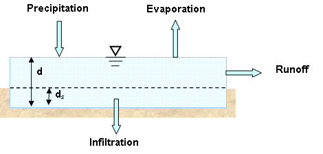
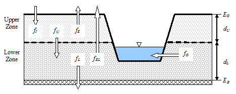
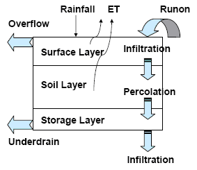

3.4 **Computational Methods ** SWMM is a physically based, discrete-time simulation model. It employs principles of conservation of mass, energy, and momentum wherever appropriate. This section briefly describes the methods SWMM uses to model stormwater runoff quantity and quality through the following physical processes:

- Surface Runoff  Groundwater  Surface Ponding

- Infiltration  Snowmelt  Water Quality Routing

- Groundwater  Flow Routing  Low Impact Development More detailed descriptions of SWMM’s computational procedures can be found in a series of three reference manuals10 11 12 available on EPA’s SWMM web site.

3.4.1 *Surface Runoff * The conceptual view of surface runoff used by SWMM is illustrated in Figure 3-11 below. Each subcatchment surface is treated as a nonlinear reservoir. Inflow comes from precipitation and any designated upstream subcatchments. There are several outflows, including infiltration, evaporation, and surface runoff. The capacity of this "reservoir" is the maximum depression storage, which is the maximum surface storage provided by ponding, surface wetting, and interception. Surface runoff per unit area occurs only when the depth of water in the "reservoir" exceeds the maximum depression storage, **d****s**, in which case the outflow is given by Manning's equation. Depth of water over the subcatchment (**d**) is continuously updated with time by solving numerically a water balance equation over the subcatchment.

10 Rossman, L.A. and Huber, W.C. (2016). *Storm Water Management Model Reference Manual * *Volume I – Hydrology (Revised)*, EPA/600/R-15/162A, National Risk Management Laboratory, U.S. Environmental Protection Agency, Cincinnati, OH.

11 Rossman, L.A. (2017). *Storm Water Management Model Reference Manual Volume II – * *Hydraulics*, EPA/600/R-17/111, National Risk Management Laboratory, U.S. Environmental Protection Agency, Cincinnati, OH.

12 Rossman, L.A. and Huber, W.C. (2016). *Storm Water Management Model Reference Manual * *Volume III – Water Quality*, EPA/600/R-15/162A, National Risk Management Laboratory, U.S. Environmental Protection Agency, Cincinnati, OH.

**Figure 3-11  Conceptual view of surface runoff **

3.4.2 *Infiltration * Infiltration is the process of rainfall penetrating the ground surface into the unsaturated soil zone of pervious subcatchments areas. SWMM offers four choices for modeling infiltration: **Horton's Method  ** This method is based on empirical observations showing that infiltration decreases exponentially from an initial maximum rate to some minimum rate over the course of a long rainfall event. Input parameters required by this method include the maximum and minimum infiltration rates, a decay coefficient that describes how fast the rate decreases over time, and a time it takes a fully saturated soil to completely dry. **Modified Horton Method ** This is a modified version of the classical Horton Method that uses the cumulative infiltration in excess of the minimum rate as its state variable (instead of time along the Horton curve), providing a more accurate infiltration estimate when low rainfall intensities occur. It uses the same input parameters as does the traditional Horton Method. **Green-Ampt Method  ** This method for modeling infiltration assumes that a sharp wetting front exists in the soil column, separating soil with some initial moisture content below from saturated soil above. The input parameters required are the initial moisture deficit of the soil, the soil's hydraulic conductivity, and the suction head at the wetting front. The recovery rate of moisture deficit during dry periods is empirically related to the hydraulic conductivity.

**Modified Green-Ampt Method ** This method modifies the original Green-Ampt procedure by not depleting moisture deficit in the top surface layer of soil during initial periods of low rainfall as was done in the original method. This change can produce more realistic infiltration behavior for storms with long initial periods where the rainfall intensity is below the soil’s saturated hydraulic conductivity.

**Curve Number Method ** This approach is adopted from the NRCS (SCS) Curve Number method for estimating runoff. It assumes that the total infiltration capacity of a soil can be found from the soil's tabulated Curve Number. During a rain event this capacity is depleted as a function of cumulative rainfall and remaining capacity. The input parameters for this method are the curve number and the time it takes a fully saturated soil to completely dry.

SWMM also allows the infiltration recovery rate to be adjusted by a fixed amount on a monthly basis to account for seasonal variation in such factors as evaporation rates and groundwater levels. This optional monthly soil recovery pattern is specified as part of a project's Evaporation data.

3.4.3 *Groundwater *

Figure 3-12 is a definitional sketch of the two-zone groundwater model that is used in SWMM.

The upper zone is unsaturated with a variable moisture content of θ. The lower zone is fully

saturated and therefore its moisture content is fixed at the soil porosity φ. The fluxes shown in the figure, expressed as volume per unit area per unit time, consist of the following:

**Figure 3-12  Two-zone groundwater model**

**f****I** infiltration from the surface

**f****E**  evapotranspiration from the upper zone which is a fixed fraction of the un-used surface evaporation

**f****U**   percolation from the upper to lower zone which depends on the upper zone moisture content

θ and depth **d****U**

**f****EL** evapotranspiration from the lower zone, which is a function of the depth of the upper zone **d****U**

**f****L**  seepage from the lower zone to deep groundwater which depends on the lower zone depth **d****L**

**f****G**  lateral groundwater interflow to the drainage system, which depends on the lower zone depth **d****L** as well as the depth in the receiving channel or node. After computing the water fluxes that exist during a given time step, a mass balance is written for the change in water volume stored in each zone so that a new water table depth and unsaturated zone moisture content can be computed for the next time step.

3.4.4 *Snowmelt * The snowmelt routine in SWMM is a part of the runoff modeling process. It updates the state of the snow packs associated with each subcatchment by accounting for snow accumulation, snow redistribution by areal depletion and removal operations, and snow melt via heat budget accounting. Any snowmelt coming off the pack is treated as an additional rainfall input onto the subcatchment. At each runoff time step the following computations are made:

**1.** Air temperature and melt coefficients are updated according to the calendar date.

**2.** Any precipitation that falls as snow is added to the snow pack.

**3.** Any excess snow depth on the plowable area of the pack is redistributed according to the removal parameters established for the pack.

**4.** Areal coverage of snow on the impervious and pervious areas of the pack is reduced according to the Areal Depletion Curves defined for the study area.

**5.** The amount of snow in the pack that melts to liquid water is found using:

a. a heat budget equation for periods with rainfall, where melt rate increases with increasing air temperature, wind speed, and rainfall intensity

b. a degree-day equation for periods with no rainfall, where melt rate equals the product of a melt coefficient and the difference between the air temperature and the pack's base melt temperature.

**6.** If no melting occurs, the pack temperature is adjusted up or down based on the product of the difference between current and past air temperatures and an adjusted melt coefficient. If melting occurs, the temperature of the pack is increased by the equivalent heat content of the melted snow, up to the base melt temperature. Any remaining melt liquid beyond this is available to runoff from the pack.

**7.** The available snowmelt is then reduced by the amount of free water holding capacity remaining in the pack. The remaining melt is treated the same as an additional rainfall input onto the subcatchment.

3.4.5 *Flow Routing * Flow routing within a conduit link in SWMM is governed by the conservation of mass and momentum equations for gradually varied, unsteady flow (i.e., the Saint Venant flow equations). The SWMM user has a choice on the level of sophistication used to solve these equations:

- Steady Flow Routing

- Kinematic Wave Routing

- Dynamic Wave Routing Each of these routing methods employs the Manning equation to relate flow rate to flow depth and bed (or friction) slope. For user-designated Force Main conduits, either the Hazen-Williams or Darcy-Weisbach equation can be used when pressurized flow occurs. Steady Flow Routing Steady Flow routing represents the simplest type of routing possible (actually no routing) by assuming that within each computational time step flow is uniform and steady. Thus it simply translates inflow hydrographs at the upstream end of the conduit to the downstream end, with no delay or change in shape. The normal flow equation is used to relate flow rate to flow area (or depth). This type of routing cannot account for channel storage, backwater effects, entrance/exit losses, flow reversal or pressurized flow. It can only be used with dendritic conveyance networks, where each node has only a single outflow link (unless the node is a divider in which case two outflow

links are required). This form of routing is insensitive to the time step employed and is really only appropriate for preliminary analysis using long-term continuous simulations.

Kinematic Wave Routing

This routing method solves the continuity equation along with a simplified form of the momentum equation in each conduit. The latter assumes that the slope of the water surface equal the slope of the conduit.

The maximum flow that can be conveyed through a conduit is the full normal flow value. Any flow in excess of this entering the inlet node is either lost from the system or can pond atop the inlet node and be re-introduced into the conduit as capacity becomes available.

Kinematic wave routing allows flow and area to vary both spatially and temporally within a conduit. This can result in attenuated and delayed outflow hydrographs as inflow is routed through the channel. However this form of routing cannot account for backwater effects, entrance/exit losses, flow reversal, or pressurized flow, and is also restricted to dendritic network layouts. It can usually maintain numerical stability with moderately large time steps, on the order of 1 to 5 minutes. If the aforementioned effects are not expected to be significant then this alternative can be an accurate and efficient routing method, especially for long-term simulations.

Dynamic Wave Routing

Dynamic Wave routing solves the complete one-dimensional Saint Venant flow equations and therefore produces the most theoretically accurate results. These equations consist of the continuity and momentum equations for conduits and a volume continuity equation at nodes.

With this form of routing it is possible to represent pressurized flow when a closed conduit becomes full, such that flows can exceed the full normal flow value. Flooding occurs when the water depth at a node exceeds the maximum available depth, and the excess flow is either lost from the system or can pond atop the node and re-enter the drainage system.

Dynamic wave routing can account for channel storage, backwater, entrance/exit losses, flow reversal, and pressurized flow. Because it couples together the solution for both water levels at nodes and flow in conduits it can be applied to any general network layout, even those containing multiple downstream diversions and loops. It is the method of choice for systems subjected to significant backwater effects due to downstream flow restrictions and with flow regulation via weirs and orifices. This generality comes at a price of having to use much smaller time steps, on the order of a thirty seconds or less (SWMM can automatically reduce the user-defined maximum time step as needed to maintain numerical stability).

3.4.6 *Ponding and Pressurization * Normally in flow routing, when the flow into a junction exceeds the capacity of the system to transport it further downstream, the excess volume overflows the system and is lost. An option exists to have instead the excess volume be stored atop the junction, in a ponded fashion, and be reintroduced into the system as capacity permits. Under Steady and Kinematic Wave flow routing, the ponded water is stored simply as an excess volume. For Dynamic Wave routing, which is influenced by the water depths maintained at nodes, the excess volume is assumed to pond over the node with a constant surface area. This amount of surface area is an input parameter supplied for the junction. Alternatively, the user may wish to represent the surface overflow system explicitly. In open channel systems this can include road overflows at bridges or culvert crossings as well as additional floodplain storage areas. In closed conduit systems, surface overflows may be conveyed down streets, alleys, or other surface routes to the next available stormwater inlet or open channel. Overflows may also be impounded in surface depressions such as parking lots, back yards or other areas. In sewer systems with pressurized pipes and force mains the hydraulic head at junction nodes can at times exceed the ground elevation under Dynamic Wave routing. This would normally result in an overflow which, as described above, can either be lost or ponded. SWMM allows the user to specify an additional "surcharge" depth for junction nodes that lets them pressurize and prevents any outflow until this additional depth is exceeded. If both ponding and pressurization are specified for a node ponding takes precedence and the surcharge depth is ignored. Ponding does not apply to storage nodes.

3.4.7 *Water Quality Routing * Water quality routing within conduit links assumes that the conduit behaves as a continuously stirred tank reactor (CSTR). Although a plug flow reactor assumption might be more realistic, the differences will be small if the travel time through the conduit is on the same order as the routing time step. The concentration of a constituent exiting the conduit at the end of a time step is found by integrating the conservation of mass equation, using average values for quantities that might change over the time step such as flow rate and conduit volume. Water quality modeling within storage unit nodes follows the same approach used for conduits. For other types of nodes that have no volume, the quality of water exiting the node is simply the mixture concentration of all water entering the node.

The pollutant concentration in both a conduit and a storage node will be reduced by a first-order decay reaction if the pollutant’s first-order decay coefficient is not zero.

3.4.8 *LID Representation * LID controls are represented by a combination of vertical layers whose properties are defined on a per-unit-area basis. This allows LIDs of the same design but differing area coverage to easily be placed within different subcatchments of a study area. During a simulation SWMM performs a moisture balance that keeps track of how much water moves between and is stored within each LID layer. As an example, the layers used to model a bio-retention cell and the flow pathways between them are shown in Figure 3-13. The various possible layers consist of the following:

**Figure 3-13  Conceptual diagram of a bio-retention cell LID **

- The *Surface Layer* corresponds to the ground (or pavement) surface that receives direct rainfall and runon from upstream land areas, stores excess inflow in depression storage, and generates surface outflow that either enters the drainage system or flows onto downstream land areas.

- The *Pavement Layer* is the layer of porous concrete or asphalt used in continuous permeable pavement systems, or is the paver blocks and filler material used in modular systems.

- The *Soil Layer* is the engineered soil mixture used in bio-retention cells to support vegetative growth. It can also be a sand layer placed beneath a pavement layer to provide bedding and filtration.

- The *Storage Layer* is a bed of crushed rock or gravel that provides storage in bio-retention cells, porous pavement, and infiltration trench systems. For a rain barrel it is simply the barrel itself.

- The D*rain System* conveys water out of the gravel storage layer of bio-retention cells, permeable pavement systems, and infiltration trenches (typically with slotted pipes) into a common outlet pipe or chamber. For rain barrels it is simply the drain valve at the bottom of the barrel while for rooftop disconnection it is the roof gutter and downspout system.

- The *Drainage Mat Layer* is a mat or plate placed between the soil media and the roof in a green roof whose purpose is to convey any water that drains through the soil layer off of the roof.

Table 3-3 indicates which combination of layers applies to each type of LID (**x** means required, **o** means optional).

**Table 3-3 Layers used to model different types of LID units **

**LID Type ** **Surface ** **Pavement ** **Soil ** **Storage ** **Drain ** **Drainage Mat **

Bio-Retention Cell x x o o

Rain Garden x x

Green Roof x x x

Permeable Pavement x x o x o

Infiltration Trench x x o

Rain Barrel x x

Roof Disconnection x x

Vegetative Swale x

All of the LID controls provide some amount of rainfall/runoff storage and evaporation of stored water (except for rain barrels). Infiltration into native soil occurs in vegetative swales and can also occur in bio-retention cells, rain gardens, permeable pavement systems, and infiltration trenches if those systems do not employ an optional impermeable bottom liner. Infiltration trenches and permeable pavement systems can also be subjected to clogging. This reduces their hydraulic conductivity over time proportional to the cumulative hydraulic loading they receive. The performance of the LID controls placed in a subcatchment is reflected in the overall runoff, infiltration, and evaporation rates computed for the subcatchment as normally reported by SWMM. SWMM's Status Report also contains a section entitled LID Performance Summary that provides an overall water balance for each LID control placed in each subcatchment. The

components of this water balance include total inflow, infiltration, evaporation, surface runoff, drain flow and initial and final stored volumes, all expressed as inches (or mm) over the LID's area. Optionally, the entire time series of flux rates and moisture levels for a selected LID control in a given subcatchment can be written to a tab delimited text file for easy viewing and graphing in a spreadsheet program (such as Microsoft Excel).