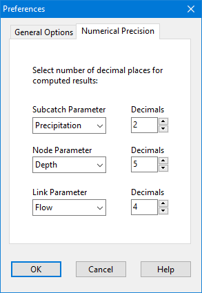
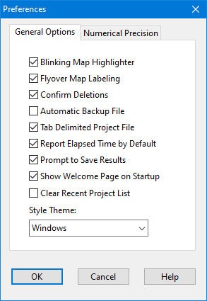
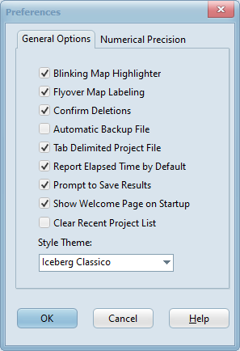
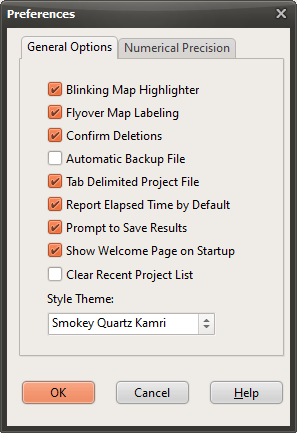

- To have the program accept edits made in a property field, either press the Enter key or move to another property. To cancel the edits, press the Esc key.

- The Property Editor can be hidden by clicking the button in the upper right corner of its title bar.

4.10 **Setting Program Preferences ** Program preferences allow one to customize certain program features. To set program preferences, select Program Preferences from the Tools menu. A Preferences dialog form will appear containing two tabbed pages – one for General Preferences and one for Numerical Precision.

The following preferences can be set on the General Preferences page of the Preferences dialog:

*Preference * *Description *

Blinking Map Highlighter Check to make the selected object on the study area map blink on and off.

Flyover Map Labeling Check to display the ID label and current theme value in a hint-style box whenever the mouse is placed over an object on the study area map.

Confirm Deletions Check to display a confirmation dialog box before deleting any object.

Automatic Backup File Check to save a backup copy of a newly opened project to disk named with a .bak extension.

Tab Delimited Project File Check to use tabs to delimit data values when saving a project to file.

Report Elapsed Time by Default

Check to use elapsed time (rather than date/time) as the default for time series graphs and tables.

Prompt to Save Results If left unchecked then simulation results are automatically saved to disk when the current project is closed. Otherwise the user will be asked if results should be saved.

Show Welcome Screen at Startup

Check to have SWMM display a welcome screen when started.

Clear Recent Project List Check to clear the list of most recently used files appearing when File >> Reopen is selected from the Main Menu.

Style Theme Selects a color theme to use for SWMM’s user interface (see below for some examples).

The Numerical Precision page of the Preferences dialog controls the number of decimal places displayed when simulation results are reported. Use the dropdown list boxes to select a specific Subcatchment, Node or Link parameter, and then use the edit boxes next to them to select the number of decimal places to use when displaying computed results for the parameter. . Note that there is no such limit to the number of decimal places displayed for any particular input design parameter, such as slope, diameter, length, etc. The number of decimal places displayed is whatever the user enters.