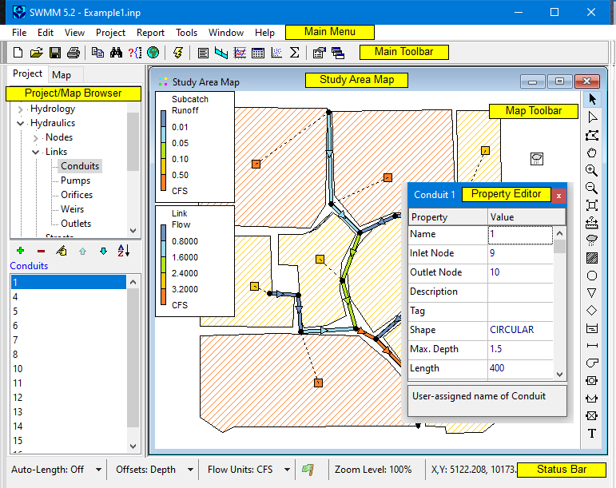

### Chapter 4 **SWMM’S MAIN WINDOW **

*This chapter discusses the essential features of SWMM’s workspace. It describes the main menu * *bar, the tool and status bars, and the three windows used most often – the Study Area Map, the * *Browser, and the Property Editor. It also shows how to set program preferences. *

4.1 **Overview ** The EPA SWMM main window is pictured below. It consists of the following user interface elements: a Main Menu, a Main Toolbar, a Status Bar, the Study Area Map window containing a Map Toolbar, a Browser panel, and a Property Editor window. A description of each of these elements is provided in the sections that follow.

