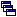

4.3 **Keyboard Shortcuts ** Several main menu commands have keyboard shortcuts that can be used to select them. They are listed below.

***Menu Command *** ***Shortcut Key ***

File | New Ctrl-N

File | Open Ctrl-O

File | Save Ctrl-S

File | Save As Ctrl-Alt-S

File | Exit Alt-F4

Edit | Copy To Ctrl-C

Edit | Select All Ctrl-A

Edit | Find Object Ctrl-F

Edit | Edit Object F2

Edit | Delete Object Ctrl-Delete

Edit | Group Edit Shift-F2

View | Query Ctrl-Q

Project | Add a New <object> Ctrl-Insert

Project | Run Simulation F9

Report | Graph | Time Series Ctrl-G

Window | Cascade Shift-F5

Window | Tile Shift-F4

Window | Close All Shift-Ctrl-F4

Help | User Guide Ctrl-F1 In addition the F1 key can be used to bring up context-sensitive Help in most of SWMM's data editing windows

4.4 **Toolbars ** The Main Toolbar appears at the top of SWMM's Main Window and provides shortcuts to the following Main Menu commands:

Creates a new project (**File >> New**)

Opens an existing project (**File >> Open**)

Saves the current project (**File >> Save**)

Prints the currently active window (**File >> Print**)

Copies selection to the clipboard or to a file (**Edit >> Copy To**)

Finds a specific object on the Study Area Map (**Edit >> Find Object**)

Makes a visual query of the Study Area Map (**View >> Query**)

Toggles the display of the Overview Map (**View >> Overview**)

Runs a simulation (**Project >> Run Simulation**)

Displays a run’s Status or Summary reports (**Report >> Status** and **Report >> ** **Summary** appear in a dropdown menu)

Creates a profile plot of simulation results (**Report >> Graph >> Profile**)

Creates a time series plot of simulation results (**Report >> Graph >> Time ** **Series**)

Creates a time series table of simulation results (**Report >> Table**)

Creates a scatter plot of simulation results (**Report >> Graph >> Scatter**)

Performs a statistical analysis of simulation results (**Report >> Statistics**)

Modifies display options for the currently active view (**Tools >> Map Display ** **Options** or **Report >> Customize**)

Arranges windows in cascaded style, with the Study Area Map filling the entire display area (**Window >> Cascade**) The Main Toolbar can be made visible or invisible by selecting **View >> Toolbar** from the Main Menu. The Map Toolbar appears on the right side of the Study Area Map and contains buttons for selecting items and viewing the Study Area Map:

Selects an object on the map (**Edit >> Select Object**)

Selects link or subcatchment vertex points (**Edit >> Select Vertex**)

Selects a region on the map (**Edit >> Select Region**)

Pans across the map (**View >> Pan**)

Zooms in on the map (**View >> Zoom In**)

Zooms out on the map (**View >> Zoom Out**)