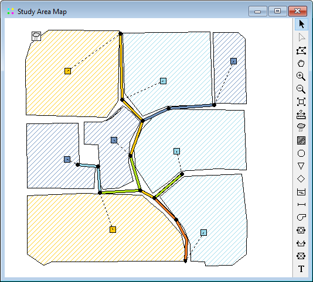

- Nodes and links can be drawn at different sizes, flow direction arrows added, and object symbols, ID labels and numerical property values displayed.

- The map can be printed, copied onto the Windows clipboard, or exported as a DXF file or Windows metafile.

4.7 **Project Browser ** The Project Browser panel (shown below) appears when the Project tab on the left panel of SWMM’s main window is selected. It provides access to all of the data objects in a project. The vertical sizes of the list boxes in the browser can be adjusted by using the splitter bar located just below the upper list box. The width of the Browser panel can be adjusted by using the splitter bar located along its right edge.