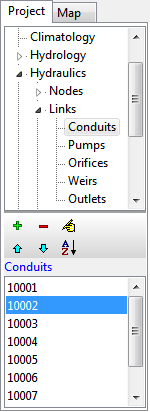
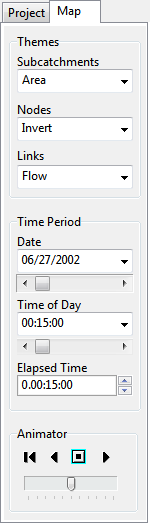

The upper list box displays the various categories of data objects available to a SWMM project. The lower list box lists the name of each individual object of the currently selected data category. The buttons between the two list boxes are used as follows:

ad

ds a new object

eletes the selected object

e

dits the selected object

oves the selected object up one position

oves the selected object down one position

so

rts the objects in ascending order Selections made in the Project Browser are coordinated with objects highlighted on the Study Area Map, and vice versa. For example, selecting a conduit in the Browser will cause that conduit to be highlighted on the map, while selecting it on the map will cause it to become the selected object in the Browser.

4.8 **Map Browser ** The Map Browser panel (shown below) appears when the Map tab on the left panel of the SWMM’s main window is selected. It controls the mapping themes and time periods viewed on the Study Area Map. The width of the Map Browser panel can be adjusted by using the splitter bar located along its right edge. The Map Browser consists of the following three panels that control what results are displayed on the map:

The **Themes** panel selects a set of variables to view in color- coded fashion on the Map:

*Subcatchments* - selects the theme to display for the subcatchment areas shown on the Map.

*Nodes* - selects the theme to display for the drainage system nodes shown on the Map.

*Links* - selects the theme to display for the drainage system links shown on the Map.

The **Time Period** panel selects which time period of the simulation results are viewed on the Map.

*Date* - selects the day for which simulation results will be viewed.

*Time of Day* - selects the time of the current date for which simulation results will be viewed.

*Elapsed Time* - selects the elapsed time from the start of the simulation (in days.hours:minutes:seconds) for which results will be viewed.

The **Animator** panel controls the animated display of the Study Area Map and all Profile Plots over time.

Returns to the starting period.

Starts animating backwards in time

Stops the animation

Starts animating forwards in time The slider bar is used to adjust the animation speed.