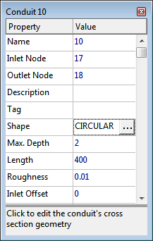

4.9 **Property Editor **

The Property Editor (shown to the right) is used to edit the properties of data objects that can appear on the Study Area Map. It is invoked when one of these objects is selected (either on the map or in the Project Browser) and double-clicked or when the Project Browser's Edit

button is clicked. Key features of the Property Editor include:

- The Editor is a grid with two columns - one for the property's name and the other for its value.

- The columns can be re-sized by re-sizing the header at the top of the Editor with the mouse.

- A hint area is displayed at the bottom of the Editor with an expanded description of the property being edited. The size of this area can be adjusted by dragging the splitter bar located just above it.

- The Editor window can be moved and re-sized via the normal Windows operations.

- Depending on the property, the value field can be one of the following:

o a text box in which you enter a value

o a dropdown combo box from which you select a value from a list of choices

o a dropdown combo box in which you can enter a value or select from a list of choices

o an ellipsis button which you click to bring up a specialized editor.

- The field in the Editor that currently has the focus will have a focus rectangle drawn around it.

- Both the mouse and the Up and Down arrow keys on the keyboard can be used to move between property fields.

- The Page Up key can be used to select the previous object of the same type (as listed in the Project Browser) into the Editor, while the Page Down key will select the next object of the same type into the Editor.

- To begin editing the property with the focus, either begin typing a value or hit the Enter key.