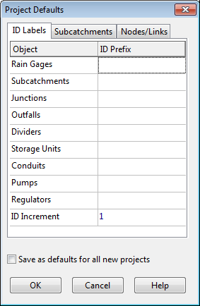

5.3 **Saving a Project ** To save a project under its current name either select **File >> Save** from the Main Menu or click

on the Main Toolbar. To save a project using a different name:

**1.** Select **File** >> **Save As** from the Main Menu.

**2.** A standard File Save dialog form will appear from which you can select the folder and name that the project should be saved under.

5.4 **Setting Project Defaults **

Each project has a set of default values that are used unless overridden by the SWMM user. These values fall into three categories:

1. Default ID labels (labels used to identify nodes and links when they are first created)

2. Default subcatchment properties (e.g., area, width, slope, etc.)

3. Default node/link properties (e.g., node invert, conduit length, routing method). To set default values for a project:

**1.** Select **Project** >> **Defaults** from the Main Menu.

**2.** A Project Defaults dialog will appear with three pages, one for each category listed above.

**3.** Check the box in the lower left of the dialog form if you want to save your choices for use in all new future projects as well.

**4.** Click OK to accept your choice of defaults. The specific items for each category of defaults will be discussed next.

5.4.1 *Default ID Labels *

The ID Labels page of the Project Defaults dialog form is used to determine how SWMM will assign default ID labels for the visual project components when they are first created. For each type of object you can enter a label prefix in the corresponding entry field or leave the field blank if an object's default name will simply be a number. In the last field you can enter an increment to be used when adding a numerical suffix to the default label. As an example, if C were used as a prefix for Conduits along with an increment of 5, then as conduits are created they receive default names of C5, C10, C15, and so on. An object’s default name can be changed by using the Property Editor for visual objects or the object-specific editor for non-visual objects.

5.4.2 *Default Subcatchment Properties *

The Subcatchment page of the Project Defaults dialog sets default property values for newly created subcatchments. These properties include:

- Subcatchment Area

- Characteristic Width

- Slope

- % Impervious

- Impervious Area Roughness

- Pervious Area Roughness

- Impervious Area Depression Storage

- Pervious Area Depression Storage

- % of Impervious Area with No Depression Storage

- Infiltration Method

The default properties of a subcatchment can be modified later by using the Property Editor.

5.4.3 *Default Node/Link Properties *

The Nodes/Links page of the Project Defaults dialog sets default property values for newly created nodes and links. These properties include:

- Node Invert Elevation

- Node Maximum Depth

- Node Ponded Area