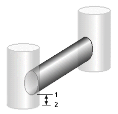

5.6 **Link Offset Conventions **

Conduits and flow regulators (orifices, weirs, and outlets) can be offset some distance above the invert of their connecting end nodes as depicted below:

There are two different conventions available for specifying the location of these offsets. The

Depth convention uses the offset distance from the node's invert (distance between  and ‚ in the figure above). The Elevation convention uses the absolute elevation of the offset location

(the elevation of point  in the figure). The choice of convention can be made on the Status Bar of SWMM's main window or on the Node/Link Properties page of the Project Defaults dialog. When this convention is changed, a dialog will appear giving one the option to automatically re- calculate all existing link offsets in the current project using the newly selected convention.

5.7 **Calibration Data **

SWMM can compare the results of a simulation with measured field data in its Time Series Plots, which are discussed in Section 9.4. Before SWMM can use such calibration data they must be entered into a specially formatted text file and registered with the project.

5.7.1 *Calibration Files *

Calibration Files contain measurements of a single parameter at one or more locations that can be compared with simulated values in Time Series Plots. Separate files can be used for each of the following parameters:

- Subcatchment Runoff

- Subcatchment Pollutant Washoff

- Groundwater Flow

- Groundwater Elevation

- Snow Pack Depth

- Node Depth

- Node Lateral Inflow

- Node Flooding

- Node Water Quality

- Link Flow Rate

- Link Flow Depth

- Link Flow Velocity

The format of the file is described in Section 11.5.

5.7.2 *Registering Calibration Data * To register calibration data residing in a Calibration File:

**1.** Select **Project** >> **Calibration Data** from the Main Menu.

**2.** In the Calibration Data dialog form shown below, click in the box next to the parameter (e.g., node depth, link flow, etc.) whose calibration data will be registered.

**3.** Then click the **Add** button to select a Calibration File from a standard Windows file selection dialog box.

**4.** Click the **Edit** button if you want to open the Calibration File in Windows NotePad for editing.

**5.** Click the **Delete** button if you wish to remove the Calibration File from the form.

**6.** Repeat steps 2 - 4 for any other parameters that have calibration data.

**7.** Click **OK** to accept your selections.