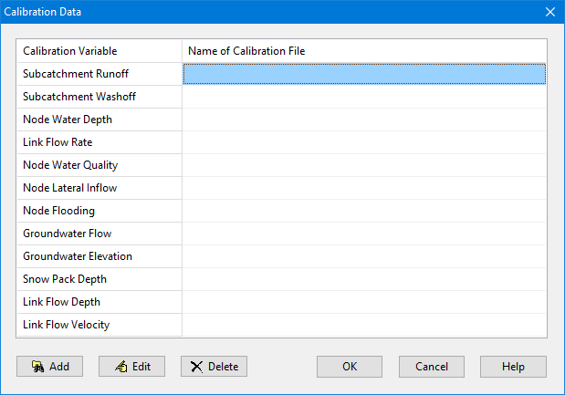
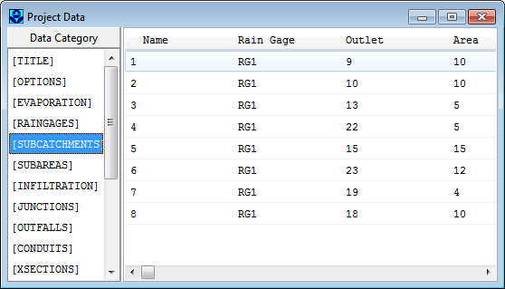

5.8 **Viewing All Project Data **

A listing of all project data (with the exception of map coordinates) can be viewed in a non- editable window, formatted for input to SWMM's computational engine (see below). This can be useful for checking data consistency and to make sure that no key components are missing. To view such a listing select **Project** >> **Details** from the Main Menu. The format of the data in this listing is the same as that used when the file is saved to disk. It is described in detail in Appendix D.2.

