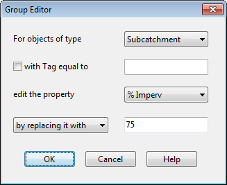

While in Vertex Selection mode you can begin editing the vertices for another link by simply clicking on the link. To leave Vertex Selection mode, right-click on the map and select **Quit** **Editing** from the popup menu, or simply select one of the other buttons on the Map Toolbar.

A link can also have its direction reversed (i.e., its end nodes switched) by right clicking on it and selecting **Reverse** from the pop-up menu that appears. Normally, links should be oriented so that the upstream end is at a higher elevation than the downstream end.

6.8 **Shaping a Subcatchment **

Subcatchments are drawn on the Study Area Map as closed polygons. To edit or add vertices to the polygon, follow the same procedures used for links. If the subcatchment is originally drawn or is edited to have two or less vertices, then only its centroid symbol will be displayed on the Study Area Map.

6.9 **Deleting an Object **

To delete an object:

**1.** Select the object on the Study Area Map or from the Project Browser.

**2.** Either click the button on the Project Browser or press the <**Delete**> key on the keyboard, or select **Edit >> Delete Object** from the Main Menu, or right-click the object on the map and select **Delete** from the pop-up menu that appears.

You can require that all deletions be confirmed before they take effect. See the General Preferences page of the Program Preferences dialog box described in Section 4.9.

6.10 **Editing or Deleting a Group of Objects **

A group of objects located within an irregular region of the Study Area Map can have a common property edited or be deleted all together. To select such a group of objects:

**1.** Choose **Edit** >> **Select Region **from the Main Menu or click on the Map Toolbar.

**2.** Draw a polygon around the region of interest on the map by clicking the left mouse button at each successive vertex of the polygon.

**3.** Close the polygon by clicking the right button or by pressing the <**Enter**> key; cancel the selection by pressing the <**Esc**> key.

To select all objects in the project, whether in view or not, select **Edit** >> **Select All **from the Main Menu.

Once a group of objects has been selected, you can edit a common property shared among them:

**1.** Select **Edit** >> **Group Edit** from the Main Menu.

**2.** Use the Group Editor dialog that appears to select a property and specify its new value.

The Group Editor dialog, shown below, is used to modify a property for a selected group of objects. To use the dialog:

**1.** Select a type of object (Subcatchments, Infiltration, Junctions, Storage Units, or Conduits) to edit.

**2.** Check the "with Tag equal to" box if you want to add a filter that will limit the objects selected for editing to those with a specific Tag value. (For Infiltration, the Tag will be that of the subcatchment to which the infiltration parameters belong.)

**3.** Enter a Tag value to filter on if you have selected that option.

**4.** Select the property to edit.

**5.** Select whether to replace, multiply, or add to the existing value of the property. Note that for some non-numerical properties the only available choice is to replace the value.

**6.** In the lower-right edit box, enter the value that should replace, multiply, or be added to the existing value for all selected objects. Some properties will have an ellipsis button displayed in the edit box which should be clicked to bring up a specialized editor for the property.

**7.** Click **OK** to execute the group edit. After the group edit is executed a confirmation dialog box will appear informing you of how many items were modified. It will ask if you wish to continue editing or not. Select **Yes** to return to the Group Edit dialog box to edit another parameter or **No** to dismiss the Group Edit dialog. To delete the objects located within a selected area of the map, select **Edit** >> **Group Delete** from the Main Menu. Then select the categories of objects you wish to delete from the dialog box that appears. As an option, you can specify that only objects within the selected area that have a specific Tag property should be deleted. Keep in mind that deleting a node will also delete any links connected to the node.