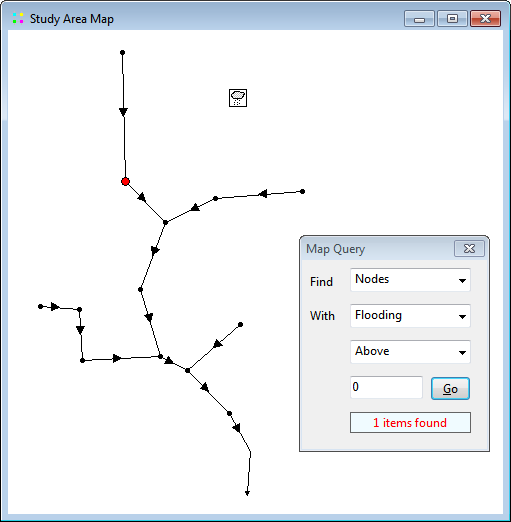
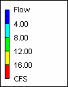
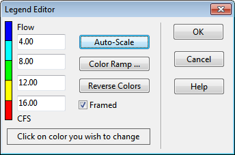

After the Query box is closed the map will revert back to its original display.

7.11 **Using the Map Legends **

Map Legends associate a color with a range of values for the current theme being viewed. Separate legends exist for Subcatchments, Nodes, and Links. A Date/Time Legend is also available for displaying the date and clock time of the simulation period being viewed on the map.

To display or hide a map legend:

**1.** Select **View** >> **Legends** from the Main Menu or right-click on the map and select Legends from the pop-up menu that appears

**2.** Click on the type of legend whose display should be toggled on or off.

A visible legend can also be hidden by double clicking on it. To move a legend to another location press the left mouse button over the legend, drag the legend to its new location with the button held down, and then release the button. To edit a legend, either select **View** >> **Legends** >> **Modify** from the Main Menu or right-click on the legend if it is visible. Then use the Legend Editor dialog that appears to modify the legend's colors and intervals.

The Legend Editor is used to set numerical ranges to which different colors are assigned for viewing a particular parameter on the network map. It works as follows:

- Numerical values, in increasing order, are entered in the edit boxes to define the ranges. Not all four boxes need to have values.

- To change a color, click on its color band in the Editor and then select a new color from the Color Dialog that will appear.

- Click the **Auto-Scale** button to automatically assign ranges based on the minimum and maximum values attained by the parameter in question at the current time period.

- The **Color Ramp** button is used to select from a list of built-in color schemes.

- The **Reverse Colors** button reverses the ordering of the current set of colors (the color in the lowest range becomes that of the highest range and so on).

- Check **Framed** if you want a frame drawn around the legend.