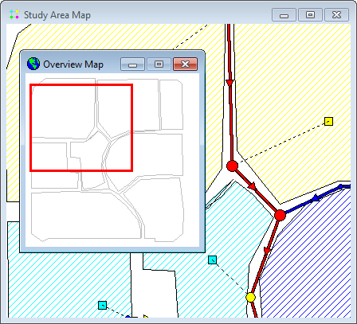

Changes made to a legend are saved with the project's settings and remain in effect when the project is re-opened in a subsequent session.

7.12 **Using the Overview Map **

The Overview Map, as pictured below, allows one to see where in terms of the overall system the main Study Area Map is currently focused. This zoom area is depicted by the rectangular outline displayed on the Overview Map. As you drag this rectangle to another position the view within the main map will be redrawn accordingly. The Overview Map can be toggled on and off by

selecting **View** >> **Overview Map** from the Main Menu or by clicking on the Main Toolbar. The Overview Map window can also be dragged to any position as well as be re-sized.

7.13 **Setting Map Display Options **

The Map Options dialog (shown below) is used to change the appearance of the Study Area Map. There are several ways to invoke it:

- select **Tools** >> **Map Display Options** from the Main Menu or,

- click the **Options** button on the Main Toolbar when the Study Area Map window has the focus or,