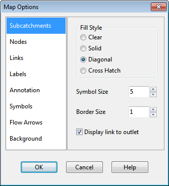

Changes made to a legend are saved with the project's settings and remain in effect when the project is re-opened in a subsequent session.

7.12 **Using the Overview Map **

The Overview Map, as pictured below, allows one to see where in terms of the overall system the main Study Area Map is currently focused. This zoom area is depicted by the rectangular outline displayed on the Overview Map. As you drag this rectangle to another position the view within the main map will be redrawn accordingly. The Overview Map can be toggled on and off by

selecting **View** >> **Overview Map** from the Main Menu or by clicking on the Main Toolbar. The Overview Map window can also be dragged to any position as well as be re-sized.

7.13 **Setting Map Display Options **

The Map Options dialog (shown below) is used to change the appearance of the Study Area Map. There are several ways to invoke it:

- select **Tools** >> **Map Display Options** from the Main Menu or,

- click the **Options** button on the Main Toolbar when the Study Area Map window has the focus or,

- right-click on any empty portion of the map and select **Options** from the popup menu that appears.

The dialog contains a separate page, selected from the panel on the left side of the form, for each of the following display option categories:

- Subcatchments (controls fill style, symbol size, and outline thickness of subcatchment areas)

- Nodes (controls size of nodes and making size be proportional to value)

- Links (controls thickness of links and making thickness be proportional to value)

- Labels (turns display of map labels on/off)

- Annotation (displays or hides node/link ID labels and parameter values)

- Symbols (turns display of storage unit, pump, and regulator symbols on/off)

- Flow Arrows (selects visibility and style of flow direction arrows)

- Background (changes color of map's background). Subcatchment Options

The Subcatchments page of the Map Options dialog controls how subcatchment areas are displayed on the study area map.

*Option * *Description *

Fill Style Selects style used to fill interior of subcatchment area

Symbol Size Sets the size of the symbol (in pixels) placed at the centroid of a subcatchment area

Border Size Sets the thickness of the line used to draw a subcatchment's border; if set to zero then only the subcatchment centroid will be displayed

Display Link to Outlet

If checked then a dashed line is drawn between the subcatchment centroid and the subcatchment's outlet node (or outlet subcatchment)

Node Options

The Nodes page of the Map Options dialog controls how nodes are displayed on the study area map.

*Option * *Description *

Node Size Selects node diameter in pixels

Proportional to Value

Select if node size should increase as the viewed parameter increases in value

Display Border Select if a border should be drawn around each node (recommended for light-colored backgrounds)

Link Options

The Links page of the Map Options dialog controls how links are displayed on the map.

*Option * *Description *

Link Size Sets thickness of links displayed on map (in pixels)

Proportional to Value

Select if link thickness should increase as the viewed parameter increases in value

Display Border Check if a black border should be drawn around each link

Label Options

The Labels page of the Map Options dialog controls how user-created map labels are displayed on the study area map.

*Option * *Description *

Use Transparent Text

Check to display label with a transparent background (otherwise an opaque background is used)

At Zoom Of Selects minimum zoom at which labels should be displayed; labels will be hidden at zooms smaller than this

Annotation Options

The Annotation page of the Map Options dialog form determines what kind of annotation is provided alongside of the objects on the study area map.

*Option * *Description *

Rain Gage IDs Check to display rain gage ID names

Subcatch IDs Check to display subcatchment ID names

Node IDs Check to display node ID names

Link IDs Check to display link ID names

Subcatch Values Check to display value of current subcatchment variable

Node Values Check to display value of current node variable

Link Values Check to display value of current link variable

Use Transparent Text Check to display text with a transparent background (otherwise an opaque background is used)

Font Size Adjusts the size of the font used to display annotation

At Zoom Of Selects minimum zoom at which annotation should be displayed; all annotation will be hidden at zooms smaller than this

Symbol Options

The Symbols page of the Map Options dialog determines which types of objects are represented with special symbols on the map.

*Option * *Description *

Display Node Symbols If checked then special node symbols will be used

Display Link Symbols If checked then special link symbols will be used

At Zoom Of Selects minimum zoom at which symbols should be displayed; symbols will be hidden at zooms smaller than this

Flow Arrow Options

The Flow Arrows page of the Map Options dialog controls how flow-direction arrows are displayed on the map.

*Option * *Description *

Arrow Style Selects style (shape) of arrow to display (select None to hide arrows)

Arrow Size Sets arrow size

At Zoom Of Selects minimum zoom at which arrows should be displayed; arrows will be hidden at zooms smaller than this

Flow direction arrows will only be displayed after a successful simulation has been made and a computed parameter has been selected for viewing. Otherwise the direction arrow will point from the user-designated start node to end node.