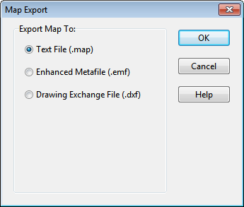

Background Options

The Background page of the Map Options dialog offers a selection of colors used to paint the map’s background.

7.14 **Exporting the Map ** The full extent view of the study area map can be saved to file using either:

- Autodesk's DXF (Drawing Exchange Format) format,

- the Windows enhanced metafile (EMF) format,

- EPA SWMM's own ASCII text (.map) format.

The DXF format is readable by many Computer Aided Design (CAD) programs. Metafiles can be inserted into word processing documents and loaded into drawing programs for re-scaling and editing. Both formats are vector-based and will not lose resolution when they are displayed at different scales. To export the map to a DXF, metafile, or text file:

**1.** Select **File** >> **Export** >> **Map**.

**2.** In the Map Export dialog that appears select the format that you want the map saved in.

If you select DXF format, you have a choice of how nodes will be represented in the DXF file. They can be drawn as filled circles, as open circles, or as filled squares. Not all DXF readers can recognize

the format used in the DXF file to draw a filled circle. Also note that map annotation, such as node and link ID labels will not be exported, but map label objects will be.

After choosing a format, click **OK** and enter a name for the file in the Save As dialog that appears.